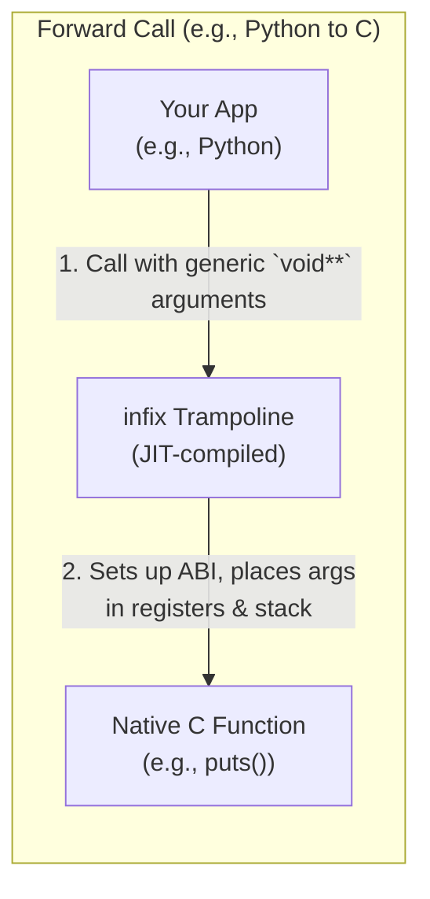
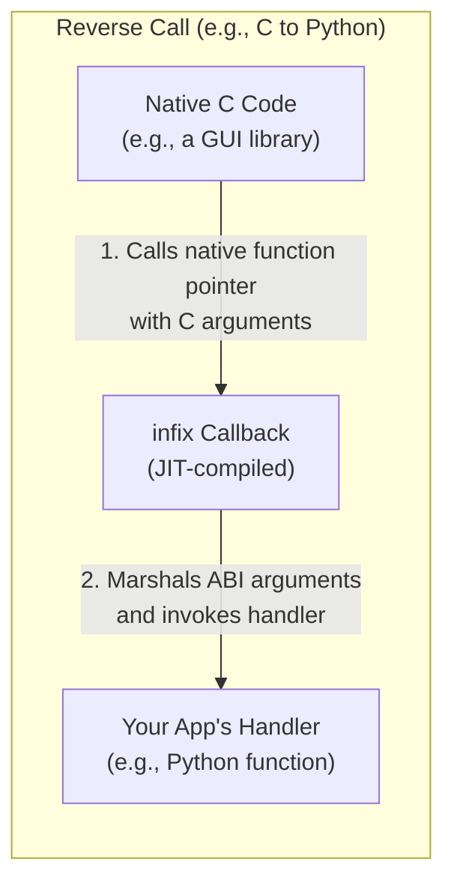

# infix: A JIT-Powered FFI Library for C

[](https://github.com/sanko/infix/actions/workflows/ci.yml) ([Matrix](#supported-platforms))

`infix` is a modern, security-conscious, and dependency-free Foreign Function Interface (FFI) library for C. It solves the complex problem of calling native functions across language boundaries, replacing brittle, hand-written binding code with a simple, human-readable signature string like `({int, *double}, *char) -> int`.

At its core, `infix` is a Just-in-Time (JIT) compiler that generates tiny, highly-optimized machine code "trampolines" at runtime. These trampolines correctly handle the low-level Application Binary Interface (ABI) for the target platform, ensuring seamless and performant interoperability.

## Documentation

*   **[Cookbook](docs/cookbook.md):** The best place to start. A comprehensive guide with practical, copy-pasteable recipes for common FFI tasks.
*   **[Signature Reference](docs/signatures.md):** The complete guide for the `infix` signature mini-language spec.
*   **[Internals](docs/internals.md):** A deep dive into the library's architecture for maintainers and contributors.
*   **[Porting Guide](docs/porting.md):** A guide for porting `infix` to new CPU architectures and ABIs.
*   **[INSTALL.md](docs/INSTALL.md):** Detailed build and integration instructions.

## How It Works: The Trampoline Concept

At its core, `infix` generates a small piece of executable machine code called a **trampoline**. This code acts as an intelligent adapter that understands the specific calling convention (ABI) of your platform.

#### Forward Call (e.g., from Python to C)

When your application wants to call a C function, it doesn't call it directly. Instead, it calls the `infix` trampoline, which handles the complex process of placing arguments in the correct CPU registers and on the stack before making the final jump to the target C function.



#### Reverse Call (e.g., from C back to Python)

`infix` generates a native C function pointer that a C library can call. When called, this JIT-compiled stub marshals the native arguments back into a generic format and invokes your high-level handler.



## Who is this for?

`infix` is designed for developers who need to bridge the gap between different codebases or language runtimes. You'll find it especially useful if you are:

*   **A Language Binding Author:** `infix` is the ideal engine for allowing a high-level language like Python, Ruby, Perl, or Lua to call C libraries. The introspectable type system simplifies the complex task of data marshalling.
*   **A Plugin System Architect:** Build a stable, ABI-agnostic plugin system. `infix` can provide the boundary layer, allowing you to load and call functions from shared libraries without tight coupling.
*   **A C/C++ Developer:** Dynamically call functions from system libraries (`user32.dll`, `libc.so.6`, etc.) without needing to link against them at compile time, or create complex stateful callbacks for C APIs.
*   **A Security Researcher:** `infix` provides a powerful, fuzz-tested toolkit for analyzing and interacting with native code.

> **How does `infix` compare to alternatives like libffi and`dyncall?**
>
> `infix` shares a similar goal with these popular libraries but differs in its design philosophy.
>
> - Compared to libffi, `infix` prioritizes a modern, security-hardened architecture (W^X memory, guard pages), a more expressive and readable string-based API, and a powerful named type registry for managing complex data structures.
> - Compared to dyncall, `infix` offers a declarative API via its signature strings. Where dyncall uses an imperative, programmatic sequence of calls (e.g., `dcArgInt(vm, 10); dcArgString(vm, "hi");`), `infix` defines the entire function prototype in a single, self-contained, and human-readable string. This makes signatures easy to log, store in configuration, and manage, especially for complex types.

## Key Features

-   **Zero Dependencies & Simple Integration:** `infix` uses a unity build, making integration into any C/C++ project trivial by simply compiling `src/infix.c`.
-   **Simple, Powerful APIs:** Use the high-level **Signature API** to create trampolines from a single string, or drop down to the memory-safe **Manual API** for dynamic, performance-critical use cases.
-   **Advanced Type System:** Full support for primitives, pointers, structs, unions, arrays, enums, `_Complex` numbers, and SIMD vectors.
-   **Named Type Registry:** Define complex types like structs and unions once, and reuse them by name (`@Name`) across all your signatures for unparalleled readability and maintainability.
-   **Stateful Callbacks Made Easy:** The reverse-call API is designed to make stateful callbacks simple and safe, even when the C library you're calling doesn't provide a `user_data` parameter. It offers both high-level, type-safe handlers for C/C++ and low-level, generic handlers for language bindings.
-   **Secure by Design:** `infix` is hardened against vulnerabilities and validated through extensive fuzz testing:
    *   **W^X Memory Protection:** JIT-compiled code is never writable and executable at the same time.
    *   **Guard Pages:** Freed trampolines are made inaccessible to prevent **use-after-free** bugs.
    *   **Read-Only Contexts:** Callback context data is made read-only to guard against runtime **memory corruption**.
-   **Cross-Platform and Cross-Architecture:** Designed for portability, with initial support for **x86-64** (System V and Windows x64) and **AArch64** (AAPCS64).
-   **Arena-Based Memory:** Utilizes an efficient arena allocator for all type descriptions, ensuring fast performance and leak-free memory management.
-   **Dynamic Library Tools**: A cross-platform API to load shared libraries (`.so`, `.dll`, `.dylib`), look up symbols, and read/write global variables using the same powerful signature system.

## Performance

`infix` is designed for high performance, balancing the flexibility of dynamic calls with the speed of compiled code.

*   **Call Overhead:** The overhead of a call through a **bound** trampoline is extremely low, typically measuring in the single-digit nanoseconds on modern hardware. This makes it suitable for performance-critical loops. **Unbound** trampolines offer more flexibility at the cost of a small, additional overhead.
*   **Generation Time:** Creating a new trampoline is fast, typically taking only a few microseconds. This allows for dynamic generation of callbacks and function calls in response to runtime events without noticeable latency.

The library includes micro-benchmarks to track these metrics and prevent performance regressions.

## Getting Started

Full build instructions for `xmake`, `cmake`, GNU `make`, and other systems are available in **[INSTALL.md](docs/INSTALL.md)**.

### Prerequisites

-   A C11-compatible compiler (GCC, Clang, or MSVC).
-   (Optional) A build tool like `cmake`, `xmake`, `make`, etc.

### Building the Library

While you can use the provided build scripts, the simplest way to build `infix` is to compile its single translation unit directly. Because `infix` uses a unity build, integration into an existing project is simple: add `src/infix.c` to your list of source files and add the `include/` directory to your include paths.

```bash
# Build a static library on Linux/macOS
gcc -c -std=c11 -O2 -I/path/to/infix/include src/infix.c -o infix.o
ar rcs libinfix.a infix.o

# Build a static library with MSVC
cl.exe /c /I C:\path\to\infix\include /O2 src\infix.c /Foinfix.obj
lib.exe /OUT:infix.lib infix.obj
```

### Integrating into Your Project

1.  **Include the Header:**

    ```c
    #include <infix/infix.h>
    ```

2.  **Link the Library:** When compiling your application, link against the `libinfix.a` (or `infix.lib`) library.

    ```bash
    gcc my_app.c -I/path/to/infix/include -L/path/to/build/dir -linfix -o my_app
    ```

### Quick Start: A 60-Second Example

Here is a complete, runnable example that calls the standard C library function `puts`.

```c
#include <stdio.h>
#include <infix/infix.h>

int main() {
    // 1. Describe the function signature: int puts(const char*);
    const char* signature = "(*char) -> int32";

    // 2. Create a "bound" trampoline, hardcoding the address of `puts`.
    //    Pass nullptr for the registry as we are not using named types.
    infix_forward_t* trampoline = NULL;
    infix_forward_create(&trampoline, signature, (void*)puts, NULL);

    // 3. Get the callable function pointer.
    infix_cif_func cif = infix_forward_get_code(trampoline);

    // 4. Prepare arguments and call.
    //    The `args` array must contain *pointers* to your argument values.
    const char* my_string = "Hello from infix!";
    void* args[] = { &my_string };
    int return_value;
    cif(&return_value, args); // A non-negative value is returned on success.

    printf("puts returned: %d\n", return_value);

    // 5. Clean up.
    infix_forward_destroy(trampoline);
    return 0;
}
```

## API Reference

A brief overview of the complete public API, grouped by functionality.

<details>
<summary><b>Click to expand Full API Reference</b></summary>

### Named Type Registry (`registry_api`)
- `infix_registry_create()`: Creates a new, empty type registry.
- `infix_registry_destroy()`: Frees a registry and all types defined within it.
- `infix_register_types()`: Parses a string of definitions to populate a registry.

### Registry Introspection (`registry_introspection_api`)
- `infix_registry_print()`: Serializes all defined types in a registry to a string.
- `infix_registry_iterator_begin()`: Creates an iterator to traverse the types in a registry.
- `infix_registry_iterator_next()`: Advances the iterator to the next type.
- `infix_registry_iterator_get_name()`: Gets the name of the type at the current iterator position.
- `infix_registry_iterator_get_type()`: Gets the `infix_type` at the current iterator position.
- `infix_registry_is_defined()`: Checks if a type name is fully defined in the registry.
- `infix_registry_lookup_type()`: Retrieves a canonical `infix_type` from the registry by name.

### High-Level Signature API (`high_level_api`)
- `infix_forward_create()`: Creates a bound forward trampoline from a signature.
- `infix_forward_create_unbound()`: Creates an unbound forward trampoline from a signature.
- `infix_reverse_create_callback()`: Creates a type-safe reverse trampoline (for C/C++ developers).
- `infix_reverse_create_closure()`: Creates a generic reverse trampoline (for language bindings).
- `infix_signature_parse()`: Parses a full function signature into its `infix_type` components.
- `infix_type_from_signature()`: Parses a string representing a single data type.

### Dynamic Library & Globals API (`exports_api`)
- `infix_library_open()`: Opens a dynamic library (`.so`, `.dll`).
- `infix_library_close()`: Closes a dynamic library handle.
- `infix_library_get_symbol()`: Retrieves a function or variable address from a library.
- `infix_read_global()`: Reads a global variable from a library using a signature.
- `infix_write_global()`: Writes to a global variable in a library using a signature.

### Manual Trampoline API (`manual_api`)
- `infix_forward_create_manual()`: Creates a bound forward trampoline from `infix_type` objects.
- `infix_forward_create_unbound_manual()`: Creates an unbound forward trampoline from `infix_type` objects.
- `infix_reverse_create_callback_manual()`: Creates a type-safe reverse trampoline from `infix_type` objects.
- `infix_reverse_create_closure_manual()`: Creates a generic reverse trampoline from `infix_type` objects.
- `infix_forward_destroy()`: Frees a forward trampoline.
- `infix_reverse_destroy()`: Frees a reverse trampoline.

### Manual Type Creation API (`type_system`)
- `infix_type_create_primitive()`: Gets a static descriptor for a primitive C type.
- `infix_type_create_pointer()`: Gets a static descriptor for `void*`.
- `infix_type_create_pointer_to()`: Creates a pointer type with a specific pointee type.
- `infix_type_create_void()`: Gets the static descriptor for the `void` type.
- `infix_type_create_struct()`: Creates a struct type from an array of members.
- `infix_type_create_packed_struct()`: Creates a struct with non-standard packing.
- `infix_type_create_union()`: Creates a union type from an array of members.
- `infix_type_create_array()`: Creates a fixed-size array type.
- `infix_type_create_enum()`: Creates an enum type with an underlying integer type.
- `infix_type_create_complex()`: Creates a `_Complex` number type.
- `infix_type_create_vector()`: Creates a SIMD vector type.
- `infix_type_create_named_reference()`: Creates a placeholder for a named type to be resolved by a registry.
- `infix_type_create_member()`: A factory function to create an `infix_struct_member`.

### Memory Management (`memory_management`)
- `infix_arena_create()`: Creates a new memory arena.
- `infix_arena_destroy()`: Frees an arena and all memory allocated from it.
- `infix_arena_alloc()`: Allocates aligned memory from an arena.
- `infix_arena_calloc()`: Allocates zero-initialized memory from an arena.

### Introspection API (`introspection_api`)
#### Trampoline & Callback Introspection
- `infix_forward_get_code()`: Gets the callable function pointer from a bound trampoline.
- `infix_forward_get_unbound_code()`: Gets the callable function pointer from an unbound trampoline.
- `infix_reverse_get_code()`: Gets the native C function pointer from a reverse trampoline.
- `infix_reverse_get_user_data()`: Gets the user-provided data from a closure.
- `infix_forward_get_num_args()`: Gets the total number of arguments for a forward trampoline.
- `infix_forward_get_num_fixed_args()`: Gets the number of fixed (non-variadic) arguments.
- `infix_forward_get_return_type()`: Gets the return type for a forward trampoline.
- `infix_forward_get_arg_type()`: Gets the type of a specific argument for a forward trampoline.
- `infix_reverse_get_num_args()`: Gets the total number of arguments for a reverse trampoline.
- `infix_reverse_get_num_fixed_args()`: Gets the number of fixed (non-variadic) arguments.
- `infix_reverse_get_return_type()`: Gets the return type for a reverse trampoline.
- `infix_reverse_get_arg_type()`: Gets the type of a specific argument for a reverse trampoline.
#### Type Introspection & Serialization
- `infix_type_get_category()`: Gets the fundamental category of a type (e.g., struct, pointer).
- `infix_type_get_size()`: Gets the size of a type in bytes.
- `infix_type_get_alignment()`: Gets the alignment of a type in bytes.
- `infix_type_get_member_count()`: Gets the number of members in a struct or union.
- `infix_type_get_member()`: Gets a specific member from a struct or union by index.
- `infix_type_get_arg_name()`: Gets the name of an argument from a function type.
- `infix_type_get_arg_type()`: Gets the type of an argument from a function type.
- `infix_type_print()`: Serializes an `infix_type` graph back to a signature string.
- `infix_function_print()`: Serializes a full function signature to a string.

### Error Handling API (`error_api`)
- `infix_get_last_error()`: Retrieves detailed information about the last error on the current thread.

</details>

## Building and Integrating

Full build instructions for `xmake`, `cmake`, GNU `make`, and other systems are available in **[INSTALL.md](docs/INSTALL.md)**.

Because `infix` uses a unity build, integration into an existing project is simple: add `src/infix.c` to your list of source files and add the `include/` directory to your include paths.

## Supported Platforms

`infix` is rigorously tested on a wide array of operating systems, compilers, and architectures with every commit.

<details>
<summary><b>Click to expand Full Platform CI Results</b></summary>

| OS           | Version     | Architecture | Compiler  | Status                                                                                                                                                                                               |
| :----------- | :---------- | :----------- | :-------- | :--------------------------------------------------------------------------------------------------------------------------------------------------------------------------------------------------- |
| DragonflyBSD | 6.4.0       | x86-64       | GCC       |  |
| FreeBSD      | 14.3        | x86-64       | GCC       |  |
|              | 14.3        | AArch64      | GCC       |      |
|              | 14.3        | x86-64       | Clang     |  |
|              | 14.3        | AArch64      | Clang     |    |
| macOS        | Sequoia     | AArch64      | Clang     |  |
|              | Sequoia     | AArch64      | GCC       |    |
| NetBSD       | 10.1        | AArch64      | GCC       |  |
|              | 10.1        | x86-64       | GCC       |    |
| OmniOS       | r151052     | x86-64       | GCC       |  |
| OpenBSD      | 7.7         | AArch64      | Clang     |  |
|              | 7.7         | AArch64      | GCC       |  |
|              | 7.7         | x86-64       | Clang     |  |
|              | 7.7         | x86-64       | Clang     |  |
| Solaris      | 11.4        | x86-64       | GCC       |  |
| Ubuntu       | 24.04       | AArch64      | Clang     |  |
|              | 24.04       | AArch64      | GCC       |  |
|              | 24.04       | x86-64       | Clang     |  |
|              | 24.04       | x86-64       | GCC       |  |
| Windows      | Server 2025 | AArch64      | Clang     |  |
|              | Server 2025 | AArch64      | GCC       |  |
|              | Server 2025 | AArch64      | MSVC      |  |
|              | Server 2025 | x86-64       | Clang     |  |
|              | Server 2025 | x86-64       | GCC       |  |
|              | Server 2025 | x86-64       | MSVC      |  |

</details>

In addition to the CI platforms tested here on Github, I can verify infix builds and passes unit tests on Android/Termux.

## Contributing

Contributions are welcome! Please feel free to submit a pull request or open an issue for any bugs, feature requests, or documentation improvements.

## License & Legal

`infix` is provided under multiple licenses to maximize its usability for all.

### Code License

Source code, including header files (`.h`) and implementation files (`.c`), is dual-licensed under the **Artistic License 2.0** or the **MIT License**. You may choose to use the code under the terms of either license.

See the [LICENSE-A2](LICENSE-A2) and/or [LICENSE-MIT](LICENSE-MIT) for the full text of both licenses.

### Documentation License

At your discretion, all standalone documentation (`.md`), explanatory text, Doxygen-style documentation blocks, comments, and code examples contained within this repository may be used, modified, and distributed under the terms of the **Creative Commons Attribution 4.0 International License (CC BY 4.0)**. We encourage you to share and adapt the documentation for any purpose (generating an API reference website, creating tutorials, etc.), as long as you give appropriate credit.

See the [LICENSE-CC](LICENSE-CC) for details.
