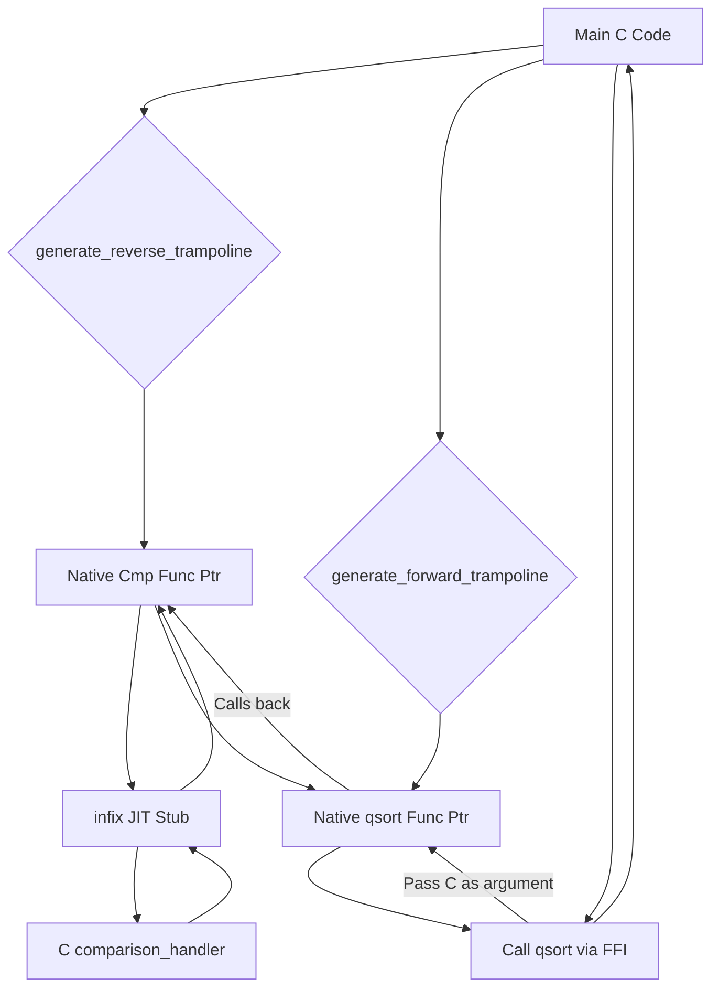
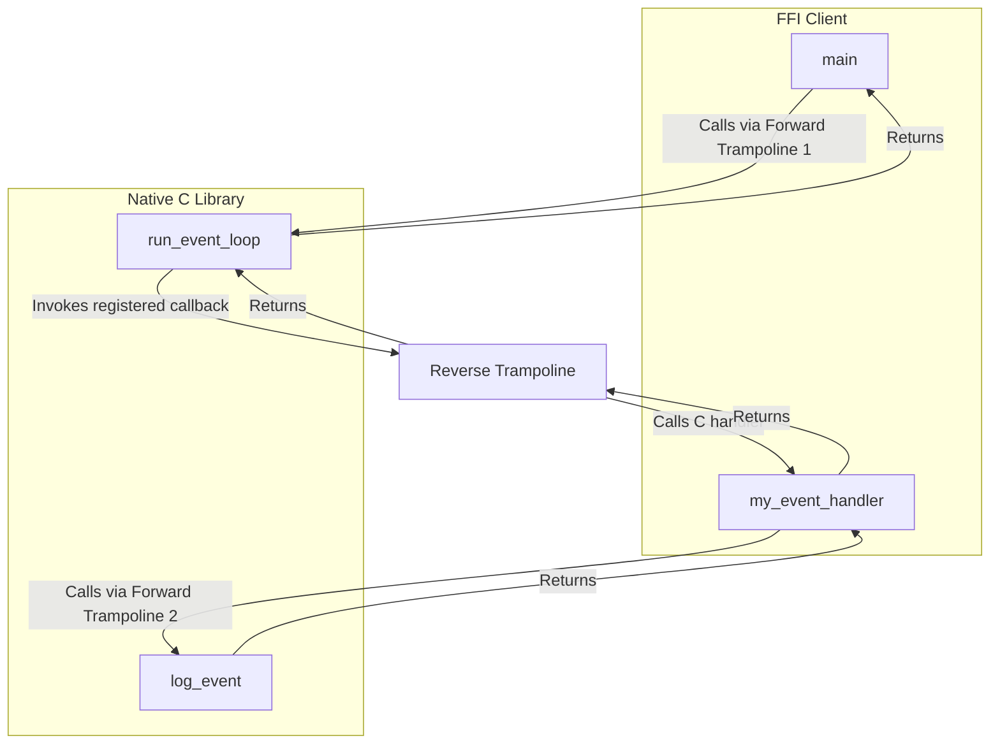
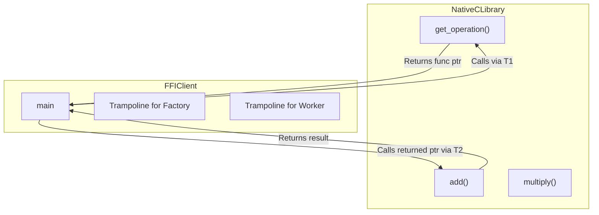

# infix FFI Cookbook: Advanced Usage Recipes

Welcome to the infix Cookbook! This guide provides practical, real-world examples to help you solve common problems and leverage the full power of the infix FFI library. Whether you're calling a simple C function or wrapping a complex C++ class, this document provides the patterns you need.

## Table of Contents

*   **Chapter 1: The Basics (Forward Calls)**
    *   [Recipe: Calling a Simple C Function](#recipe-calling-a-simple-c-function)
    *   [Recipe: Passing and Receiving Pointers](#recipe-passing-and-receiving-pointers)
    *   [Recipe: Working with Opaque Pointers (Incomplete Types)](#recipe-working-with-opaque-pointers-incomplete-types)
    *   [Recipe: Working with Fixed-Size Arrays](#recipe-working-with-fixed-size-arrays)
*   **Chapter 2: Handling Complex Data Structures**
    *   [Recipe: Dynamic Struct Marshalling with the Signature Parser](#recipe-dynamic-struct-marshalling-with-the-signature-parser)
    *   [Recipe: Small Structs Passed by Value](#recipe-small-structs-passed-by-value)
    *   [Recipe: Large Structs Passed by Reference](#recipe-large-structs-passed-by-reference)
    *   [Recipe: Receiving a Struct from a Function](#recipe-receiving-a-struct-from-a-function)
    *   [Recipe: Working with Packed Structs](#recipe-working-with-packed-structs)
    *   [Recipe: Working with Packed Structs via the Signature API](#recipe-working-with-packed-structs-via-the-signature-api)
    *   [Recipe: Working with Unions](#recipe-working-with-unions)
*   **Chapter 3: The Power of Callbacks (Reverse Calls)**
    *   [Recipe: Creating a Stateless Callback for `qsort`](#recipe-creating-a-stateless-callback-for-qsort)
    *   [Recipe: Creating a Stateless Callback for `qsort` via the Signature API](#recipe-creating-a-stateless-callback-for-qsort-via-the-signature-api)
    *   [Recipe: Callbacks with State (The `user_data` Pattern)](#recipe-callbacks-with-state-the-user_data-pattern)
*   **Chapter 4: Advanced Techniques**
    *   [Recipe: Calling Variadic Functions like `printf`](#recipe-calling-variadic-functions-like-printf)
    *   [Recipe: Creating a Variadic Callback](#recipe-creating-a-variadic-callback)
    *   [Recipe: Proving Reentrancy with Nested FFI Calls](#recipe-proving-reentrancy-with-nested-ffi-calls)
    *   [Recipe: Receiving and Calling a Function Pointer](#recipe-receiving-and-calling-a-function-pointer)
*   **Chapter 5: Interoperability with Other Languages**
    *   [The Universal Principle: The C ABI](#the-universal-principle-the-c-abi)
    *   [A Cross-Language Type Reference](#a-cross-language-type-reference)
    *   [Part 1: The C++ Master Example](#part-1-the-c-master-example)
        *   [The Recommended Approach: `extern "C"` Wrapper](#the-recommended-approach-extern-c-wrapper)
        *   [The Advanced Approach: Calling Mangled Symbols Directly](#the-advanced-approach-calling-mangled-symbols-directly)
    *   [Part 2: The Pattern for Other Compiled Languages](#part-2-the-pattern-for-other-compiled-languages)
        *   [Rust](#rust)
        *   [Fortran](#fortran)
        *   [Zig](#zig)
        *   [Go](#go)
        *   [Swift](#swift)
        *   [D (dlang)](#d-dlang)
        *   [Assembly (NASM)](#assembly-nasm)
*   **Chapter 6: Calling System Libraries**
    *   [Recipe (Windows): Displaying a `MessageBox`](#recipe-windows-displaying-a-messagebox)
    *   [Recipe (macOS): Interacting with CoreFoundation Objects](#recipe-macos-interacting-with-corefoundation-objects)
    *   [Recipe (Linux/POSIX): Getting System Information](#recipe-linuxposix-getting-system-information)
*   **Chapter 7: Memory Management Patterns**
    *   [Recipe: Early Cleanup for Long-Lived Trampolines](#recipe-early-cleanup-for-long-lived-trampolines)
*   **Chapter 8: Performance Patterns**
    *   [Understanding Generation vs. Call-Time Overhead](#understanding-generation-vs-call-time-overhead)
    *   [Best Practice: Caching Trampolines](#best-practice-caching-trampolines)
*   **Chapter 9: Common Pitfalls & Troubleshooting**
    *   [Mistake: Passing a Value Instead of a Pointer in `args[]`](#mistake-passing-a-value-instead-of-a-pointer-in-args)
    *   [Mistake: `ffi_type` Mismatch](#mistake-ffi_type-mismatch)
    *   [Mistake: Forgetting to Free Dynamic `ffi_type` Objects](#mistake-forgetting-to-free-dynamic-ffi_type-objects)
    *   [Mistake: Incorrect `num_fixed_args` for Variadic Functions](#mistake-incorrect-num_fixed_args-for-variadic-functions)
*   **Chapter 10: Building Language Bindings**
    *   [The Four Pillars of a Language Binding](#the-four-pillars-of-a-language-binding)
    *  [The Two Paths: Core API vs. Signature API](#the-two-paths-core-api-vs.-signature-api)

---

## Chapter 1: The Basics (Forward Calls)

### Recipe: Calling a Simple C Function

**Problem**: You want to call a standard C function, like `int add(int, int);`.

**Solution**: Describe the function's signature using `ffi_type` objects, generate a forward trampoline, prepare the arguments, and make the call.

```c
#include <infix.h>
#include <stdio.h>

int add_ints(int a, int b) { return a + b; }

int main() {
    // 1. Describe the signature: int(int, int)
    ffi_type* ret_type = ffi_type_create_primitive(FFI_PRIMITIVE_TYPE_SINT32);
    ffi_type* arg_types[] = {
        ffi_type_create_primitive(FFI_PRIMITIVE_TYPE_SINT32),
        ffi_type_create_primitive(FFI_PRIMITIVE_TYPE_SINT32)
    };

    // 2. Generate the trampoline.
    ffi_trampoline_t* trampoline = NULL;
    generate_forward_trampoline(&trampoline, ret_type, arg_types, 2, 2);

    // 3. Prepare arguments. The args array holds *pointers* to the values.
    int a = 40, b = 2;
    void* args[] = { &a, &b };
    int result = 0;

    // 4. Get the callable function and invoke it.
    ffi_cif_func cif_func = (ffi_cif_func)ffi_trampoline_get_code(trampoline);
    cif_func((void*)add_ints, &result, args);

    printf("Result of add_ints(40, 2) is: %d\n", result); // Expected: 42

    // 5. Clean up.
    ffi_trampoline_free(trampoline);
    return 0;
}
```

### Recipe: Passing and Receiving Pointers

**Problem**: You need to call a C function that takes pointers as arguments, like `void swap(int* a, int* b);`.

**Solution**: Use `ffi_type_create_pointer()` to describe the arguments. The values you pass in the `args` array will be the addresses of your pointer variables.

```c
#include <infix.h>
#include <stdio.h>

void swap_ints(int* a, int* b) {
    int temp = *a;
    *a = *b;
    *b = temp;
}

int main() {
    // 1. Describe the signature: void(int*, int*)
    ffi_type* ret_type = ffi_type_create_void();
    ffi_type* arg_types[] = { ffi_type_create_pointer(), ffi_type_create_pointer() };

    // 2. Generate the trampoline.
    ffi_trampoline_t* trampoline = NULL;
    generate_forward_trampoline(&trampoline, ret_type, arg_types, 2, 2);

    // 3. Prepare arguments.
    int x = 10, y = 20;
    int* ptr_x = &x; // The pointers are the arguments.
    int* ptr_y = &y;

    // The args array holds pointers to our pointers.
    void* args[] = { &ptr_x, &ptr_y };

    printf("Before swap: x = %d, y = %d\n", x, y);

    // 4. Call the function.
    ffi_cif_func cif_func = (ffi_cif_func)ffi_trampoline_get_code(trampoline);
    cif_func((void*)swap_ints, NULL, args);

    printf("After swap: x = %d, y = %d\n", x, y); // Expected: x = 20, y = 10

    // 5. Clean up.
    ffi_trampoline_free(trampoline);
    return 0;
}
```

### Recipe: Working with Opaque Pointers (Incomplete Types)

**Problem**: You need to interact with a C library that uses opaque pointers (or "handles") where the internal structure is hidden from you.

**Discussion**: This is a very common and safe C API design pattern. The library gives you a pointer to a struct whose definition you don't have (an incomplete type). All you can do is pass this handle back to other functions in the library. From an FFI perspective, this is the simplest case: an opaque pointer is just a pointer.

**Solution**: Use `ffi_type_create_pointer()` for all handles, both as arguments and return values.

#### The C "Library" (`handle_lib.h`/`.c`)
```c
// handle_lib.h
struct my_handle; // Opaque struct declaration
typedef struct my_handle my_handle_t;

my_handle_t* create_handle(int initial_value);
void destroy_handle(my_handle_t* handle);
int get_handle_value(my_handle_t* handle);
```

#### The infix C Code
```c
#include <infix.h>
#include <stdio.h>
#include "handle_lib.h"

int main() {
    // 1. The opaque handle is just a pointer.
    ffi_type* handle_type = ffi_type_create_pointer();
    ffi_type* s32_type = ffi_type_create_primitive(FFI_PRIMITIVE_TYPE_SINT32);

    // 2. Create trampolines for the C API.
    ffi_trampoline_t *t_create, *t_destroy, *t_get;
    generate_forward_trampoline(&t_create, handle_type, &s32_type, 1, 1);
    generate_forward_trampoline(&t_destroy, ffi_type_create_void(), &handle_type, 1, 1);
    generate_forward_trampoline(&t_get, s32_type, &handle_type, 1, 1);

    // 3. Use the API through the trampolines.
    my_handle_t* handle = NULL;
    int initial_val = 123;
    void* create_args[] = { &initial_val };
    ((ffi_cif_func)ffi_trampoline_get_code(t_create))((void*)create_handle, &handle, create_args);
    printf("Created handle: %p\n", handle);

    int value = 0;
    void* handle_arg[] = { &handle };
    ((ffi_cif_func)ffi_trampoline_get_code(t_get))((void*)get_handle_value, &value, handle_arg);
    printf("Value from handle: %d\n", value); // Expected: 123

    ((ffi_cif_func)ffi_trampoline_get_code(t_destroy))((void*)destroy_handle, NULL, handle_arg);
    printf("Handle destroyed.\n");

    // 4. Clean up.
    ffi_trampoline_free(t_create);
    ffi_trampoline_free(t_destroy);
    ffi_trampoline_free(t_get);
    return 0;
}
```

### Recipe: Working with Fixed-Size Arrays

**Problem**: You need to call a function that operates on a fixed-size array, like `long sum_array(long arr[4]);`. On many ABIs, small arrays are passed by value, similar to how structs are passed.

**Discussion**: This is a subtle but important concept in C. When you write a function signature like `long fn(long arr[4])`, the C compiler automatically converts it to `long fn(long* arr)`. This is called "array-to-pointer decay". While the C function *implementation* sees a pointer, the calling convention (ABI) for the original signature might be different from that of a simple pointer argument. For example, the ABI might require passing the entire array on the stack or in multiple registers.

**Solution**: To ensure infix generates the correct code, you must describe the *original* array type using `ffi_type_create_array`. This gives the FFI engine the information it needs to respect the ABI rules for passing an array by value, even though your C code will ultimately receive a pointer.

```c
#include <infix.h>
#include <stdio.h>

// Note: Even though the signature can be written as `long arr[4]`,
// it decays to a pointer. The implementation must treat it as such.
long sum_array_elements(const long* arr) {
    long sum = 0;
    for(int i = 0; i < 4; ++i) {
        sum += arr[i];
    }
    return sum;
}

int main() {
    // 1. Describe the array type: long. This tells infix the
    //    argument is a block of 4 longs, not just a pointer.
    ffi_type* element_type = ffi_type_create_primitive(FFI_PRIMITIVE_TYPE_SINT64);
    ffi_type* array_type = NULL;
    ffi_type_create_array(&array_type, element_type, 4);

    // 2. Generate the trampoline for the function signature.
    ffi_type* ret_type = ffi_type_create_primitive(FFI_PRIMITIVE_TYPE_SINT64);
    ffi_trampoline_t* trampoline = NULL;
    generate_forward_trampoline(&trampoline, ret_type, &array_type, 1, 1);

    // 3. Prepare arguments.
    long my_array = { 10, 20, 30, 40 };
    // We pass a pointer to the entire array object.
    void* args[] = { &my_array };
    long result = 0;

    // 4. Call the function via the trampoline.
    ffi_cif_func cif_func = (ffi_cif_func)ffi_trampoline_get_code(trampoline);
    cif_func((void*)sum_array_elements, &result, args);

    printf("Sum of array is: %ld\n", result); // Expected: 100

    // 5. Clean up.
    ffi_trampoline_free(trampoline);
    ffi_type_destroy(array_type); // Destroy the dynamically created array type.
    return 0;
}
```

---

## Chapter 2: Handling Complex Data Structures

### Recipe: Dynamic Struct Marshalling with the Signature Parser

**Problem**: You have data in a high-level form (like a dictionary or map) and you need to pack it into a raw memory buffer that matches a C `struct`'s layout. You want to do this dynamically using a signature string, without hardcoding offsets or sizes in your code.

**Discussion**: This is a powerful pattern for language bindings and serialization tools. The `ffi_type_from_signature` function is the perfect tool for this job. It acts as a "schema parser," turning a signature string into a detailed `ffi_type` graph. This graph contains all the `size`, `alignment`, and member `offset` information you need to correctly write data into a C-compatible memory buffer.

**Solution**:
1.  Define the target C struct layout with a signature string.
2.  Call `ffi_type_from_signature` to parse it. This gives you an `arena_t*` and the root `ffi_type*`.
3.  Allocate a raw memory buffer of `ffi_type->size`.
4.  Iterate through the `ffi_type->meta.aggregate_info.members` array.
5.  For each member, get its name, type, and offset. Use this information to find the corresponding data in your high-level data structure and `memcpy` it to the correct location in the buffer.
6.  Remember to `arena_destroy` the arena when you're done with the type information.

**Example**: A C function that simulates a key-value store to represent high-level data, and a marshalling function that packs this data into a C struct.

```c
#include <infix.h>
#include <stdio.h>
#include <string.h>
#include <stddef.h>

// The target C struct we want to pack data into.
typedef struct {
    int32_t user_id;
    double score;
    char name;
} UserProfile;

// --- Simulation of a high-level key-value data source ---
typedef struct { const char* key; void* value; } KeyValue;
void* find_value(KeyValue* data, size_t count, const char* key) {
    for (size_t i = 0; i < count; ++i) {
        if (strcmp(data[i].key, key) == 0) return data[i].value;
    }
    return NULL;
}
// --- End Simulation ---

// The marshalling function.
void marshal_from_kv(void* dest_buffer, const char* signature, KeyValue* data, size_t data_count) {
    ffi_type* struct_type = NULL;
    arena_t* arena = NULL;

    // 1. Parse the signature to get the layout blueprint.
    if (ffi_type_from_signature(&struct_type, &arena, signature) != FFI_SUCCESS) {
        fprintf(stderr, "Failed to parse signature!\n");
        return;
    }

    // 2. Clear the destination buffer.
    memset(dest_buffer, 0, struct_type->size);

    // 3. Iterate through the struct members defined in the blueprint.
    for (size_t i = 0; i < struct_type->meta.aggregate_info.num_members; ++i) {
        ffi_struct_member* member = &struct_type->meta.aggregate_info.members[i];

        // Find the corresponding data in our key-value source.
        void* value_ptr = find_value(data, data_count, member->name);
        if (value_ptr) {
            // Copy the data to the correct offset in the buffer.
            memcpy((char*)dest_buffer + member->offset, value_ptr, member->type->size);
            printf("Marshalled member '%s' (size %zu) to offset %zu\n",
                   member->name, member->type->size, member->offset);
        }
    }

    // 4. The type graph is no longer needed. Clean it up.
    arena_destroy(arena);
}

int main() {
    // Our high-level data.
    int32_t id_val = 123;
    double score_val = 98.6;
    char name_val = "Sanko";
    KeyValue my_data[] = {
        { "score", &score_val }, // Out of order to prove it works
        { "user_id", &id_val },
        { "name", &name_val }
    };

    // The signature string for the UserProfile struct.
    // We must manually add member names for the lookup to work.
    const char* profile_sig = "{i@0'user_id';d@8'score';c@16'name'}";

    // Allocate a buffer and marshal the data into it.
    UserProfile profile_buffer;
    marshal_from_kv(&profile_buffer, profile_sig, my_data, 3);

    printf("\nResulting C struct:\n");
    printf("  user_id: %d\n", profile_buffer.user_id);
    printf("  score:   %f\n", profile_buffer.score);
    printf("  name:    %s\n", profile_buffer.name);

    return 0;
}
```

### Recipe: Small Structs Passed by Value

**Problem**: You need to call a function that takes a small `struct` that the ABI passes in registers.

**Solution**: Use `ffi_type_create_struct`. infix will automatically consult the ABI-specific logic to determine if the struct should be passed in GPRs, XMM/VPRs, or a combination.

```c
#include <infix.h>
#include <stdio.h>
#include <stddef.h> // For offsetof

typedef struct { double x; double y; } Point;

double process_point(Point p) { return p.x + p.y; }

int main() {
    // 1. Describe the Point struct.
    ffi_struct_member* members = malloc(sizeof(ffi_struct_member) * 2);
    members = ffi_struct_member_create("x", ffi_type_create_primitive(FFI_PRIMITIVE_TYPE_DOUBLE), offsetof(Point, x));
    members = ffi_struct_member_create("y", ffi_type_create_primitive(FFI_PRIMITIVE_TYPE_DOUBLE), offsetof(Point, y));
    ffi_type* point_type = NULL;
    ffi_type_create_struct(&point_type, members, 2);

    // 2. Generate the trampoline for double(Point)
    ffi_type* ret_type = ffi_type_create_primitive(FFI_PRIMITIVE_TYPE_DOUBLE);
    ffi_trampoline_t* trampoline = NULL;
    generate_forward_trampoline(&trampoline, ret_type, &point_type, 1, 1);

    // 3. Prepare arguments and call.
    Point p = { 1.5, 2.5 };
    void* args[] = { &p };
    double result = 0;
    ((ffi_cif_func)ffi_trampoline_get_code(trampoline))((void*)process_point, &result, args);

    printf("Result is: %f\n", result); // Expected: 4.0

    // 4. Clean up.
    ffi_trampoline_free(trampoline);
    ffi_type_destroy(point_type); // This recursively frees the members array.
    return 0;
}
```

### Recipe: Large Structs Passed by Reference

**Problem**: A function takes a struct that is too large to fit in registers.

**Solution**: The process is identical to the small struct example. infix's ABI logic will detect that the struct is large and automatically pass it by reference (i.e., pass a pointer to a copy) as required by the platform's calling convention.

```c
// ... assume LargeStruct is defined, with size > 16 bytes ...
// ... assume ffi_type *large_struct_type is created for it ...

// The infix code remains the same.
LargeStruct data = { /* ... initial values ... */ };
void* args[] = { &data };
// ... call the trampoline ...
```

### Recipe: Receiving a Struct from a Function

**Problem**: You need to call a function that *returns* a struct by value.

**Solution**: Simply use the struct's `ffi_type` as the return type when generating the trampoline. infix will automatically handle the ABI specifics, such as returning the struct in multiple registers (System V) or via a hidden pointer argument (Windows and for large structs everywhere).

```c
#include <infix.h>
#include <stdio.h>
#include <stddef.h>

typedef struct { double x; double y; } Point;

Point create_point() { return (Point){ 100.0, 200.0 }; }

int main() {
    // 1. Describe the Point struct. (Same as before)
    ffi_struct_member* members = malloc(sizeof(ffi_struct_member) * 2);
    members = ffi_struct_member_create("x", ffi_type_create_primitive(FFI_PRIMITIVE_TYPE_DOUBLE), offsetof(Point, x));
    members = ffi_struct_member_create("y", ffi_type_create_primitive(FFI_PRIMITIVE_TYPE_DOUBLE), offsetof(Point, y));
    ffi_type* point_type = NULL;
    ffi_type_create_struct(&point_type, members, 2);

    // 2. Generate a trampoline for Point(void).
    ffi_trampoline_t* trampoline = NULL;
    generate_forward_trampoline(&trampoline, point_type, NULL, 0, 0);

    // 3. Prepare a buffer for the return value and call.
    Point result_point;
    ((ffi_cif_func)ffi_trampoline_get_code(trampoline))((void*)create_point, &result_point, NULL);

    printf("Returned point: (%f, %f)\n", result_point.x, result_point.y);

    // 4. Clean up.
    ffi_trampoline_free(trampoline);
    ffi_type_destroy(point_type);
    return 0;
}
```

### Recipe: Working with Packed Structs

**Problem**: A C function uses a struct defined with `#pragma pack(1)` or `__attribute__((packed))`, which has a non-standard memory layout.

**Solution**: Use `ffi_type_create_packed_struct`. You **must** provide the exact `sizeof`, `_Alignof`, and member `offsetof` values from your C compiler, as infix cannot calculate the non-standard layout itself.

```c
#include <infix.h>
#include <stdio.h>
#include <stdint.h>
#include <stddef.h>

#pragma pack(push, 1)
typedef struct { char a; uint64_t b; } PackedStruct;
#pragma pack(pop)

int process_packed(PackedStruct p) {
    return (p.a == 'X' && p.b == 0xDEADBEEFCAFEBABE) ? 42 : -1;
}

int main() {
    // 1. Describe members using compiler's offsetof.
    ffi_struct_member* members = malloc(sizeof(ffi_struct_member) * 2);
    members = ffi_struct_member_create("a", ffi_type_create_primitive(FFI_PRIMITIVE_TYPE_SINT8), offsetof(PackedStruct, a));
    members = ffi_struct_member_create("b", ffi_type_create_primitive(FFI_PRIMITIVE_TYPE_UINT64), offsetof(PackedStruct, b));

    // 2. Create the packed ffi_type, providing the exact layout.
    ffi_type* packed_type = NULL;
    ffi_type_create_packed_struct(&packed_type, sizeof(PackedStruct), _Alignof(PackedStruct), members, 2);

    // 3. Generate trampoline and call.
    ffi_trampoline_t* trampoline = NULL;
    generate_forward_trampoline(&trampoline, ffi_type_create_primitive(FFI_PRIMITIVE_TYPE_SINT32), &packed_type, 1, 1);

    PackedStruct data = { 'X', 0xDEADBEEFCAFEBABE };
    int result = 0;
    ((ffi_cif_func)ffi_trampoline_get_code(trampoline))((void*)process_packed, &result, &data);

    printf("Packed struct result: %d\n", result); // Expected: 42

    ffi_trampoline_free(trampoline);
    ffi_type_destroy(packed_type);
    return 0;
}
```

### Recipe: Working with Packed Structs via the Signature API

**Problem**: You need to call a C function that takes a packed struct (one with non-standard alignment and padding), and you want to use the high-level signature API.

**Discussion**: This is an advanced use case that highlights a key feature of the infix signature language. A simple string like `p{c;x}` isn't enough, because the parser can't know the exact, compiler-specific layout details (`sizeof`, `_Alignof`, `offsetof`).

**Solution**: infix solves this by extending the signature language. You provide the layout metadata *inside* the string itself, allowing you to define any C layout in a self-contained way.

The syntax is: **`p(size,align){member_type:offset;...}`**

#### The C "Library"
```c
#include <stdio.h>
#include <stdint.h>

#pragma pack(push, 1)
typedef struct {
    char a;      // offset 0
    uint64_t b;  // offset 1
} PackedStruct;  // Total size: 9 bytes, Alignment: 1
#pragma pack(pop)

// A native C function that expects the packed layout.
int process_packed(PackedStruct p) {
    if (p.a == 'X' && p.b == 0xDEADBEEFCAFEBABE) {
        return 42;
    }
    return -1;
}
```

### The infix C Code

```c
#include "infix.h"
#include <stdio.h>
#include <stddef.h> // For offsetof
#include "your_library.h"

int main() {
    // 1. Get the layout metadata from your C compiler.
    size_t total_size = sizeof(PackedStruct); // Should be 9
    size_t alignment = _Alignof(PackedStruct); // Should be 1
    size_t offset_a = offsetof(PackedStruct, a); // Should be 0
    size_t offset_b = offsetof(PackedStruct, b); // Should be 1

// 2. Construct the signature string using this metadata.
    char signature;
    snprintf(signature, sizeof(signature), "p(%zu,%zu){c:%zu;y:%zu} => i",
             total_size, alignment, offset_a, offset_b);

    printf("Generated Signature String: \"%s\"\n", signature);

    // 3. Generate the trampoline from the self-contained signature.
    ffi_trampoline_t* trampoline = NULL;
    ffi_status status = ffi_create_forward_trampoline_from_signature(&trampoline, signature);

    if (status != FFI_SUCCESS) {
        fprintf(stderr, "Failed to create packed struct trampoline.\n");
        return 1;
    }

    // 4. Prepare arguments and call as usual.
    PackedStruct data = { 'X', 0xDEADBEEFCAFEBABE };
    int result = 0;
    void* args[] = { &data };
    ((ffi_cif_func)ffi_trampoline_get_code(trampoline))((void*)process_packed, &result, args);

    printf("Packed struct result: %d\n", result); // Expected: 42

    ffi_trampoline_free(trampoline);
    return 0;
}
```

### Recipe: Working with Unions

**Problem**: You need to call a function that passes or returns a `union`.

**Discussion**: Unions are one of the most interesting cases for an FFI library. The way a union is passed is determined by the combination of *all* its members, not just the one that is currently active. For example, a `union { int i; double d; }` will almost always be passed in a floating-point register on platforms like System V x64, because the presence of the `double` member forces it into the `SSE` classification. infix's ABI logic handles this classification automatically.

**Solution**: Use `ffi_type_create_union`, describing all of its members. Then, use the resulting `ffi_type` as you would a struct.

#### The C "Library"
```c
#include <stdio.h>

// A union that can hold different numeric types.
typedef union {
    int i;
    double d;
} Number;

// This function assumes the union holds an integer.
int process_number_as_int(Number n) {
    return n.i * 2;
}

// This function assumes the union holds a double.
double process_number_as_double(Number n) {
    return n.d + 10.0;
}

// This function returns a union.
Number create_number(int type) {
    Number n;
    if (type == 0) {
        n.i = 100;
    } else {
        n.d = 42.5;
    }
    return n;
}
```

#### The infix C Code
```c
#include <infix.h>
#include <stdio.h>
#include <stddef.h> // for offsetof
#include "your_library.h" // contains the Number union and function definitions

int main() {
    // 1. Describe the Number union. All members are at offset 0.
    ffi_struct_member* members = malloc(sizeof(ffi_struct_member) * 2);
    members = ffi_struct_member_create("i", ffi_type_create_primitive(FFI_PRIMITIVE_TYPE_SINT32), 0);
    members = ffi_struct_member_create("d", ffi_type_create_primitive(FFI_PRIMITIVE_TYPE_DOUBLE), 0);
    ffi_type* number_type = NULL;
    ffi_type_create_union(&number_type, members, 2);

    // --- Part 1: Passing a union AS AN ARGUMENT ---

    // Trampoline for int(Number)
    ffi_trampoline_t* t_as_int = NULL;
    generate_forward_trampoline(&t_as_int, ffi_type_create_primitive(FFI_PRIMITIVE_TYPE_SINT32), &number_type, 1, 1);

    // Trampoline for double(Number)
    ffi_trampoline_t* t_as_double = NULL;
    generate_forward_trampoline(&t_as_double, ffi_type_create_primitive(FFI_PRIMITIVE_TYPE_DOUBLE), &number_type, 1, 1);

    // Call process_number_as_int
    Number n1;
    n1.i = 21;
    int int_result = 0;
    ((ffi_cif_func)ffi_trampoline_get_code(t_as_int))((void*)process_number_as_int, &int_result, &n1);
    printf("process_number_as_int(21) returned: %d\n", int_result); // Expected: 42

    // Call process_number_as_double
    Number n2;
    n2.d = 5.5;
    double dbl_result = 0.0;
    ((ffi_cif_func)ffi_trampoline_get_code(t_as_double))((void*)process_number_as_double, &dbl_result, &n2);
    printf("process_number_as_double(5.5) returned: %f\n", dbl_result); // Expected: 15.5

    ffi_trampoline_free(t_as_int);
    ffi_trampoline_free(t_as_double);

    // --- Part 2: Receiving a union AS A RETURN VALUE ---

    // Trampoline for Number(int)
    ffi_trampoline_t* t_create = NULL;
    generate_forward_trampoline(&t_create, number_type, &ffi_type_create_primitive(FFI_PRIMITIVE_TYPE_SINT32), 1, 1);

    // Call create_number to get an int-filled union
    Number ret_n1;
    int type_int = 0;
    ((ffi_cif_func)ffi_trampoline_get_code(t_create))((void*)create_number, &ret_n1, &type_int);
    printf("create_number(0) returned union with int: %d\n", ret_n1.i); // Expected: 100

    // Call create_number to get a double-filled union
    Number ret_n2;
    int type_double = 1;
    ((ffi_cif_func)ffi_trampoline_get_code(t_create))((void*)create_number, &ret_n2, &type_double);
    printf("create_number(1) returned union with double: %f\n", ret_n2.d); // Expected: 42.5

    ffi_trampoline_free(t_create);

    // --- Cleanup ---
    ffi_type_destroy(number_type); // This frees the members array
    return 0;
}
```

---

## Chapter 3: The Power of Callbacks (Reverse Calls)

A "reverse call" or "callback" is when you create a native C function pointer that, when called by C code, executes a handler you've written. This is essential for event-driven systems, custom allocators, comparison functions, and countless other C library patterns. infix makes this process safe and efficient.

### Recipe: Creating a Stateless Callback for `qsort`

**Problem**: You need to sort an array using C's `qsort`, which requires a function pointer for the comparison logic. This is a classic FFI use case that combines a reverse trampoline (for the comparison logic) with a forward trampoline (to call `qsort` itself).

**Discussion**: The `qsort` function needs to be able to call back into our code to compare two elements. We provide this by creating a reverse trampoline from our `compare_ints_handler`. The C `qsort` function then calls this trampoline as if it were a normal C function pointer.



```c
#include <infix.h>
#include <stdio.h>
#include <stdlib.h>

// 1. Our custom comparison logic. This is the "handler".
int compare_ints_handler(const void* a, const void* b) {
    int int_a = *(const int*)a;
    int int_b = *(const int*)b;
    if (int_a < int_b) return -1;
    if (int_a > int_b) return 1;
    return 0;
}

int main() {
    // 2. Create the reverse trampoline for the comparison function.
    ffi_type* rt_ret_type = ffi_type_create_primitive(FFI_PRIMITIVE_TYPE_SINT32);
    ffi_type* rt_arg_types[] = { ffi_type_create_pointer(), ffi_type_create_pointer() };
    ffi_reverse_trampoline_t* rt = NULL;
    generate_reverse_trampoline(&rt, rt_ret_type, rt_arg_types, 2, 2,
                                (void*)compare_ints_handler, NULL);

    // This is the native, callable function pointer for our handler.
    void* comparison_func_ptr = rt->exec_code.rx_ptr;

    // 3. Create the forward trampoline for qsort itself.
    // Signature: void qsort(void* base, size_t num, size_t size, int (*compar)(const void*, const void*));
    ffi_type* ft_arg_types[] = {
        ffi_type_create_pointer(),
        ffi_type_create_primitive(FFI_PRIMITIVE_TYPE_UINT64), // size_t
        ffi_type_create_primitive(FFI_PRIMITIVE_TYPE_UINT64), // size_t
        ffi_type_create_pointer()  // The function pointer
    };
    ffi_trampoline_t* ft = NULL;
    generate_forward_trampoline(&ft, ffi_type_create_void(), ft_arg_types, 4, 4);

    // 4. Prepare arguments and call qsort through the FFI.
    int numbers[] = { 5, 2, 8, 1, 9 };
    size_t num_elements = 5;
    size_t element_size = sizeof(int);
    void* qsort_args[] = { &numbers, &num_elements, &element_size, &comparison_func_ptr };

    ((ffi_cif_func)ffi_trampoline_get_code(ft))((void*)qsort, NULL, qsort_args);

    printf("Sorted numbers: ");
    for (int i = 0; i < 5; ++i) printf("%d ", numbers[i]);
    printf("\n");

    // 5. Clean up everything.
    ffi_trampoline_free(ft);
    ffi_reverse_trampoline_free(rt);
    return 0;
}
```

### Recipe: Creating a Stateless Callback for `qsort` via the Signature API

Whew! That was **verbose**! Let's try it again with our signature feature...

**Problem**: You need to sort an array using C's `qsort`, which requires a function pointer for the comparison logic.

**Solution**: With the signature API, this becomes remarkably simple. You generate the callback using a reverse trampoline, and then call `qsort` using a forward trampoline whose signature includes the function pointer type.

**The `qsort` Signature**: `void qsort(void* base, size_t num, size_t size, int (*compar)(const void*, const void*));`
**infix Signature**: `c*yy(c*c*=>i) => v`
*   `c*`: for `void* base` (`c*` is the canonical void pointer)
*   `y`: for `size_t num` (`unsigned long long` is a safe choice)
*   `y`: for `size_t size`
*   `(c*c*=>i)`: for the function pointer `int (*)(const void*, const void*)`
*   `=> v`: for the `void` return type

```c
#include <infix.h>
#include <stdio.h>
#include <stdlib.h>

// 1. Our custom comparison logic (the handler).
int compare_ints_handler(const void* a, const void* b) {
    int int_a = *(const int*)a;
    int int_b = *(const int*)b;
    if (int_a < int_b) return -1;
    if (int_a > int_b) return 1;
    return 0;
}

int main() {
    // 2. Create the reverse trampoline for the comparison function from its signature.
    ffi_reverse_trampoline_t* rt = NULL;
    ffi_create_reverse_trampoline_from_signature(&rt, "c*c* => i", (void*)compare_ints_handler, NULL);

    void* comparison_func_ptr = rt->exec_code.rx_ptr;

    // 3. Create the forward trampoline for qsort using its signature.
    ffi_trampoline_t* ft = NULL;
    ffi_create_forward_trampoline_from_signature(&ft, "c*yy(c*c*=>i) => v");

    // 4. Prepare arguments and call qsort.
    int numbers[] = { 5, 2, 8, 1, 9 };
    size_t num_elements = 5;
    size_t element_size = sizeof(int);
    void* qsort_args[] = { &numbers, &num_elements, &element_size, &comparison_func_ptr };

    ((ffi_cif_func)ffi_trampoline_get_code(ft))((void*)qsort, NULL, qsort_args);

    printf("Sorted numbers: ");
    for (int i = 0; i < 5; ++i) printf("%d ", numbers[i]);
    printf("\n");

    // 5. Clean up.
    ffi_trampoline_free(ft);
    ffi_reverse_trampoline_free(rt);
    return 0;
}
```

### Recipe: Callbacks with State (The `user_data` Pattern)

**Problem**: A callback handler often needs access to application state without using global variables. How do you pass context to a callback?

**Discussion**: The `user_data` parameter in `generate_reverse_trampoline` is the key. It associates an arbitrary pointer with a specific callback instance. This is essential for object-oriented style programming in C or for managing state in event-driven systems.

There are two primary patterns for this. The correct one to use depends on the signature of the callback defined by the C library you are using.

#### Pattern 1: Explicit Context (The Standard C Method)

Many well-designed C libraries provide a `void*` context argument in their callback signatures specifically for this purpose.

**Scenario**: A simple GUI library where you can register an `on_click` handler for a button. The library passes a pointer to the button back to the handler.

```c
// Pretend C GUI Library
typedef struct { const char* id; int click_count; } Button;
typedef void (*on_click_t)(Button* button_clicked);
void simulate_click(Button* button, on_click_t handler) {
    printf("Native C: Button '%s' was clicked.\n", button->id);
    handler(button); // Pass the context pointer back to the handler.
}
```

**Solution**: Your handler's signature matches the native one. You don't need infix's `user_data` parameter because the native library handles passing the context for you.

```c
#include <infix.h>
#include <stdio.h>
// ... include Button definition ...

// Our handler directly receives the Button context.
void my_button_handler(Button* button) {
    button->click_count++;
    printf("Handler: Button '%s' has been clicked %d times.\n", button->id, button->click_count);
}

int main() {
    // 1. Create the reverse trampoline for our handler.
    ffi_type* arg_types[] = { ffi_type_create_pointer() };
    ffi_reverse_trampoline_t* rt = NULL;
    // The user_data parameter is not needed here.
    generate_reverse_trampoline(&rt, ffi_type_create_void(), arg_types, 1, 1, (void*)my_button_handler, NULL);

    void* callback_ptr = rt->exec_code.rx_ptr;

    // 2. Create a forward trampoline to call `simulate_click`.
    ffi_trampoline_t* ft = NULL;
    generate_forward_trampoline(&ft, ffi_type_create_void(), arg_types, 2, 2);

    // 3. Call the native function, passing our button and our new callback.
    Button my_button = { "LoginButton", 0 };
    void* forward_args[] = { &my_button, &callback_ptr };
    ((ffi_cif_func)ffi_trampoline_get_code(ft))((void*)simulate_click, NULL, forward_args);
    ((ffi_cif_func)ffi_trampoline_get_code(ft))((void*)simulate_click, NULL, forward_args);

    printf("Final click count: %d\n", my_button.click_count); // Expected: 2

    ffi_reverse_trampoline_free(rt);
    ffi_trampoline_free(ft);
    return 0;
}
```

#### Pattern 2: Implicit Context (Using infix `user_data`)

**Problem**: The native C library's callback signature does **not** provide a `void*` argument (e.g., `void (*signal_handler_t)(int signum)`). How can the handler know which state it's associated with?

**Solution**: This is a powerful pattern where `user_data` truly shines. We create a "bridge" handler whose signature matches the C library. Inside the bridge, we retrieve our state from the `user_data` pointer provided by infix and call our real, stateful handler.

##### The C "Library"
```c
// A simple iterator function that takes a callback.
// Note: This signature is common, but doesn't have a user_data parameter of its own.
typedef void (*item_processor_t)(int item_value);

void process_list(int* items, int count, item_processor_t process_func) {
    for (int i = 0; i < count; ++i) {
        process_func(items[i]);
    }
}
```

##### The infix C Code
```c
#include <infix.h>
#include <stdio.h>

// This struct holds the state we need in our callback.
typedef struct {
    const char* list_name;
    int items_processed;
    int sum;
} ProcessingContext;

// The ACTUAL logic we want to run. Its signature is NOT compatible
// with the C library's expected callback.
void stateful_handler(ProcessingContext* ctx, int item_value) {
    printf("Handler for '%s': processing item %d\n", ctx->list_name, item_value);
    ctx->items_processed++;
    ctx->sum += item_value;
}

// THE BRIDGE: A handler whose signature MATCHES the C library's expectation.
// It will be called by the reverse trampoline.
void bridge_handler(ffi_reverse_trampoline_t* context, void* ret, void** args) {
    // 1. Get the item_value from the normalized arguments.
    int item_value = **(int**)args;

    // 2. Retrieve our context from the user_data pointer!
    ProcessingContext* ctx = (ProcessingContext*)context->user_data;

    // 3. Call the real, stateful handler.
    stateful_handler(ctx, item_value);
}

int main() {
    // Create two separate contexts.
    ProcessingContext ctx1 = { "List A", 0, 0 };
    ProcessingContext ctx2 = { "List B", 0, 0 };

    // Describe the signature: void(int)
    ffi_type* arg_types[] = { ffi_type_create_primitive(FFI_PRIMITIVE_TYPE_SINT32) };

    // Create a reverse trampoline for the FIRST context.
    ffi_reverse_trampoline_t* rt1 = NULL;
    generate_reverse_trampoline(&rt1, ffi_type_create_void(), arg_types, 1, 1, (void*)bridge_handler, &ctx1);

    // Create a second, independent reverse trampoline for the SECOND context.
    ffi_reverse_trampoline_t* rt2 = NULL;
    generate_reverse_trampoline(&rt2, ffi_type_create_void(), arg_types, 1, 1, (void*)bridge_handler, &ctx2);

    // Get the callable function pointers.
    item_processor_t processor1 = (item_processor_t)rt1->exec_code.rx_ptr;
    item_processor_t processor2 = (item_processor_t)rt2->exec_code.rx_ptr;

    int list_a[] = { 1, 2, 3 };
    int list_b[] = { 10, 20, 30 };

    printf("--- Processing List A ---\n");
    process_list(list_a, 3, processor1);
    printf("Result for '%s': %d items, sum = %d\n\n", ctx1.list_name, ctx1.items_processed, ctx1.sum);

    printf("--- Processing List B ---\n");
    process_list(list_b, 3, processor2);
    printf("Result for '%s': %d items, sum = %d\n", ctx2.list_name, ctx2.items_processed, ctx2.sum);

    ffi_reverse_trampoline_free(rt1);
    ffi_reverse_trampoline_free(rt2);

    return 0;
}
```

---

## Chapter 4: Advanced Techniques

### Recipe: Calling Variadic Functions like `printf`

**Problem**: You need to call a function with a variable number of arguments, like `printf`.

**Solution**: When generating the trampoline, provide the types for *all* the arguments you intend to pass, and use the `num_fixed_args` parameter to tell infix where the variadic `...` part begins.

```c
#include <infix.h>
#include <stdio.h>

int main() {
    // 1. Describe the specific signature we want to call:
    // int printf(const char* format, int, double);
    ffi_type* ret_type = ffi_type_create_primitive(FFI_PRIMITIVE_TYPE_SINT32);
    ffi_type* arg_types[] = {
        ffi_type_create_pointer(),                           // const char*
        ffi_type_create_primitive(FFI_PRIMITIVE_TYPE_SINT32),// variadic int
        ffi_type_create_primitive(FFI_PRIMITIVE_TYPE_DOUBLE) // variadic double
    };

    // 2. Generate trampoline. `printf` has 1 fixed argument, the rest are variadic.
    ffi_trampoline_t* trampoline = NULL;
    generate_forward_trampoline(&trampoline, ret_type, arg_types, 3, 1);

    // 3. Prepare arguments and call.
    const char* fmt = "Number: %d, Pi: %.2f\n";
    int val = 123;
    double pi = 3.14;
    void* args[] = { &fmt, &val, &pi };
    int result = 0;

    ((ffi_cif_func)ffi_trampoline_get_code(trampoline))((void*)printf, &result, args);

    ffi_trampoline_free(trampoline);
    return 0;
}
```

### Recipe: Creating a Variadic Callback

**Problem**: You need to create a native function pointer for a handler that is itself variadic.

**Solution**: The process is identical to a normal reverse trampoline. Define the types for all fixed arguments, and set `num_fixed_args` accordingly. Your C handler function will use `<stdarg.h>` to access the variadic arguments.

```c
#include <infix.h>
#include <stdio.h>
#include <stdarg.h>

// 1. The variadic C handler.
void my_logger(const char* level, const char* format, ...) {
    printf("[%s] ", level);
    va_list args;
    va_start(args, format);
    vprintf(format, args);
    va_end(args);
}

// 2. A native C function that expects a variadic callback.
typedef void (*log_func_t)(const char*, const char*, ...);
void run_logger(log_func_t logger) {
    logger("INFO", "User logged in with ID %d\n", 42);
    logger("ERROR", "File '%s' not found!\n", "config.txt");
}

int main() {
    // 3. Describe the SIGNATURE of the callback, including the variadic parts.
    ffi_type* ret_type = ffi_type_create_void();
    ffi_type* arg_types[] = {
        ffi_type_create_pointer(), // level
        ffi_type_create_pointer(), // format
        ffi_type_create_primitive(FFI_PRIMITIVE_TYPE_SINT32),
        ffi_type_create_pointer()
    };

    // 4. Generate trampoline. The first 2 args are fixed.
    ffi_reverse_trampoline_t* rt = NULL;
    generate_reverse_trampoline(&rt, ret_type, arg_types, 4, 2, (void*)my_logger, NULL);

    // 5. Call the harness with our generated callback.
    run_logger((log_func_t)rt->exec_code.rx_ptr);

    ffi_reverse_trampoline_free(rt);
    return 0;
}
```

### Recipe: Proving Reentrancy with Nested FFI Calls

**Problem**: You need to call a C function that takes a callback, and inside that callback handler, you need to call *another* C function using infix. This requires re-entering the FFI system before the first call has completed.

**Solution**: infix is fully reentrant. You can create all the trampolines you need upfront and use them in a nested fashion. The key is that trampolines are stateless, so they can be used safely in this way.



#### Part 1: The Native C "Library" (`event_system.h`/`.c`)
```c
// event_system.h
#pragma once
#include <stdio.h>

typedef void (*event_handler_t)(int event_code, const char* data);
void register_event_handler(event_handler_t handler);
void run_event_loop();
void log_event(const char* message);

// event_system.c
#include "event_system.h"
static event_handler_t g_handler = NULL;

void register_event_handler(event_handler_t handler) {
    g_handler = handler;
}

void run_event_loop() {
    printf("C Library: Event loop starting.\n");
    if (g_handler) {
        printf("C Library: Firing 'UserLogin' event.\n");
        g_handler(101, "user_id:42");
    }
    printf("C Library: Event loop finished.\n");
}

void log_event(const char* message) {
    printf("C Library Log: %s\n", message);
}
```

#### Part 2: The Reentrant FFI Client (`main.c`)
```c
#include <infix.h>
#include <stdio.h>
#include "event_system.h" // Our pretend C library

// Globals to hold our trampolines for easy access from the handler.
// In a real app, you might pass these via the callback's user_data.
static ffi_trampoline_t* g_log_trampoline = NULL;

// 1. This is our handler. It will be called from C's run_event_loop.
void my_event_handler(int event_code, const char* data) {
    printf("Handler: Received event %d with data '%s'.\n", event_code, data);
    printf("Handler: Now re-entering FFI to call log_event().\n");

    // 2. Use the pre-made forward trampoline to call back into C.
    const char* log_message = "Event processed successfully by handler.";
    void* log_args[] = { &log_message };
    ((ffi_cif_func)ffi_trampoline_get_code(g_log_trampoline))((void*)log_event, NULL, log_args);
}

int main() {
    // 3. SETUP PHASE: Create all required trampolines.

    // Trampoline for log_event(const char*), used inside the handler.
    ffi_type* log_arg_types[] = { ffi_type_create_pointer() };
    generate_forward_trampoline(&g_log_trampoline, ffi_type_create_void(), log_arg_types, 1, 1);

    // Reverse trampoline for our handler, void(int, const char*).
    ffi_type* handler_arg_types[] = { ffi_type_create_primitive(FFI_PRIMITIVE_TYPE_SINT32), ffi_type_create_pointer() };
    ffi_reverse_trampoline_t* rt = NULL;
    generate_reverse_trampoline(&rt, ffi_type_create_void(), handler_arg_types, 2, 2, (void*)my_event_handler, NULL);
    void* handler_ptr = rt->exec_code.rx_ptr;

    // Forward trampoline for register_event_handler(event_handler_t).
    ffi_trampoline_t* t_register = NULL;
    generate_forward_trampoline(&t_register, ffi_type_create_void(), &ffi_type_create_pointer(), 1, 1);

    // Forward trampoline for run_event_loop(void).
    ffi_trampoline_t* t_run = NULL;
    generate_forward_trampoline(&t_run, ffi_type_create_void(), NULL, 0, 0);

    // 4. EXECUTION PHASE

    // Register our callback with the C library.
    void* register_args[] = { &handler_ptr };
    ((ffi_cif_func)ffi_trampoline_get_code(t_register))((void*)register_event_handler, NULL, register_args);

    // Start the event loop. This will trigger the nested calls.
    ((ffi_cif_func)ffi_trampoline_get_code(t_run))((void*)run_event_loop, NULL, NULL);

    // 5. CLEANUP
    ffi_trampoline_free(g_log_trampoline);
    ffi_reverse_trampoline_free(rt);
    ffi_trampoline_free(t_register);
    ffi_trampoline_free(t_run);

    return 0;
}
```

**Explanation**: The ability to call a forward trampoline (`log_event`) from within the handler of a reverse trampoline (`my_event_handler`) demonstrates that the library is reentrant. The internal state of the first FFI call is not corrupted by the second, nested FFI call. This is possible because infix trampolines are stateless and thread-safe by design.

### Recipe: Receiving and Calling a Function Pointer

**Problem**: You need to call a "factory" function that returns a pointer to another function, which you then need to call.

**Solution**: This requires a two-step FFI process. First, you create a trampoline to call the factory function. Then, you create a *second* trampoline that matches the signature of the functions the factory *returns*.



#### The C "Library"
```c
#include <string.h>
// The function signature for the workers.
typedef int (*math_op_t)(int, int);

int add_op(int a, int b) { return a + b; }
int mul_op(int a, int b) { return a * b; }

// The factory function.
math_op_t get_operation(const char* name) {
    if (strcmp(name, "add") == 0) return add_op;
    if (strcmp(name, "mul") == 0) return mul_op;
    return NULL;
}
```

#### The infix C Code
```c
#include <infix.h>
#include <stdio.h>
// ... include C library headers ...

int main() {
    // 1. Describe the signature of the WORKER functions: int(int, int)
    ffi_type* s32_type = ffi_type_create_primitive(FFI_PRIMITIVE_TYPE_SINT32);
    ffi_type* worker_args[] = { s32_type, s32_type };

    // 2. Describe the signature of the FACTORY function: math_op_t(const char*)
    // The return type is a function pointer, which is just a generic pointer.
    ffi_type* ptr_type = ffi_type_create_pointer();

    // 3. Generate trampolines for BOTH signatures.
    ffi_trampoline_t *t_factory, *t_worker;
    generate_forward_trampoline(&t_factory, ptr_type, &ptr_type, 1, 1);
    generate_forward_trampoline(&t_worker, s32_type, worker_args, 2, 2);

    ffi_cif_func call_factory = (ffi_cif_func)ffi_trampoline_get_code(t_factory);
    ffi_cif_func call_worker = (ffi_cif_func)ffi_trampoline_get_code(t_worker);

    // 4. Call the factory to get a function pointer.
    math_op_t received_func_ptr = NULL;
    const char* op_name = "mul";
    void* factory_args[] = { &op_name };
    call_factory((void*)get_operation, &received_func_ptr, factory_args);
    printf("Factory returned function pointer: %p\n", received_func_ptr);

    // 5. Use the worker trampoline to call the returned function pointer.
    int a = 7, b = 6;
    void* worker_args_vals[] = { &a, &b };
    int result = 0;
    call_worker((void*)received_func_ptr, &result, worker_args_vals);
    printf("Result of returned function: %d\n", result); // Expected: 42

    // 6. Clean up.
    ffi_trampoline_free(t_factory);
    ffi_trampoline_free(t_worker);
    return 0;
}
```
## Chapter 5: Interoperability with Other Languages

### The Universal Principle: The C ABI

**Discussion**: How is it possible to call a function written in Rust, Fortran, or C++ from a C program? The answer lies in a powerful, shared standard: the **C Application Binary Interface (ABI)**. The C ABI is a set of rules for a specific CPU architecture and operating system that dictates the low-level mechanics of a function call. It defines:

*   How function arguments are passed (in which registers or on the stack).
*   How return values are handled.
*   How function names (symbols) are represented in a compiled library.

Nearly every compiled language (C++, Rust, Fortran, Go, etc.) provides a mechanism to expose a function using the C ABI. When they do, they are creating a function that is, at the machine code level, indistinguishable from a function that was originally written in C.

**From infix's perspective, this is the key insight.** A C function is the same as a Rust function marked `extern "C"`, or a Fortran function with `bind(C)`. Once you have a C-compatible function pointer from a shared library, the process of creating and using an infix trampoline is **exactly the same**, regardless of the source language. This chapter will show you how to create that C-compatible bridge from various languages and how to call them with infix.

### A Cross-Language Type Reference

Getting the types right is the most critical part of FFI. A mismatch between the `ffi_type` you describe and the actual type used by the library function can lead to stack corruption, crashes, or silent data corruption.

**The Golden Rule**: Always use explicit, fixed-width types when possible. `<stdint.h>` in C is your best friend. Relying on types like `long` is risky, as it can be 32-bit on some 64-bit platforms (like Windows) and 64-bit on others (like Linux).

The following table maps infix's primitive type enums to their corresponding types in C and other common languages.

| infix `ffi_primitive_type_id`    | C (`<stdint.h>`) | C++         | Rust                | Go (`import "C"`)  | Swift       | Zig         | Fortran (`iso_c_binding`) |
| -------------------------------- | ---------------- | ----------- | ------------------- | ------------------ | ----------- | ----------- | ------------------------- |
| `FFI_PRIMITIVE_TYPE_BOOL`        | `_Bool`          | `bool`      | `bool`              | `C.bool`           | `CBool`     | `bool`      | `logical(c_bool)`         |
| `FFI_PRIMITIVE_TYPE_SINT8`       | `int8_t`         | `int8_t`    | `i8`                | `C.schar`          | `CChar`     | `i8`        | `integer(c_signed_char)`  |
| `FFI_PRIMITIVE_TYPE_UINT8`       | `uint8_t`        | `uint8_t`   | `u8`                | `C.uchar`          | `CUnsignedChar` | `u8`      | `integer(c_char)`         |
| `FFI_PRIMITIVE_TYPE_SINT16`      | `int16_t`        | `int16_t`   | `i16`               | `C.short`          | `CShort`    | `i16`       | `integer(c_short)`        |
| `FFI_PRIMITIVE_TYPE_UINT16`      | `uint16_t`       | `uint16_t`  | `u16`               | `C.ushort`         | `CUnsignedShort` | `u16`     | `integer(c_unsigned_short)` |
| `FFI_PRIMITIVE_TYPE_SINT32`      | `int32_t`        | `int32_t`   | `i32`               | `C.int`            | `CInt`      | `i32`       | `integer(c_int)`          |
| `FFI_PRIMITIVE_TYPE_UINT32`      | `uint32_t`       | `uint32_t`  | `u32`               | `C.uint`           | `CUnsignedInt` | `u32`     | `integer(c_unsigned_int)` |
| `FFI_PRIMITIVE_TYPE_SINT64`      | `int64_t`        | `int64_t`   | `i64`               | `C.longlong`       | `CLongLong` | `i64`       | `integer(c_long_long)`    |
| `FFI_PRIMITIVE_TYPE_UINT64`      | `uint64_t`       | `uint64_t`  | `u64`               | `C.ulonglong`      | `CUnsignedLongLong` | `u64`   | `integer(c_unsigned_long_long)` |
| `FFI_PRIMITIVE_TYPE_SINT128`    | `__int128_t`     | `__int128_t`| `i128`              | **N/A**            | **N/A**     | `i128`      | **N/A**                   |
| `FFI_PRIMITIVE_TYPE_UINT128`    | `__uint128_t`    | `__uint128_t`| `u128`             | **N/A**            | **N/A**     | `u128`      | **N/A**                   |
| `FFI_PRIMITIVE_TYPE_FLOAT`       | `float`          | `float`     | `f32`               | `C.float`          | `CFloat`    | `f32`       | `real(c_float)`           |
| `FFI_PRIMITIVE_TYPE_DOUBLE`      | `double`         | `double`    | `f64`               | `C.double`         | `CDouble`   | `f64`       | `real(c_double)`          |
| `FFI_PRIMITIVE_TYPE_LONG_DOUBLE`| `long double`    | `long double`| **N/A**            | `C.longdouble`     | `CLongDouble` | `f80`/`f128`| `real(c_long_double)`     |
| **Pointer Type**                 | `void*`          | `void*`     | `*mut T` / `*const T` | `unsafe.Pointer` | `UnsafeMutableRawPointer` | `*T` | `type(c_ptr)` |

#### Common Windows Type Definitions

The Windows API uses a large number of `typedef`s for C primitives. This table helps map them to the correct infix types. All types are for 64-bit Windows.

| Windows Type  | Underlying C Type         | Recommended infix `ffi_type`                             | Notes                                                              |
| ------------- | ------------------------- | -------------------------------------------------------- | ------------------------------------------------------------------ |
| `HANDLE`      | `void*`                   | `ffi_type_create_pointer()`                              | Base type for most OS objects (files, processes, etc.).            |
| `HMODULE`     | `HANDLE`                  | `ffi_type_create_pointer()`                              | Handle to a loaded DLL.                                            |
| `HWND`        | `HANDLE`                  | `ffi_type_create_pointer()`                              | Handle to a window.                                                |
| `HCALL`       | `HANDLE`                  | `ffi_type_create_pointer()`                              | A generic handle type.                                             |
| `DWORD`       | `unsigned long` (32-bit)  | `ffi_type_create_primitive(FFI_PRIMITIVE_TYPE_UINT32)`   | A 32-bit unsigned integer.                                         |
| `UINT`        | `unsigned int` (32-bit)   | `ffi_type_create_primitive(FFI_PRIMITIVE_TYPE_UINT32)`   | A 32-bit unsigned integer.                                         |
| `HRESULT`     | `long` (32-bit)           | `ffi_type_create_primitive(FFI_PRIMITIVE_TYPE_SINT32)`   | A 32-bit signed integer for success/failure codes.                 |
| `SIZE_T`      | `unsigned __int64` (64-bit) | `ffi_type_create_primitive(FFI_PRIMITIVE_TYPE_UINT64)` | The native unsigned integer for sizes.                             |
| `LPCSTR`      | `const char*`             | `ffi_type_create_pointer()`                              | Pointer to a null-terminated 8-bit ANSI string.                    |
| `LPCWSTR`     | `const wchar_t*`          | `ffi_type_create_pointer()`                              | Pointer to a null-terminated 16-bit UTF-16 string.                 |
| `UINT128`     | `struct { uint64_t, uint64_t }` | `ffi_type` for a struct of two `UINT64`s.                | This is **not** a primitive. It must be described as a struct. |

**Notes & Pitfalls:**

1.  **128-bit Integers**: `__int128_t` is a non-standard compiler extension, primarily available in GCC and Clang. It is not supported by MSVC. Many other languages do not have a C-compatible 128-bit integer type.
2.  **`long double`**: This is the most dangerous type for FFI. Its size and representation vary wildly:
    *   On x86-64 Linux, it's typically an 80-bit extended-precision float.
    *   On AArch64 Linux, it's a 128-bit quadruple-precision float.
    *   On Windows (MSVC and Clang), it is simply an alias for `double` (64 bits).
    *   On macOS (x86-64 and AArch64), it is also just an alias for `double`.
    infix's `ffi_type_create_primitive` correctly aliases it to `DOUBLE` on platforms where they are the same, but you must be certain the library you are calling uses a distinct `long double` type.
3.  **Variadic `float`**: When you call a variadic C function (one with `...`), any `float` argument is automatically **promoted** to a `double`. You must use `FFI_PRIMITIVE_TYPE_DOUBLE` in your infix type signature for that argument.

### Part 1: The C++ Master Example

**Problem**: You need to create, use, and destroy a C++ object from a pure C environment using FFI.

**Challenge**: C++ presents two main challenges for FFI:
1.  **Name Mangling**: The C++ compiler changes function names to encode type information (e.g., `Counter::add(int)` might become `_ZN7Counter3addEi`). These mangled names are unstable and hard to use.
2.  **The `this` Pointer**: C++ methods have a hidden first argument: the `this` pointer, which points to the object instance.

We will explore two ways to solve this: the recommended, safe `extern "C"` wrapper, and the advanced, direct-call method for when you cannot modify the C++ library.

#### The Recommended Approach: `extern "C"` Wrapper

This method is **strongly recommended** as it is portable, stable, and easy to maintain. You create a simple C-style API in your C++ code that infix can call without issue.

```mermaid
graph TD
    subgraph C Code
        A[FFI Client Code]
    end
    subgraph C++ Library
        C[C-Style Wrapper<br/>(extern "C")]
        D[C++ Counter Class]
    end
    A --> B[infix Trampoline];
    B --> C;
    C --> D;
```

##### Step 1.1: The C++ Class and Wrapper (`counter.cpp`)

```cpp
// counter.hpp
class Counter {
public:
    Counter();
    void add(int value);
    int get() const;
private:
    int count;
};

// counter.cpp
#include "counter.hpp"
#include <iostream>

Counter::Counter() : count(0) { std::cout << "C++: Counter created." << std::endl; }
void Counter::add(int value) { this->count += value; }
int Counter::get() const { return this->count; }

// The C-style wrapper API
extern "C" {
    Counter* Counter_create() {
        return new Counter();
    }
    void Counter_destroy(Counter* c) {
        delete c;
    }
    void Counter_add(Counter* c, int value) {
        c->add(value);
    }
    int Counter_get(Counter* c) {
        return c->get();
    }
}
```
*Compile this into a shared library: `g++ -shared -fPIC -o libcounter.so counter.cpp`*

##### Step 1.2: Using the Wrapper with infix (`main_wrapper.c`)

Your C code now calls the clean, predictable wrapper functions.

```c
#include <infix.h>
#include <stdio.h>
#include <dlfcn.h> // For loading the shared library

int main() {
    void* lib = dlopen("./libcounter.so", RTLD_LAZY);
    void* (*Counter_create)() = dlsym(lib, "Counter_create");
    void (*Counter_add)(void*, int) = dlsym(lib, "Counter_add");

    // Trampoline for Counter_create: Counter*()
    ffi_trampoline_t* t_create = NULL;
    generate_forward_trampoline(&t_create, ffi_type_create_pointer(), NULL, 0, 0);

    // Trampoline for Counter_add: void(Counter*, int)
    ffi_trampoline_t* t_add = NULL;
    ffi_type* add_args[] = { ffi_type_create_pointer(), ffi_type_create_primitive(FFI_PRIMITIVE_TYPE_SINT32) };
    generate_forward_trampoline(&t_add, ffi_type_create_void(), add_args, 2, 2);

    // --- Use the C++ Object ---
    void* counter_instance = NULL;
    ((ffi_cif_func)ffi_trampoline_get_code(t_create))((void*)Counter_create, &counter_instance, NULL);
    printf("Created C++ object via wrapper at address: %p\n", counter_instance);

    int value_to_add = 42;
    void* add_arg_vals[] = { &counter_instance, &value_to_add };
    ((ffi_cif_func)ffi_trampoline_get_code(t_add))((void*)Counter_add, NULL, add_arg_vals);

    // ... and so on ...

    ffi_trampoline_free(t_create);
    ffi_trampoline_free(t_add);
    dlclose(lib);
    return 0;
}
```

#### The Advanced Approach: Calling Mangled Symbols Directly

> **Warning**: This method is fragile and not portable. C++ name mangling schemes differ between compilers (and even compiler versions). This should only be used as a last resort when you cannot add an `extern "C"` wrapper to the target library.

##### Step 2.1: Finding the Mangled Symbols

First, you must find the exact symbol names the C++ compiler generated.

*   **On Linux/macOS**: Use the `nm` utility. The `-C` flag demangles the names for readability.

    ```bash
    $ nm -C libcounter.so
    ...
    00000000000011e4 T Counter::get() const
    00000000000011c2 T Counter::add(int)
    00000000000011a0 W Counter::Counter()
    ...

    # Now, get the real (mangled) names
    $ nm libcounter.so
    ...
    00000000000011e4 T _ZNK7Counter3getEv  <-- get() const
    00000000000011c2 T _ZN7Counter3addEi    <-- add(int)
    00000000000011a0 W _ZN7CounterC1Ev    <-- Constructor
    ...
    ```

*   **On Windows**: Use `dumpbin` from a Visual Studio command prompt.

    ```bash
    > dumpbin /SYMBOLS libcounter.dll | findstr "Counter"
    ... ??0Counter@@QEAA@XZ            ; Counter::Counter() (Constructor)
    ... ?add@Counter@@QEAAXH@Z         ; Counter::add(int)
    ... ?get@Counter@@QEBAHXZ          ; Counter::get(void)
    ```

##### Step 2.2: Calling the Mangled Symbols with infix

The key is to treat the hidden `this` pointer as the **first argument** to every method call.

```c
#include <infix.h>
#include <stdio.h>
#include <stdlib.h> // For malloc/free
#include <dlfcn.h>

// For Itanium ABI (GCC/Clang)
#define MANGLED_CONSTRUCTOR "_ZN7CounterC1Ev"
#define MANGLED_ADD "_ZN7Counter3addEi"
#define MANGLED_GET "_ZNK7Counter3getEv"

int main() {
    void* lib = dlopen("./libcounter.so", RTLD_LAZY);
    void (*Counter_ctor)(void*) = dlsym(lib, MANGLED_CONSTRUCTOR);
    void (*Counter_add)(void*, int) = dlsym(lib, MANGLED_ADD);
    int (*Counter_get)(void*) = dlsym(lib, MANGLED_GET);

    // --- Type Descriptors ---
    ffi_type* void_ptr_type = ffi_type_create_pointer();
    ffi_type* s32_type = ffi_type_create_primitive(FFI_PRIMITIVE_TYPE_SINT32);

    // --- Trampolines (Note the argument changes!) ---

    // Constructor: void Counter(Counter* this)
    ffi_trampoline_t* t_ctor = NULL;
    generate_forward_trampoline(&t_ctor, ffi_type_create_void(), &void_ptr_type, 1, 1);

    // add: void add(Counter* this, int value)
    ffi_trampoline_t* t_add = NULL;
    ffi_type* add_args[] = { void_ptr_type, s32_type };
    generate_forward_trampoline(&t_add, ffi_type_create_void(), add_args, 2, 2);

    // get: int get(Counter* this)
    ffi_trampoline_t* t_get = NULL;
    generate_forward_trampoline(&t_get, s32_type, &void_ptr_type, 1, 1);

    // --- Use the C++ Object Directly ---
    void* counter_instance = malloc(sizeof(int));

    // Call constructor, passing the allocated memory as the 'this' pointer.
    void* ctor_args[] = { &counter_instance };
    ((ffi_cif_func)ffi_trampoline_get_code(t_ctor))((void*)Counter_ctor, NULL, ctor_args);

    // Call 'add', passing 'this' as the first argument.
    int value_to_add = 42;
    void* add_arg_vals[] = { &counter_instance, &value_to_add };
    ((ffi_cif_func)ffi_trampoline_get_code(t_add))((void*)Counter_add, NULL, add_arg_vals);

    int current_value = 0;
    void* get_arg_vals[] = { &counter_instance };
    ((ffi_cif_func)ffi_trampoline_get_code(t_get))((void*)Counter_get, &current_value, get_arg_vals);
    printf("Direct call to get() returned: %d\n", current_value);

    free(counter_instance);
    ffi_trampoline_free(t_ctor);
    ffi_trampoline_free(t_add);
    ffi_trampoline_free(t_get);
    dlclose(lib);
    return 0;
}
```

### Part 2: The Pattern for Other Compiled Languages

The following examples all demonstrate how to export a simple `int add(int, int)` function from a shared library. Notice how the infix C code is nearly identical in every case, highlighting the power of the C ABI as a universal interface.

#### Rust

**Discussion**: Rust has excellent, first-class support for C interoperability. The `extern "C"` keyword tells the compiler to use the C ABI, and the `#[no_mangle]` attribute prevents it from changing the function's name.

##### Rust Code (`librust_math.rs`)
```rust
#[no_mangle]
pub extern "C" fn rust_add(a: i32, b: i32) -> i32 {
    a + b
}
```
*Compile with: `rustc --crate-type cdylib librust_math.rs`*

##### infix C Code (`main_rust.c`)
```c
#include <infix.h>
#include <stdio.h>
#include <dlfcn.h>

int main() {
    void* lib = dlopen("./librust_math.so", RTLD_LAZY);
    int (*rust_add)(int, int) = dlsym(lib, "rust_add");

    ffi_type* s32_type = ffi_type_create_primitive(FFI_PRIMITIVE_TYPE_SINT32);
    ffi_type* arg_types[] = { s32_type, s32_type };
    ffi_trampoline_t* trampoline = NULL;
    generate_forward_trampoline(&trampoline, s32_type, arg_types, 2, 2);

    int a = 50, b = 50;
    void* args[] = { &a, &b };
    int result = 0;

    ((ffi_cif_func)ffi_trampoline_get_code(trampoline))((void*)rust_add, &result, args);

    printf("Result from Rust: %d\n", result); // Expected: 100

    ffi_trampoline_free(trampoline);
    dlclose(lib);
    return 0;
}
```

#### Fortran

**Discussion**: Modern Fortran (2003+) can interoperate with C using the standard `iso_c_binding` module. The `bind(C)` attribute is the key to creating a C-compatible function. We must also explicitly tell it which arguments are passed by value, as Fortran's default is to pass by reference.

##### Fortran Code (`libfortran_math.f90`)
```fortran
function fortran_add(a, b) result(c) bind(C, name='fortran_add')
    use iso_c_binding
    integer(c_int), value :: a, b
    integer(c_int) :: c
    c = a + b
end function fortran_add
```
*Compile with: `gfortran -shared -fPIC -o libfortran_math.so libfortran_math.f90`*

##### infix C Code (`main_fortran.c`)
```c
#include <infix.h>
#include <stdio.h>
#include <dlfcn.h>

int main() {
    void* lib = dlopen("./libfortran_math.so", RTLD_LAZY);
    int (*fortran_add)(int, int) = dlsym(lib, "fortran_add");

    // The infix code is identical to the Rust example!
    ffi_type* s32_type = ffi_type_create_primitive(FFI_PRIMITIVE_TYPE_SINT32);
    ffi_type* arg_types[] = { s32_type, s32_type };
    ffi_trampoline_t* trampoline = NULL;
    generate_forward_trampoline(&trampoline, s32_type, arg_types, 2, 2);

    int a = 20, b = 22;
    void* args[] = { &a, &b };
    int result = 0;

    ((ffi_cif_func)ffi_trampoline_get_code(trampoline))((void*)fortran_add, &result, args);

    printf("Result from Fortran: %d\n", result); // Expected: 42

    ffi_trampoline_free(trampoline);
    dlclose(lib);
    return 0;
}
```

#### Zig

**Discussion**: Zig is designed for seamless C integration. The `export` keyword is all that's needed to create a C-compatible function in a shared library.

##### Zig Code (`libzig_math.zig`)
```zig
const std = @import("std");

export fn zig_add(a: c_int, b: c_int) c_int {
    return a + b;
}
```
*Compile with: `zig build-lib -dynamic libzig_math.zig`*

##### infix C Code (`main_zig.c`)
The C code would be identical to the previous examples, just loading `libzig_math.so` and calling the `zig_add` symbol.

#### Go

**Discussion**: Go can export functions to C using a special build mode and `cgo`. This involves a specific comment (`//export`) above the function.

##### Go Code (`libgo_math.go`)
```go
package main

import "C"

//export go_add
func go_add(a C.int, b C.int) C.int {
    return a + b
}

func main() {} // Required for the build, but not used.
```
*Compile with: `go build -buildmode=c-shared -o libgo_math.so libgo_math.go`*

##### infix C Code (`main_go.c`)
The C code would be identical to the previous examples, just loading `libgo_math.so` and calling the `go_add` symbol.

#### Swift

**Discussion**: Swift can export functions to C using the `@_cdecl` attribute, which makes them available via the C ABI.

##### Swift Code (`libswift_math.swift`)
```swift
import Foundation

@_cdecl("swift_add")
public func swift_add(a: CInt, b: CInt) -> CInt {
    return a + b
}
```
*Compile with: `swiftc -emit-library libswift_math.swift -o libswift_math.so`*

##### infix C Code (`main_swift.c`)
The C code would be identical to the previous examples, just loading `libswift_math.so` and calling the `swift_add` symbol.

#### D (dlang)

**Discussion**: The D language provides `extern (C)` to apply C linkage and calling conventions.

##### D Code (`libd_math.d`)
```d
extern (C) int d_add(int a, int b) {
    return a + b;
}
```
*Compile with: `dmd -shared -fPIC -of=libd_math.so libd_math.d`*

##### infix C Code (`main_d.c`)
The C code would be identical to the previous examples, just loading `libd_math.so` and calling the `d_add` symbol.

#### Assembly (NASM)

**Discussion**: This is the ultimate example. Assembly doesn't *use* an ABI; it *implements* it. Here we write an `add` function for the System V AMD64 ABI directly.

##### NASM Code (`libasm_math.asm`)
```nasm
section .text
global asm_add

; int asm_add(int edi, int esi)
asm_add:
    mov eax, edi    ; Move first argument (edi) into eax
    add eax, esi    ; Add second argument (esi) to eax
    ret             ; Return value is in eax
```
*Compile with: `nasm -f elf64 -o libasm_math.o libasm_math.asm && gcc -shared -o libasm_math.so libasm_math.o`*

##### infix C Code (`main_asm.c`)
The C code would be identical to the previous examples, just loading `libasm_math.so` and calling the `asm_add` symbol. This demonstrates that infix is simply generating the machine code necessary to talk to any function that adheres to the platform's C ABI, no matter how it was created.

---

## Chapter 6: Calling System Libraries

One of the primary use cases for an FFI library is interacting with the native operating system's APIs. This chapter shows how to call common system libraries on Windows, macOS, and Linux. This often involves loading the library dynamically and handling platform-specific types.

### Recipe (Windows): Displaying a `MessageBox`

**Problem**: You want to display a native GUI message box on Windows from your cross-platform C application.

**Discussion**: The Win32 API function for this is `MessageBoxW`, which lives in `User32.dll`. Its C signature is `int MessageBoxW(HWND hWnd, LPCWSTR lpText, LPCWSTR lpCaption, UINT uType);`. To call this, we need to understand the Windows-specific types:
*   `HWND`: A "handle" to a window. All handles in the Win32 API are essentially opaque pointers, so we use `ffi_type_create_pointer()`.
*   `LPCWSTR`: A "Long Pointer to a Constant Wide String". This is a pointer to a null-terminated string of `wchar_t` characters. On Windows, `wchar_t` is a 16-bit type used for UTF-16 encoding. For FFI, this is still just a pointer.
*   `UINT`: A 32-bit unsigned integer.

This example demonstrates loading a system DLL, finding a function, describing a signature with Windows-specific types, and handling wide strings.

```c
#if defined(_WIN32)
#include <infix.h>
#include <stdio.h>
#include <windows.h> // For LoadLibraryA and GetProcAddress

int main() {
    // 1. Load the User32 library and get the function pointer.
    HMODULE user32 = LoadLibraryA("user32.dll");
    if (!user32) { return 1; }
    int (*MessageBoxW_ptr)(HWND, LPCWSTR, LPCWSTR, UINT) =
        (void*)GetProcAddress(user32, "MessageBoxW");
    if (!MessageBoxW_ptr) { return 1; }

    // 2. Describe the function signature.
    ffi_type* ret_type = ffi_type_create_primitive(FFI_PRIMITIVE_TYPE_SINT32);
    ffi_type* arg_types[] = {
        ffi_type_create_pointer(), // HWND hWnd (handle is a pointer)
        ffi_type_create_pointer(), // LPCWSTR lpText (wide string is a pointer)
        ffi_type_create_pointer(), // LPCWSTR lpCaption
        ffi_type_create_primitive(FFI_PRIMITIVE_TYPE_UINT32) // UINT uType
    };

    // 3. Generate the trampoline.
    ffi_trampoline_t* trampoline = NULL;
    generate_forward_trampoline(&trampoline, ret_type, arg_types, 4, 4);

    // 4. Prepare arguments. Windows uses UTF-16 for wide strings, so we use the L"" prefix.
    HWND hwnd = NULL; // No owner window
    const wchar_t* text = L"This is a message from infix!";
    const wchar_t* caption = L"infix FFI Test";
    UINT type = 0x00000040L; // MB_ICONINFORMATION

    void* args[] = { &hwnd, &text, &caption, &type };
    int result = 0;

    // 5. Call the function.
    ((ffi_cif_func)ffi_trampoline_get_code(trampoline))((void*)MessageBoxW_ptr, &result, args);
    printf("MessageBoxW returned: %d\n", result);

    // 6. Clean up.
    ffi_trampoline_free(trampoline);
    FreeLibrary(user32);
    return 0;
}
#else
// Dummy main for other platforms to allow compilation.
int main() { return 0; }
#endif
```

### Recipe (macOS): Interacting with CoreFoundation Objects

**Problem**: You want to use a native macOS framework like CoreFoundation.

**Discussion**: CoreFoundation is an object-oriented C API that uses opaque pointers (like `CFStringRef`) and a create/use/release memory management pattern. We will create a `CFString`, get its length, and then release it. This demonstrates handling opaque object handles, which are common across many C libraries. Since we don't have the full definition of `struct __CFString`, we treat it as an incomplete type and use `ffi_type_create_pointer()` for any `CFStringRef`.

```c
#if defined(__APPLE__)
#include <infix.h>
#include <stdio.h>
#include <dlfcn.h>

// Manually define the types we need, as we don't want to include the full framework header.
// This is a common FFI practice to keep dependencies minimal.
typedef const struct __CFString* CFStringRef;
typedef long CFIndex; // On macOS, CFIndex is a long, which is 64-bit.

int main() {
    // 1. Load the CoreFoundation framework.
    void* cf = dlopen("/System/Library/Frameworks/CoreFoundation.framework/CoreFoundation", RTLD_LAZY);
    if (!cf) { return 1; }
    CFStringRef (*CFStringCreateWithCString)(void*, const char*, int) = dlsym(cf, "CFStringCreateWithCString");
    CFIndex (*CFStringGetLength)(CFStringRef) = dlsym(cf, "CFStringGetLength");
    void (*CFRelease)(void*) = dlsym(cf, "CFRelease");

    // 2. Describe the types. A CFStringRef is an opaque pointer.
    ffi_type* ptr_type = ffi_type_create_pointer();
    ffi_type* s32_type = ffi_type_create_primitive(FFI_PRIMITIVE_TYPE_SINT32);
    ffi_type* s64_type = ffi_type_create_primitive(FFI_PRIMITIVE_TYPE_SINT64); // CFIndex is long

    // 3. Generate trampolines for all three functions.
    ffi_trampoline_t *t_create, *t_getlen, *t_release;
    ffi_type* create_args[] = { ptr_type, ptr_type, s32_type }; // allocator, cStr, encoding
    generate_forward_trampoline(&t_create, ptr_type, create_args, 3, 3);
    generate_forward_trampoline(&t_getlen, s64_type, &ptr_type, 1, 1);
    generate_forward_trampoline(&t_release, ffi_type_create_void(), &ptr_type, 1, 1);

    // 4. Use the API.
    const char* my_str = "Hello from macOS!";
    int encoding = 0x0600; // kCFStringEncodingUTF8
    void* create_arg_vals[] = { NULL, &my_str, &encoding };
    CFStringRef cf_str = NULL;

    // Call CFStringCreateWithCString
    ((ffi_cif_func)ffi_trampoline_get_code(t_create))((void*)CFStringCreateWithCString, &cf_str, create_arg_vals);
    printf("Created CFStringRef: %p\n", cf_str);

    // Call CFStringGetLength
    CFIndex length = 0;
    void* getlen_arg_vals[] = { &cf_str };
    ((ffi_cif_func)ffi_trampoline_get_code(t_getlen))((void*)CFStringGetLength, &length, getlen_arg_vals);
    printf("String length is: %ld\n", length);

    // Call CFRelease
    ((ffi_cif_func)ffi_trampoline_get_code(t_release))((void*)CFRelease, NULL, getlen_arg_vals);
    printf("CFStringRef released.\n");

    // 5. Clean up.
    ffi_trampoline_free(t_create);
    ffi_trampoline_free(t_getlen);
    ffi_trampoline_free(t_release);
    dlclose(cf);
    return 0;
}
#else
// Dummy main for other platforms
int main() { return 0; }
#endif
```

### Recipe (Linux/POSIX): Getting System Information

**Problem**: You need to get the machine's hostname and query the system's math library on Linux.

**Discussion**: We will call two functions: `gethostname` from the standard C library (`libc`) and `pow` from the math library (`libm`). This demonstrates loading multiple libraries and handling "in/out" pointer arguments for buffers. Note that on 64-bit Linux, `size_t` is a 64-bit unsigned integer.

```c
#if defined(__linux__)
#include <infix.h>
#include <stdio.h>
#include <dlfcn.h>

int main() {
    // 1. Load libraries and function pointers.
    void* libc = dlopen("libc.so.6", RTLD_LAZY);
    int (*gethostname_ptr)(char*, size_t) = dlsym(libc, "gethostname");

    void* libm = dlopen("libm.so.6", RTLD_LAZY);
    double (*pow_ptr)(double, double) = dlsym(libm, "pow");

    // 2. Describe types.
    ffi_type* s32_type = ffi_type_create_primitive(FFI_PRIMITIVE_TYPE_SINT32);
    ffi_type* ptr_type = ffi_type_create_pointer();
    ffi_type* size_t_type = ffi_type_create_primitive(FFI_PRIMITIVE_TYPE_UINT64);
    ffi_type* dbl_type = ffi_type_create_primitive(FFI_PRIMITIVE_TYPE_DOUBLE);

    // 3. Generate trampolines.
    ffi_trampoline_t *t_hostname, *t_pow;
    ffi_type* hostname_args[] = { ptr_type, size_t_type };
    generate_forward_trampoline(&t_hostname, s32_type, hostname_args, 2, 2);

    ffi_type* pow_args[] = { dbl_type, dbl_type };
    generate_forward_trampoline(&t_pow, dbl_type, pow_args, 2, 2);

    // 4. Call gethostname.
    char hostname_buf = {0};
    size_t len = sizeof(hostname_buf);
    int result = 0;
    void* hostname_arg_vals[] = { &hostname_buf, &len };
    ((ffi_cif_func)ffi_trampoline_get_code(t_hostname))((void*)gethostname_ptr, &result, hostname_arg_vals);

    if (result == 0) printf("Linux Hostname: %s\n", hostname_buf);

    // 5. Call pow.
    double base = 2.0, exp = 10.0;
    double pow_result = 0.0;
    void* pow_arg_vals[] = { &base, &exp };
    ((ffi_cif_func)ffi_trampoline_get_code(t_pow))((void*)pow_ptr, &pow_result, pow_arg_vals);
    printf("2^10 = %f\n", pow_result); // Expected: 1024.0

    // 6. Clean up.
    ffi_trampoline_free(t_hostname);
    ffi_trampoline_free(t_pow);
    dlclose(libc);
    dlclose(libm);
    return 0;
}
#else
// Dummy main for other platforms
int main() { return 0; }
#endif
```

---

## Chapter 7: Memory Management Patterns

### Recipe: Early Cleanup for Long-Lived Trampolines

**Problem**: Your application creates FFI trampolines during an initialization phase and then uses them throughout its lifetime. You want to free the memory used during setup without affecting the live trampolines.

**Discussion**: This is a key feature of infix's design. The `ffi_type` objects you create are essentially **blueprints**. The `generate_*_trampoline` functions read these blueprints to emit a self-contained block of machine code. Once the trampoline is generated, the blueprints are no longer needed.

**Solution**: You can (and should) call `ffi_type_destroy` on any dynamically created types as soon as the trampolines that use them have been created. This reduces your application's steady-state memory footprint.

Let's adapt the C++ wrapper example to demonstrate this.

```c
#include <infix.h>
#include <stdio.h>
#include <dlfcn.h>

int main() {
    // --- Phase 1: Setup and Trampoline Generation ---
    printf("--- Phase 1: Setup ---\n");

    void* lib = dlopen("./libcounter.so", RTLD_LAZY);
    void* (*Counter_create)() = dlsym(lib, "Counter_create");
    void (*Counter_add)(void*, int) = dlsym(lib, "Counter_add");
    int (*Counter_get)(void*) = dlsym(lib, "Counter_get");

    // Create all necessary type descriptors.
    ffi_type* void_ptr_type = ffi_type_create_pointer();
    ffi_type* s32_type = ffi_type_create_primitive(FFI_PRIMITIVE_TYPE_SINT32);
    ffi_type* void_type = ffi_type_create_void();

    ffi_type* add_args_types[] = { void_ptr_type, s32_type };

    // Generate all trampolines.
    ffi_trampoline_t* t_create, *t_add, *t_get;
    generate_forward_trampoline(&t_create, void_ptr_type, NULL, 0, 0);
    generate_forward_trampoline(&t_add, void_type, add_args_types, 2, 2);
    generate_forward_trampoline(&t_get, s32_type, &void_ptr_type, 1, 1);

    printf("Trampolines generated.\n");

    // --- Phase 2: Cleanup of FFI Types ---
    printf("--- Phase 2: Cleaning up temporary ffi_type objects ---\n");

    // The trampolines are now self-contained machine code. We no longer need
    // the ffi_type objects that were used as blueprints to create them.
    // Note: The primitive and pointer types are static and don't need freeing,
    // but calling destroy on them is safe and does nothing.
    ffi_type_destroy(void_ptr_type);
    ffi_type_destroy(s32_type);
    ffi_type_destroy(void_type);

    printf("Types cleaned up. Trampolines remain active.\n");

    // --- Phase 3: Long-Running Application Logic ---
    printf("--- Phase 3: Using the long-lived trampolines ---\n");

    // Even though the types are gone, the trampolines work perfectly.
    void* counter_instance = NULL;
    ((ffi_cif_func)ffi_trampoline_get_code(t_create))((void*)Counter_create, &counter_instance, NULL);

    int value_to_add = 42;
    void* add_arg_vals[] = { &counter_instance, &value_to_add };
    ((ffi_cif_func)ffi_trampoline_get_code(t_add))((void*)Counter_add, NULL, add_arg_vals);

    int current_value = 0;
    void* get_arg_vals[] = { &counter_instance };
    ((ffi_cif_func)ffi_trampoline_get_code(t_get))((void*)Counter_get, &current_value, get_arg_vals);

    printf("Final counter value is: %d\n", current_value); // Expected: 42

    // Final cleanup of the trampolines themselves and the library.
    ffi_trampoline_free(t_create);
    ffi_trampoline_free(t_add);
    ffi_trampoline_free(t_get);
    dlclose(lib);

    return 0;
}
```

## Chapter 8: Performance Patterns

**Discussion**: infix is designed to be a high-performance FFI library, but "performance" isn't a single number. It's a trade-off between two distinct phases: the one-time cost of **generating** a trampoline and the per-call overhead of **invoking** it. Understanding this distinction is key to writing fast FFI-driven applications.

### Understanding Generation vs. Call-Time Overhead

#### 1. Generation Time

This is the "setup" cost incurred when you call `generate_forward_trampoline` or `generate_reverse_trampoline`. During this phase, infix performs several complex operations:
*   It analyzes the function signature's `ffi_type` descriptions.
*   It calls the platform-specific ABI logic to calculate the call frame layout (which arguments go in which registers, how much stack space is needed, etc.).
*   It allocates a block of executable memory from the operating system.
*   It JIT-compiles a sequence of machine code instructions tailored to the specific signature and ABI.

**This is the "expensive" part of the process.** To make it as fast as possible, infix uses an internal arena allocator (`arena.c`) for all temporary data needed during generation. This avoids thousands of small `malloc` calls, making the process much faster than a naive implementation.

You can measure this cost by running the benchmark in `tests/903_generation_benchmark.c`, which creates and destroys thousands of trampolines in a loop.

#### 2. Call Time

This is the recurring cost of actually *invoking* a function through an already-created trampoline. Once generated, a trampoline is a small, highly-optimized piece of machine code.

The overhead of calling through the trampoline versus calling the C function directly is extremely low. It consists of just a few extra instructions to load arguments from the `void** args` array into the correct registers before making the final native `call` or `blr` instruction.

This overhead is typically measured in **single-digit nanoseconds** on modern hardware. You can measure this for your specific platform by running the microbenchmark in `tests/901_call_overhead.c`.

### Best Practice: Caching Trampolines

Given the difference between generation time and call time, the most important performance pattern for any FFI application is to **cache trampolines**.

**Rule**: Generate trampolines once during an initialization phase and reuse them for the lifetime of your application. You should **never** generate a new trampoline for the same function signature inside a hot loop.

```c
// Anti-pattern: DO NOT DO THIS!
for (int i = 0; i < 1000000; ++i) {
    ffi_trampoline_t* t;
    // VERY SLOW: Generating a new trampoline on every iteration.
    generate_forward_trampoline(&t, ...);
    cif_func(target, &result, args);
    ffi_trampoline_free(t);
}

// Correct Pattern: Generate once, use many times.
ffi_trampoline_t* t;
generate_forward_trampoline(&t, ...);
ffi_cif_func cif_func = ffi_trampoline_get_code(t);

for (int i = 0; i < 1000000; ++i) {
    // VERY FAST: Re-using the same highly-optimized trampoline.
    cif_func(target, &result, args);
}

ffi_trampoline_free(t);
```
By amortizing the one-time generation cost over millions of calls, the FFI overhead becomes negligible for all but the most performance-critical inner loops.

---

## Chapter 9: Common Pitfalls & Troubleshooting

**Discussion**: Every powerful tool has its common mistakes. This chapter is designed to help you quickly diagnose and solve the most frequent issues that users encounter when working with FFI.

### Mistake: Passing a Value Instead of a Pointer in `args[]`

*   **Symptom**: Immediate crash (segmentation fault) or garbage data read by the called function.
*   **Explanation**: The `ffi_cif_func` expects its third parameter to be an array of `void*`, where each `void*` is the **address of an argument**. A common mistake is to cast the argument's value directly to a pointer, especially when working with integers.
*   **Solution**: Always pass the address of your argument variables. The `args` array should contain pointers *to* your data.

```c
// WRONG:
int my_int = 42;
void* args[] = { (void*)my_int }; // This passes the value 42 as if it were a memory
                                 // address, which will almost certainly crash.

// CORRECT:
int my_int = 42;
void* args[] = { &my_int }; // This passes the address of the variable 'my_int'.
```

### Mistake: `ffi_type` Mismatch

*   **Symptom**: Silent data corruption (e.g., large numbers become small, floats are garbled) or stack corruption that leads to a crash much later in the program's execution.
*   **Explanation**: The `ffi_type` you describe to infix must *exactly* match the C type's size and alignment on the target platform. The most common error is mismatching the `long` type. On 64-bit Windows, `long` is 32 bits. On 64-bit Linux, `long` is 64 bits. If you tell infix a function takes a 64-bit integer when it really takes a 32-bit `long` on Windows, you will corrupt the stack.
*   **Solution**: Use the fixed-width types from `<stdint.h>` (like `int64_t`) and their corresponding infix types whenever possible. If you must interface with a library that uses ambiguous types like `long`, use preprocessor checks to select the correct `ffi_type`. Refer to the **Cross-Language Type Reference** table in Chapter 5.

```c
// RISKY: Is `long` 32 or 64 bits?
ffi_type* long_type;
#if defined(_WIN64)
    long_type = ffi_type_create_primitive(FFI_PRIMITIVE_TYPE_SINT32);
#else
    long_type = ffi_type_create_primitive(FFI_PRIMITIVE_TYPE_SINT64);
#endif

// SAFE: int64_t is always 64 bits on any 64-bit platform.
ffi_type* safe_type = ffi_type_create_primitive(FFI_PRIMITIVE_TYPE_SINT64);
```

### Mistake: Forgetting to Free Dynamic `ffi_type` Objects

*   **Symptom**: Memory leaks reported by tools like Valgrind or AddressSanitizer.
*   **Explanation**: Types created with `ffi_type_create_struct`, `ffi_type_create_union`, or `ffi_type_create_array` are dynamically allocated on the heap and must be freed. Types from `ffi_type_create_primitive` or `ffi_type_create_pointer` are static and should *not* be freed.
*   **Solution**: Call `ffi_type_destroy` on any `ffi_type*` that you created for a struct, union, or array. The function is safe to call on a primitive or pointer type (it will simply do nothing), so a good pattern is to always call `ffi_type_destroy` on your top-level type objects after you are done with them. See the "Early Cleanup" recipe in Chapter 7 for a best-practice example.

### Mistake: Incorrect `num_fixed_args` for Variadic Functions

*   **Symptom**: Garbage values for variadic arguments or a crash inside the called function (e.g., `printf`).
*   **Explanation**: The `num_fixed_args` parameter in `generate_forward_trampoline` is crucial for the ABI logic to know how to handle register assignments correctly. It tells infix how many arguments are "fixed" before the variadic `...` begins. If you get it wrong, the FFI will place arguments in the wrong locations.
*   **Solution**: For a function `ret_t name(arg1, arg2, ...);`, `num_fixed_args` is `2`. Count the number of arguments before the ellipsis. For `printf`, which is `int printf(const char* format, ...);`, the value is `1`.

## Chapter 10: Building Language Bindings

**Discussion**: While infix is a C library, its primary purpose is to enable communication between different programming ecosystems. A common and powerful use case is to build a "language binding"a library that allows a high-level language like Python, Ruby, Lua, or JavaScript (via Node.js) to call C functions. infix provides the low-level FFI engine; the binding provides the crucial "glue" to the high-level language's runtime.

This chapter provides a high-level blueprint for how you would use infix to build such a binding. Here, we outline the core architectural patterns and responsibilities that any robust language binding must implement. It will compare the two main infix APIsthe Core API and the Signature APIand demonstrate why the **Signature API is a massive accelerator for this task** when dealing with function signatures that are known at either compile- or runtime.

### The Four Pillars of a Language Binding

A well-designed language binding built on top of infix will need to solve four main challenges.

#### 1. Type Mapping

**The Challenge**: A high-level language has its own dynamic type system (e.g., Python's `int`, `str`, `ctypes.c_double`). These must be translated into the static, precise `ffi_type` descriptions that infix requires to generate correct code.

**The Solution**: The binding must implement a mapping layer. This typically looks like a function that takes a language-native type object and recursively builds an `ffi_type` structure.

**Pseudo-code for a Type Mapper:**
```c
// This is a conceptual C function. In a real binding, it might be C++.
ffi_type* map_hll_type_to_ffi_type(HLL_TypeObject* hll_type) {
    if (is_hll_integer(hll_type)) {
        // Map based on size and signedness.
        switch(get_hll_int_size(hll_type)) {
            case 4: return ffi_type_create_primitive(FFI_PRIMITIVE_TYPE_SINT32);
            // ... etc.
        }
    } else if (is_hll_pointer(hll_type)) {
        return ffi_type_create_pointer();
    } else if (is_hll_struct(hll_type)) {
        size_t num_members = get_hll_struct_member_count(hll_type);
        ffi_struct_member* members = malloc(sizeof(ffi_struct_member) * num_members);
        for (size_t i = 0; i < num_members; ++i) {
            HLL_MemberInfo* member_info = get_hll_struct_member_info(hll_type, i);
            members[i] = ffi_struct_member_create(
                member_info->name,
                map_hll_type_to_ffi_type(member_info->type), // Recursive call
                member_info->offset
            );
        }
        ffi_type* struct_type = NULL;
        ffi_type_create_struct(&struct_type, members, num_members);
        return struct_type;
    }
    // ... handle arrays, unions, etc.
}
```

#### 2. Trampoline Caching

**The Challenge**: As discussed in the Performance chapter, generating a trampoline is a one-time setup cost. Doing it for every single FFI call would be extremely inefficient.

**The Solution**: The binding must implement a global, persistent cache for trampolines. The first time a function with a specific signature is called, the binding generates a trampoline and stores it. Every subsequent call with the same signature reuses the cached trampoline.

**Pseudo-code for a Trampoline Cache:**
```c
// A global hash map or dictionary.
// Key: A string representing the function signature (e.g., "i(pd)").
// Value: The ffi_trampoline_t*.
static TrampolineCache* g_trampoline_cache = create_cache();

ffi_trampoline_t* get_or_create_trampoline(const char* signature_string, ffi_type* ret_type, ffi_type** arg_types, ...) {
    ffi_trampoline_t* cached = find_in_cache(g_trampoline_cache, signature_string);
    if (cached != NULL) {
        return cached;
    }

    // Not in cache, so we generate it now.
    ffi_trampoline_t* new_trampoline = NULL;
    generate_forward_trampoline(&new_trampoline, ret_type, arg_types, ...);

    // Store it in the cache for next time.
    if (new_trampoline) {
        insert_into_cache(g_trampoline_cache, signature_string, new_trampoline);
    }
    return new_trampoline;
}
```

#### 3. Managing Memory & Object Lifetimes

**The Challenge**: This is often the hardest part of FFI. The high-level language has a garbage collector (GC), but the C code you're calling does not. The binding must act as a bridge to ensure memory is valid when C needs it.

**The Solution**: The binding must manage object references carefully.

*   **For Forward Calls (HLL -> C)**: When passing an object like a string or a buffer to a C function, the binding must **hold a reference** to the high-level object for the duration of the C call. This prevents the GC from collecting the object's memory while the C function is still using the pointer to it.

*   **For Reverse Calls (C -> HLL)**: When a high-level function is passed to C as a callback, the binding must ensure the HLL function object itself is not garbage collected.
    *   Create a reverse trampoline.
    *   Store a **handle or reference to the HLL function object** in the `user_data` field of the trampoline's context.
    *   When the reverse trampoline is eventually freed, the binding must have a mechanism to release its reference to the HLL function object, allowing the GC to collect it.

#### 4. Implementing the Callback Bridge

**The Challenge**: When a C library invokes a reverse trampoline, the JIT-compiled stub eventually calls a C handler function. This C handler, the "bridge," must now transfer control back to the high-level language's runtime, which may involve dealing with interpreter locks and exceptions.

**The Solution**: The C bridge handler must perform a careful sequence of operations.


**Pseudo-code for a Python Callback Bridge:**
```c
#include <Python.h> // Example for Python

// This C function is the handler given to infix.
void python_callback_bridge(ffi_reverse_trampoline_t* context, void* ret_ptr, void** args) {
    // 1. Acquire the Global Interpreter Lock (GIL).
    PyGILState_STATE gstate = PyGILState_Ensure();

    // 2. Retrieve the Python function object from user_data.
    PyObject* py_callback = (PyObject*)context->user_data;

    // 3. Convert the C arguments from the `args` array into Python objects (PyObject*).
    PyObject* py_args = convert_c_args_to_python_tuple(context->arg_types, context->num_args, args);

    // 4. Call the Python function, trapping any exceptions.
    PyObject* py_result = PyObject_CallObject(py_callback, py_args);

    if (py_result == NULL) {
        // An exception occurred in the Python code.
        // Report the error back to the HLL runtime, but don't let it crash the C layer.
        PyErr_Print();
    } else {
        // 5. Convert the Python return value back to its C representation.
        convert_python_result_to_c(py_result, context->return_type, ret_ptr);
        Py_DECREF(py_result);
    }

    Py_DECREF(py_args);

    // 6. Release the GIL.
    PyGILState_Release(gstate);
}
```

By carefully implementing these four pillars, you can create a robust, high-performance, and safe binding that seamlessly connects your favorite high-level language to the vast ecosystem of C libraries using infix as the core engine.


### The Two Paths: Core API vs. Signature API

When building a binding, you have two choices for how you tell infix about C function signatures.

1.  **The Core API (The Powerhouse)**: This is the low-level API using functions like `ffi_type_create_struct`. It requires you to manually build `ffi_type` object graphs in C. It offers maximum control and is essential when types must be constructed programmatically from runtime information (e.g., parsing a C header file at runtime). However, it is verbose and requires careful memory management of the `ffi_type` objects.

2.  **The Signature API (The Accelerator)**: This is the high-level API using `ffi_create_forward_trampoline_from_signature`. It takes a simple string and handles all the `ffi_type` creation and memory management internally. For the vast majority of language bindings, where the C functions to be called are known in advance, this is the far simpler, more readable, and more productive choice.

Let's compare them with a real-world example: creating a trampoline to call C's `qsort`.

#### Example: Calling `qsort` with the Core API

The signature is `void qsort(void* base, size_t num, size_t size, int (*compar)(const void*, const void*));`.

```c
// --- Using the Core API ---

// 1. Manually describe the signature for the COMPARISON FUNCTION: int(void*, void*)
ffi_type* cmp_ret_type = ffi_type_create_primitive(FFI_PRIMITIVE_TYPE_SINT32);
ffi_type* cmp_arg_types[] = { ffi_type_create_pointer(), ffi_type_create_pointer() };
// Note: We don't actually build a function pointer type, we just use a generic pointer.
// This is a simplification that works but loses some type information.

// 2. Manually describe the signature for QSORT itself.
ffi_type* qsort_ret_type = ffi_type_create_void();
ffi_type* qsort_arg_types[] = {
    ffi_type_create_pointer(),                             // void* base
    ffi_type_create_primitive(FFI_PRIMITIVE_TYPE_UINT64),  // size_t num
    ffi_type_create_primitive(FFI_PRIMITIVE_TYPE_UINT64),  // size_t size
    ffi_type_create_pointer()                              // The function pointer itself
};

// 3. Generate the trampoline.
ffi_trampoline_t* ft = NULL;
generate_forward_trampoline(&ft, qsort_ret_type, qsort_arg_types, 4, 4);

// This is verbose and requires careful management of the ffi_type objects if they
// were dynamic (e.g., structs).
```

#### Example: Calling `qsort` with the Signature API

Now, let's achieve the exact same result with the Signature API.

```c
// --- Using the Signature API ---

// 1. Describe the ENTIRE signature in one readable string.
// c* = void*, y = size_t (uint64), (c*c*=>i) = the function pointer
const char* signature = "c*yy(c*c*=>i) => v";

// 2. Generate the trampoline.
ffi_trampoline_t* ft = NULL;
ffi_create_forward_trampoline_from_signature(&ft, signature);

// That's it. All type creation and memory management is handled internally.
```
The comparison makes the benefit clear: the Signature API is dramatically simpler for any function signature known at compile time.

### Architecting a Binding with the Signature API

Let's revisit the "Four Pillars of a Language Binding" from the perspective of using the Signature API. This API simplifies the first two pillars immensely.

#### Pillar 1: Type Mapping -> Signature String Generation

**The Challenge**: A high-level language's types must be mapped to their C equivalents.

**The Signature API Solution**: Instead of building complex, interconnected `ffi_type` C objects, the binding's primary job is now to **generate a signature string**. This is a much simpler string manipulation task.

**Conceptual Python Binding Code:**
```python
# A conceptual function in a Python binding
def _get_signature_string_from_ctypes(restype, argtypes):
    type_map = {
        ctypes.c_int: 'i',
        ctypes.c_double: 'd',
        ctypes.c_void_p: 'c*',
        # ... and so on
    }

    arg_parts = []
    for arg_t in argtypes:
        # This would be a recursive function to handle pointers, structs, etc.
        arg_parts.append(type_map.get(arg_t, '?'))

    ret_part = type_map.get(restype, 'v')

    return f"{' '.join(arg_parts)} => {ret_part}"

# Example Usage:
# signature = _get_signature_string_from_ctypes(ctypes.c_int, [ctypes.c_int, ctypes.c_int])
# print(signature)  # Output: "i i => i"
```

#### Pillar 2: Trampoline Caching

**The Challenge**: Generating trampolines can be costly. They must be cached and reused.

**The Signature API Solution**: The signature string itself becomes the perfect, human-readable key for your trampoline cache.

**Conceptual C/C++ Binding Code:**
```c
#include <map>
#include <string>
#include "infix.h"

// A global cache mapping signature strings to trampolines.
static std::map<std::string, ffi_trampoline_t*> g_trampoline_cache;

ffi_trampoline_t* get_or_create_trampoline(const char* signature) {
    if (g_trampoline_cache.count(signature)) {
        return g_trampoline_cache[signature];
    }

    ffi_trampoline_t* new_trampoline = NULL;
    ffi_status status = ffi_create_forward_trampoline_from_signature(&new_trampoline, signature);

    if (status == FFI_SUCCESS) {
        g_trampoline_cache[signature] = new_trampoline;
    }
    return new_trampoline;
}
```

#### Pillars 3 & 4: Memory Lifetimes and the Callback Bridge

**The Challenge**: Managing memory lifetimes between a garbage-collected language and C, and safely transferring control between runtimes.

**The Signature API Solution**: The Signature API does not change the fundamental challenges of these low-level tasks. You still need to:
*   Hold references to high-level objects to prevent the GC from freeing memory that C is using.
*   Use the `user_data` field in `ffi_create_reverse_trampoline_from_signature` to associate high-level callback functions with their native C stubs.
*   Write a "C bridge" function to handle runtime-specific tasks like acquiring a Global Interpreter Lock (GIL) before calling back into the high-level language.

However, by simplifying the FFI description and caching layers so dramatically, the Signature API allows you, the binding author, to focus your effort on these truly difficult parts of the problem.

### When to Choose Which API?

*   **Use the Signature API when:**
    *   The signatures of the C functions you are wrapping are known when you write your binding. **This is 99% of use cases.**
    *   You are building tools that read C-like signatures from configuration files or scripts.
    *   You want maximum readability and minimal boilerplate code.

*   **Use the Core API when:**
    *   You are building a highly dynamic system that needs to construct C types programmatically at runtime (e.g., from parsing a C header file live or from a database schema).
    *   You need to perform complex introspection on `ffi_type` objects before creating the trampoline.
    *   You are extending infix itself.

For building language bindings, the Signature API is almost always the right tool for the job. It accelerates development, reduces the chance of bugs, and makes the binding code easier for others to understand and maintain.

---

# License and Leval

Copyright (c) 2025 Sanko Robinson

This documentation is licensed under the Creative Commons Attribution 4.0 International License (CC BY 4.0). You are free to share and adapt this material for any purpose, provided you give appropriate credit.

For the full license text, see the [LICENSE-CC](LICENSE-CC) file or visit [https://creativecommons.org/licenses/by/4.0/](https://creativecommons.org/licenses/by/4.0/).
