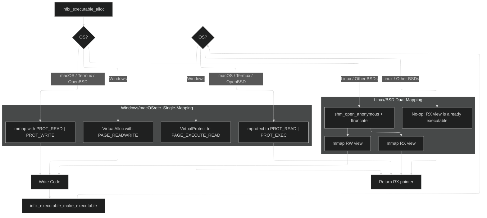

# infix FFI: Internals Documentation

This document provides a deep dive into the architecture and internal workings of `infix`. It is intended for maintainers and developers looking to contribute or understand the library's design philosophy.

## Core Design Philosophy

The architecture of `infix` is the result of a series of deliberate design choices aimed at balancing performance, security, and developer ergonomics.

### Guiding Principles

Three high-level principles guide the library's development:

1.  **Security First:** An FFI library with a JIT engine is a prime target for security vulnerabilities. We proactively defend against these with a multi-layered approach: strict W^X memory, hardened integer arithmetic against overflows, guard pages for freed code, and read-only callback contexts. All complex components are subjected to continuous fuzz testing.
2.  **Performance by Design:** FFI overhead must be minimal. The API is intentionally designed to separate the expensive, one-time **generation cost** from the near-zero **call-time cost**. This encourages users to cache trampolines, making the FFI overhead negligible in high-performance applications.
3.  **Abstraction and Portability:** Platform- and ABI-specific logic is strictly isolated behind a clean internal interface (the "ABI spec" v-tables). This allows the core trampoline engine to remain platform-agnostic, which dramatically simplifies maintenance and makes porting to new architectures a clear, well-defined process.

### Key Architectural Decisions

#### The Unity Build

`infix` is designed to be built as a single translation unit. The top-level `src/infix.c` file simply `#include`s all other core `.c` files.

*   **Rationale**:
    1.  **Simplicity of Integration:** A user can add `src/infix.c` and the `include` directory to their project, and it will build without complex makefiles.
    2.  **Potential for Optimization:** Compiling the entire library as a single unit gives the compiler maximum visibility, enabling more aggressive inlining and interprocedural optimizations.
    3.  **Encapsulation:** Because most functions are declared `static`, we avoid polluting the global namespace of the final object file. The `trampoline.c` file is key, as it includes the ABI-specific `.c` files directly, ensuring their internal functions remain private.

#### API Naming: The `infix_` Prefix

*   **The Decision:** All public symbols use the `infix_` or `INFIX_` prefix.
*   **Rationale:** This is for **safety and responsible ecosystem citizenship**. The most popular C FFI library, `libffi`, uses the `ffi_` prefix. By using a distinct prefix, `infix` guarantees it will never cause name clashes or ODR (One Definition Rule) violations in projects that link against both libraries. This prevents a class of subtle, difficult-to-diagnose crashes.

#### Memory Safety by Default: The Arena-Based Manual API

*   **The Decision:** The low-level, "manual" API for creating `infix_type` objects is **exclusively arena-based**.
*   **Rationale:** The old rule—"the library takes ownership on success, the caller owns on failure"—is a notorious source of memory leaks. By forcing the use of an arena, we eliminate this entire class of bugs. The user's responsibility is simplified to a single pattern: create an arena, perform all type creations, and destroy the arena once. This is safer, more consistent, and often faster than repeated calls to `malloc`.

#### Callbacks: The Power of the Universal Context

*   **The Decision:** All user-provided C callback handlers **always** receive a pointer to their `infix_context_t` as their first argument.
*   **Rationale:** This prioritizes power and API simplicity.
    1.  **Power by Default:** It allows every callback to be stateful, which is essential for adapting to C libraries that don't provide a `void* user_data` parameter. A stateless handler can simply ignore the context.
    2.  **API Safety:** A single, consistent pattern for all callbacks is safer and easier to learn than offering two different modes (`callback` vs. `closure`), which would inevitably lead to users providing the wrong kind of handler and causing stack corruption.
    3.  **Industry Precedent:** This closure-based model is the standard pattern used by all major FFI libraries.

#### ABI Dispatch: V-Tables for Cross-Platform Fuzzing

*   **The Decision:** The core `trampoline.c` engine dispatches to ABI-specific logic via a v-table (a struct of function pointers like `infix_forward_abi_spec`).
*   **Rationale:** While using `#ifdef` blocks to compile in only one ABI seems simpler, it destroys our ability to easily test all ABIs on a single platform. The v-table design allows us to compile the library on a single Linux machine with the logic for the **Windows x64**, **System V AMD64**, and **AArch64** ABIs all present in the same binary. Our fuzzers can then use the `INFIX_FORCE_ABI_*` macros to dynamically select which v-table to test. This is an incredibly powerful and efficient way to ensure the entire library is robust across all supported platforms.

#### The Self-Contained Object Model

*   **The Decision:** Both `infix_forward_t` and `infix_reverse_t` are designed as **self-contained objects**. When a trampoline is created, it performs a **deep copy** of all the `infix_type` metadata it needs into its own private, internal memory arena.
*   **Rationale:** This prioritizes memory safety and API simplicity. It completely eliminates a class of use-after-free bugs where the user might destroy the arena used for type creation while a trampoline still points to it. It also enables a safe introspection API, as the type information is guaranteed to be valid for the entire lifetime of the trampoline handle. The trade-off is a slightly higher memory footprint per trampoline, which is acceptable for the vast majority of applications.

#### Platform Macros: An Internal Affair

*   **The Decision:** All platform-detection logic has been moved out of the public `infix.h` and into an internal header, `src/common/infix_config.h`.
*   **Rationale:** The public API is a stable contract. The internal detection macros are an implementation detail that we must be free to change without breaking user code. This prevents tight coupling and keeps the public API surface clean.

---

## Architectural Overview

The library can be broken down into five main layers:

1.  **Public API Layer (`infix.h`, `signature.c`)**: The user-facing interface, providing both a high-level Signature API and a low-level Manual API.
2.  **Type System (`types.c`)**: Describes the data types used in function signatures.
3.  **Executable Memory Manager (`executor.c`)**: Handles the allocation and protection of memory for JIT-compiled code.
4.  **ABI Abstraction Layer (`infix_internals.h`)**: Defines the v-table interfaces (`infix_forward_abi_spec`, `infix_reverse_abi_spec`) that connect the generic engine to platform-specific logic.
5.  **Trampoline Generator (`trampoline.c`)**: The core engine that uses the other layers to build the final machine code.

### 1. API Layers: Signature vs. Manual

`infix` provides two distinct APIs for creating trampolines.

#### The Signature API (`infix_forward_create`, etc.)

This is the recommended high-level API. It uses a self-contained mini-language to describe C types. The parser allocates all `infix_type` objects from a temporary internal arena, generates the trampoline, and then immediately destroys the arena. The user never has to manage `infix_type` memory.

**Signature API Example: Describing a Packed Struct**
```c
// Describe a packed struct with the Signature API:
const char* signature = "!{id:uint16, name:char, flags:uint32}";

// A trampoline can then be created in one line:
// infix_forward_create(&t, "(*!{...}) -> void");
```

#### The Manual API (`infix_type_create_*`, `infix_forward_create_manual`)

This is the foundational, low-level API. It is **exclusively Arena-Based**. The user is responsible for creating an arena, allocating all types from it, and destroying the arena when finished.

**Manual API Example: Describing a Struct**
```c
// Describe: struct Point { double x; double y; };
infix_arena_t* arena = infix_arena_create(4096);

infix_struct_member members[] = {
    infix_type_create_member("x", infix_type_create_primitive(INFIX_PRIMITIVE_DOUBLE), offsetof(Point, x)),
    infix_type_create_member("y", infix_type_create_primitive(INFIX_PRIMITIVE_DOUBLE), offsetof(Point, y))
};
infix_type* point_type = NULL;
infix_type_create_struct(arena, &point_type, members, 2);

// 'point_type' is valid only for the lifetime of the arena.
infix_arena_destroy(arena);
```

### 2. The Signature Parser (`signature.c`)

This component is a recursive-descent parser that translates the signature string into an `infix_type` object graph. It is hardened against stack overflow from malicious input (`MAX_RECURSION_DEPTH`) and uses a sticky error state for clean and fast failure.

### 3. Executable Memory Management and Security (`executor.c`)

The library implements multiple layers of security to protect against common JIT vulnerabilities.

##### Write XOR Execute (W^X)
A memory region is never simultaneously writable and executable. The implementation strategy varies by platform for maximum security and compatibility:



##### Guard Pages and Read-Only Contexts
To mitigate use-after-free bugs, `infix_executable_free` turns freed memory into a non-accessible "guard page." Additionally, after a reverse trampoline's context is created, its memory is made read-only to prevent runtime corruption.

### 4. The Trampoline Engine and ABI Dispatch (`trampoline.c`)

The core `trampoline.c` is the ABI-agnostic orchestrator. It uses the `infix_forward_abi_spec` and `infix_reverse_abi_spec` v-tables to delegate all platform-specific work.

#### Forward Call Trampoline Flow

```mermaid
graph TD
    subgraph "Setup Phase (infix_forward_create)"
        A[User calls API with signature] --> B(Parse Signature);
        B --> C{prepare_forward_call_frame};
        C --> D[Generate Prologue];
        D --> E[Generate Argument Moves];
        E --> F[Generate Call Instruction];
        F --> G[Generate Epilogue];
        G --> H[Copy code to executable memory];
        H --> I[Return callable cif_func];
    end

    subgraph "Call Phase (cif_func(...))"
        J[User calls cif_func] --> K(Prologue: Set up stack);
        K --> L(Argument Marshalling);
        L --> M(Validate target_func != NULL);
        M --> N[call native_func];
        N --> O(Epilogue: Handle return, restore stack);
        O --> P[Return to User];
    end
```



### 5. Code Generation and Emitters (`*_emitters.c`)

The actual machine code is generated by a set of low-level "emitter" functions, specific to each architecture (e.g., `abi_x64_emitters.c`, `abi_arm64_emitters.c`).

*   **Encapsulation:** Emitters completely encapsulate the complexity of machine code encoding (opcodes, ModR/M bytes, etc.). The higher-level ABI logic thinks in terms of abstract operations like "move this register to memory."
*   **Clarity:** Emitter function names map directly to the assembly instruction they produce (e.g., `emit_mov_reg_mem` generates `mov r64, [mem]`).
*   **Safety:** The emitters operate on a `code_buffer` struct, which handles automatic resizing, preventing buffer overflows during JIT compilation.

---

## ABI Internals

This section provides a low-level comparison of the ABIs supported by `infix`.

| Feature                      | System V AMD64 (Linux, macOS)                                   | Windows x64                                                    | AArch64 (ARM64)                                                 |
| ---------------------------- | --------------------------------------------------------------- | -------------------------------------------------------------- | --------------------------------------------------------------- |
| **Integer/Pointer Args**     | 6 GPRs: `RDI, RSI, RDX, RCX, R8, R9`                            | 4 GPRs: `RCX, RDX, R8, R9` (Shared slots)                      | 8 GPRs: `X0` - `X7`                                             |
| **Floating-Point Args**      | 8 XMMs: `XMM0` - `XMM7` (Separate pool)                         | 4 XMMs: `XMM0` - `XMM3` (Shared slots)                         | 8 VPRs: `V0` - `V7` (Separate pool)                             |
| **Struct/Union Passing**     | **Recursive Classification**. Passed in GPRs, XMMs, or both.    | **By Reference** if size is not 1, 2, 4, or 8 bytes.             | **By Reference** if size > 16 bytes. HFAs passed in VPRs.       |
| **Return by Hidden Pointer** | If struct > 16 bytes or classified as MEMORY. Pointer in `RDI`. | If struct size is not 1, 2, 4, or 8. Pointer in `RCX`.         | If struct > 16 bytes. Pointer in `X8`.                          |
| **Return Value Registers**   | `RAX` (int), `RAX:RDX` (int pair), `XMM0` (float), `st(0)` (ld) | `RAX` (int/struct), `XMM0` (float)                             | `X0` (int), `X0:X1` (int pair), `V0` (float/HFA)                |
| **Variadic `printf` Rule**   | `AL` must contain the number of XMM registers used.             | Floating-point variadic args are passed in GPRs *and* XMMs.    | Standard: no special rule. Apple: All variadic args on stack.   |
| **Stack Alignment**          | 16-byte boundary before `call`.                                 | 16-byte boundary before `call`.                                | 16-byte boundary.                                               |
| **Shadow Space**             | No. Has a 128-byte "red zone" below `RSP`.                      | Yes, caller allocates 32 bytes on stack for the callee.        | No.                                                             |

---

## The Debugging Guide

This guide is for maintainers who need to debug the low-level machine code generated by `infix`.

### Method 1: Static Analysis with `infix_dump_hex`

The simplest way to see what the JIT is producing is to enable `INFIX_DEBUG_ENABLED` in your build and observe the hexdump output from `infix_dump_hex`, which is called automatically at the end of trampoline creation in debug builds.

```# My Forward Trampoline (size: 78 bytes)
#   0x0000: 55 48 89 e5 41 54 41 55  41 56 41 57 49 89 cc 49 | UH..ATAUAVAWI..I
#   0x0010: 89 d5 4d 89 c6 48 81 ec  20 00 00 00 4c 89 e9 4d | ..M..H.. ...L..M
#   ...
```

### Method 2: Live Debugging with GDB/LLDB

This is the most powerful method. It allows you to step through the JIT'd code one instruction at a time.

1.  **Get the Address**: Print the address of the executable code right after it's generated.
    ```c
    infix_cif_func cif_func = (infix_cif_func)infix_forward_get_code(trampoline);
    printf("DEBUG: Trampoline generated at address: %p\n", (void*)cif_func);
    ```
2.  **Run Under Debugger**: `gdb ./my_test_executable`
3.  **Set Breakpoint**: Use the printed address to set a breakpoint: `(gdb) b *0x7ffff7fde000`
4.  **Trigger and Disassemble**: Run the program. When it breaks, use `disassemble` to view the JIT code.
5.  **Step and Verify**: Use `stepi` (step instruction) and `info registers` to walk through the code and check register values.

---

## External ABI Documentation

*   **System V AMD64 ABI:** [https://github.com/hjl-tools/x86-psABI/wiki/x86-64-psABI-1.0.pdf](https://github.com/hjl-tools/x86-psABI/wiki/x86-64-psABI-1.0.pdf)
*   **Microsoft Windows x64 ABI:** [https://docs.microsoft.com/en-us/cpp/build/x64-calling-convention](https://docs.microsoft.com/en-us/cpp/build/x64-calling-convention)
*   **ARM 64-bit (AArch64) ABI:** [https://developer.arm.com/documentation/ihi0055/latest/](https://developer.arm.com/documentation/ihi0055/latest/)
*   **Apple ARM64 Specifics:** [https://developer.apple.com/documentation/xcode/writing-arm64-code-for-apple-platforms](https://developer.apple.com/documentation/xcode/writing-arm64-code-for-apple-platforms)
