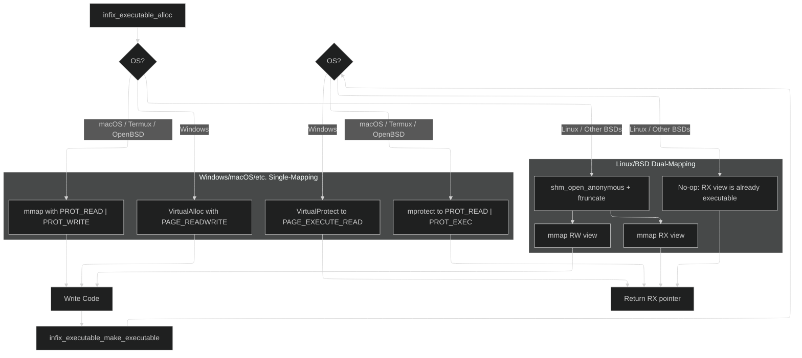

# infix FFI: Internals Documentation

This document provides a deep dive into the architecture and internal workings of `infix`. It's a little disorganized but is intended for maintainers and developers looking to contribute or understand the library's design philosophy.

## Core Design Philosophy

The architecture of `infix` is the result of deliberate design choices aimed at balancing performance, security, and developer ergonomics.

1.  **Security First:** An FFI library with a JIT engine is a prime target for security vulnerabilities. We proactively defend against these with a multi-layered approach: strict W^X memory, hardened integer arithmetic against overflows, guard pages for freed code, and read-only callback contexts. All complex components are subjected to continuous fuzz testing.
2.  **Performance by Design:** FFI overhead must be minimal. The API is intentionally designed to separate the expensive, one-time **generation cost** from the near-zero **call-time cost**. This encourages users to cache trampolines, making the FFI overhead negligible in high-performance applications.
3.  **Abstraction and Portability:** Platform- and ABI-specific logic is strictly isolated behind a clean internal interface (the "ABI spec" v-tables). This allows the core trampoline engine to remain platform-agnostic, which dramatically simplifies maintenance and makes porting to new architectures a clear, well-defined process.

---

## Architectural Overview

The library can be broken down into five main layers:

1.  **Public API Layer (`infix.h`, `signature.c`)**: The user-facing interface, providing both a high-level Signature API and a low-level Core API.
2.  **Type System (`types.c`)**: Describes the data types used in function signatures.
3.  **Executable Memory Manager (`executor.c`)**: Handles the allocation and protection of memory for JIT-compiled code.
4.  **ABI Abstraction Layer (`infix_forward_abi_spec`, `infix_reverse_abi_spec`)**: A pair of v-table interfaces that define how to handle a specific calling convention.
5.  **Trampoline Generator (`trampoline.c`)**: The core engine that uses the other layers to build the final machine code.

### 1. API Layers: Core vs. Signature

`infix` provides two distinct APIs for creating trampolines. Understanding their trade-offs is key to using the library effectively.

#### The Core API (`infix_type_create_*`, `infix_forward_create_manual`)

This is the foundational, low-level API. It offers maximum power and flexibility and is designed for performance-critical applications or dynamic environments where type information is not known until runtime.

*   **Purpose**: To programmatically construct C types at runtime. This is essential for language bindings that introspect C headers or for dynamically marshalling data.
*   **Mechanism**: The user acts as a "builder," creating `infix_type` objects for primitives and composing them into more complex aggregates like structs, unions, and arrays.
*   **Memory Management**: **Exclusively Arena-Based**. To eliminate a major class of memory management bugs, the Manual API *requires* an `infix_arena_t*`. All `infix_type` objects created for a given task are allocated from this arena. The user is responsible for calling `infix_arena_destroy` once to free all associated memory. The old, error-prone `infix_type_destroy` function is no longer part of the public API.

**Core API Example: Describing a Packed Struct**

```c
#pragma pack(push, 1)
typedef struct { uint16_t id; char name; uint32_t flags; } PackedData;
#pragma pack(pop)

// To describe this with the Core API:
infix_type* create_packed_data_type(infix_arena_t* arena) {
    // 1. Create the inner array type first, from the arena.
    infix_type* char_array_type = NULL;
    infix_type_create_array(arena, &char_array_type, infix_type_create_primitive(INFIX_PRIMITIVE_UINT8), 10);

    // 2. Allocate the list of members from the arena.
    infix_struct_member* members = infix_arena_alloc(arena, sizeof(infix_struct_member) * 3, _Alignof(infix_struct_member));
    members = infix_type_create_member(NULL, infix_type_create_primitive(INFIX_PRIMITIVE_UINT16), offsetof(PackedData, id));
    members = infix_type_create_member(NULL, char_array_type, offsetof(PackedData, name));
    members = infix_type_create_member(NULL, infix_type_create_primitive(INFIX_PRIMITIVE_UINT32), offsetof(PackedData, flags));

    // 3. Create the final packed struct type, also from the arena.
    infix_type* packed_type = NULL;
    infix_type_create_packed_struct(arena, &packed_type, sizeof(PackedData), _Alignof(PackedData), members, 3);

    return packed_type; // This pointer is valid only for the lifetime of the arena.
}
```

#### The Signature API (`infix_forward_create`, `infix_reverse_create`)

This is the high-level API, designed for convenience, readability, and safety. It is the recommended choice for over 99% of use cases.

*   **Purpose**: To create trampolines from a concise, declarative string when the C function's signature is known at compile-time or can be determined from configuration.
*   **Mechanism**: It uses a self-contained mini-language to describe C types. The `infix_signature_parse` and `infix_type_from_signature` functions implement a recursive-descent parser that translates this string into the required `infix_type` object graph.
*   **Memory Management**: **Automatic**. The parser allocates all necessary `infix_type` objects from a temporary internal arena. The high-level `infix_forward_create` and `infix_reverse_create` functions create this arena, use it to generate the trampoline, and then immediately destroy the arena, freeing all the blueprint objects. The user never has to manage `infix_type` memory.

**Signature API Example: Describing the Same Packed Struct**
```c
#include <infix.h>
#include <stdio.h>

// To describe the same struct with the Signature API:
char* create_packed_data_signature() {
    static char signature;
    // Note the primitive codes: t=ushort, c=char, j=uint
    snprintf(signature, sizeof(signature), "p(%zu,%zu){t@%zu,c@%zu,j@%zu}",
             sizeof(PackedData), _Alignof(PackedData),
             offsetof(PackedData, id), offsetof(PackedData, name), offsetof(PackedData, flags));
    return signature;
}

// A trampoline can then be created in one line for a function taking a pointer to it:
// infix_forward_create(&t, strcat(create_packed_data_signature(), "*=>y"));
```
The comparison clearly shows that the Signature API is far more productive and less error-prone for any signature that can be expressed as a string.

### 2. The Signature Parser (`signature.c`)

This component is the engine behind the Signature API.

*   **Strategy**: It uses a recursive-descent approach. The main entry point, `parse_type`, acts as a dispatcher based on the current character in the signature string (e.g., `[` calls `parse_array`, `{` calls `parse_aggregate`). This allows for natural handling of complex nested types.
*   **Named Fields**: The aggregate parsers use a lookahead technique to distinguish between an unnamed type (`{i,d}`) and a named field (`{id:i,val:d}`). It tentatively parses an identifier, then peeks at the next character. If it's a colon (`:`), it's a named field; otherwise, it rewinds and parses the identifier as part of a type.
*   **Function Pointer Parsing**: When the parser encounters a function pointer signature like `(i=>v)`, it performs a recursive parse. It isolates the inner signature string (`i=>v`) and calls the main `infix_signature_parse` function on that substring. The result is a detailed `infix_type` of category `INFIX_TYPE_REVERSE_TRAMPOLINE`, which contains the full type information for the function pointer's arguments and return value. For ABI purposes, this `infix_type` still has the size and alignment of a standard `void*`.

#### Parser Error Handling and Security
The parser is a primary attack surface and is hardened accordingly.
*   **Sticky Errors**: A `parser_state_t` struct is passed through all parsing functions. If any function encounters a syntax error, it sets `state->error` and returns `NULL`. All other functions check this flag on entry and abort immediately if it's set, ensuring a clean and fast failure.
*   **Recursion Guard**: To prevent stack overflow vulnerabilities from maliciously crafted signatures (e.g., `{{{{...}}}}`), all recursive parsing functions (`parse_type`, `parse_aggregate`, etc.) track their current recursion depth. If the depth exceeds the `MAX_RECURSION_DEPTH` constant, parsing is aborted with an error. This vulnerability was discovered and fixed thanks to fuzz testing.

### 3. The Type System (`types.c`)

The `infix_type` struct is the cornerstone of the library. It provides the generator with the metadata (size, alignment, and composition) needed to correctly handle arguments and return values.

*   **Static vs. Dynamic Types**: Primitives (`int`, `float`, `void*`) are represented by static, singleton `infix_type` instances to avoid allocations. Complex types (structs, unions, arrays) are dynamically allocated from an arena and must not be freed individually.
*   **Rich Pointers**: A pointer type contains a `pointee_type` field, allowing the type system to represent not just a generic pointer, but a `pointer to int` or a `pointer to struct`, which is crucial for introspection.
*   **Compiler-Specific Nuances**: The type system is aware of compiler-specific type aliases. For example, it knows that `long double` on MSVC and Clang for Windows is an 8-byte alias for `double`, and returns the canonical `double` type to ensure correct ABI classification.
*   **Security**: The type creation functions (`infix_type_create_struct`, etc.) contain explicit checks to prevent integer overflows.

### 4. Executable Memory Management and Security (`executor.c`)

The library implements multiple layers of security to protect against common JIT vulnerabilities.

##### Write XOR Execute (W^X)
A memory region is never simultaneously writable and executable. The implementation strategy varies by platform for maximum security and compatibility:



##### Guard Pages for Freed Trampolines
To mitigate use-after-free vulnerabilities, `infix_executable_free` does not immediately release the memory. Instead, it changes its protection to `PROT_NONE` (no read/write/execute). This turns a subtle vulnerability into a safe, immediate, and obvious crash if a dangling function pointer is ever called.

##### Read-Only Callback Contexts
The `infix_reverse_t` struct contains function pointers that could be targeted by memory corruption attacks. After a callback context is fully initialized, the memory page containing it is made read-only using `mprotect`/`VirtualProtect`.

### 5. The ABI Abstraction Layer and Trampoline Generator (`trampoline.c`)

The core of the library's portability is the separation of concerns via two v-table structs: `infix_forward_abi_spec` and `infix_reverse_abi_spec`. The `trampoline.c` engine is the consumer of these specs. It orchestrates the entire JIT process, from classifying the signature to emitting the final machine code.

#### Trampoline Generation Flow

##### Forward Call Trampoline


##### Reverse Call Trampoline (Callbacks)


## A Note on the "Unity" Build

`infix` is designed to be built as a single translation unit (a "unity build"). The top-level `src/infix.c` file does not contain logic; it is simply a list of `#include` directives for all the other `.c` files in the `src/core/` directory.

**Why use a unity build?**

1.  **Simplicity of Integration:** It makes compiling the library trivial. A user can simply add `infix.c` and the `include` directory to their project, and it will build without any complex makefiles or build scripts.
2.  **Potential for Optimization:** Compiling the entire library as a single unit gives the compiler maximum visibility. This can enable more aggressive inlining and interprocedural optimizations, potentially leading to a smaller and faster final library.
3.  **Encapsulation:** Because all functions can be declared `static` within their respective files (except for the public API), we avoid polluting the global namespace of the final object file. The only symbols exported are the public `infix_*` functions. The `trampoline.c` file is a key part of this, as it includes the ABI-specific `.c` files directly, ensuring their internal functions remain private to the library.

---

## infix ABI Internals

This document provides a low-level technical comparison of the Application Binary Interfaces (ABIs) supported by infix. It is intended for maintainers and contributors working within the `abi/` directory.

### Comparative Overview

The following table summarizes the key differences in calling conventions between the supported 64-bit ABIs.

| Feature                      | System V AMD64 (Linux, macOS)                                   | Windows x64                                                    | AArch64 (ARM64)                                                 |
| ---------------------------- | --------------------------------------------------------------- | -------------------------------------------------------------- | --------------------------------------------------------------- |
| **Integer/Pointer Args**     | 6 GPRs: `RDI, RSI, RDX, RCX, R8, R9`                            | 4 GPRs: `RCX, RDX, R8, R9` (Shared slots)                      | 8 GPRs: `X0` - `X7`                                             |
| **Floating-Point Args**      | 8 XMMs: `XMM0` - `XMM7` (Separate pool)                         | 4 XMMs: `XMM0` - `XMM3` (Shared slots)                         | 8 VPRs: `V0` - `V7` (Separate pool)                             |
| **Struct/Union Passing**     | **Recursive Classification**. Passed in GPRs, XMMs, or both.    | **By Reference** if size is not 1, 2, 4, or 8 bytes.             | **By Reference** if size > 16 bytes. HFAs passed in VPRs.       |
| **Return by Hidden Pointer** | If struct > 16 bytes or classified as MEMORY. Pointer in `RDI`. | If struct size is not 1, 2, 4, or 8. Pointer in `RCX`.         | If struct > 16 bytes. Pointer in `X8`.                          |
| **Return Value Registers**   | `RAX` (int), `RAX:RDX` (int pair), `XMM0` (float), `st(0)` (ld) | `RAX` (int/struct), `XMM0` (float)                             | `X0` (int), `X0:X1` (int pair), `V0` (float/HFA)                |
| **Variadic `printf` Rule**   | `AL` must contain the number of XMM registers used.             | Floating-point variadic args are passed in GPRs *and* XMMs.    | Standard: `AL` rule. Apple: All variadic args on the stack. |
| **Stack Alignment**          | 16-byte boundary before `call`.                                 | 16-byte boundary before `call`.                                | 16-byte boundary.                                               |
| **Shadow Space**             | No. Has a 128-byte "red zone" below `RSP`.                      | Yes, caller allocates 32 bytes on stack for the callee.        | No.                                                             |

### Deep Dive: System V AMD64 Aggregate Classification

*File: `abi_sysv_x64.c`*

The System V ABI has the most complex rules for passing aggregates (structs/unions). The logic is implemented in `classify_aggregate_sysv` and `classify_recursive`.

*   **Eightbytes**: An aggregate up to 16 bytes is conceptually split into one or two 8-byte chunks called "eightbytes".
*   **Classification**: Each field of the struct is examined recursively. Its type determines the class of the eightbyte(s) it falls into.
    *   `INTEGER`: The eightbyte contains integer types, pointers, or a mix of integer and float. It will be passed in a GPR.
    *   `SSE`: The eightbyte contains only `float` or `double` types. It will be passed in an XMM register.
    *   `MEMORY`: The aggregate is too large (> 16 bytes), contains unaligned fields, or contains special types like `long double`. It must be passed on the stack.
*   **Result**: This classification can result in a single struct being passed across two different register types (e.g., one GPR and one XMM), which is handled by the `ARG_LOCATION_GPR_SSE_PAIR` logic.

### Deep Dive: Windows x64 By-Reference Rule

*File: `abi_win_x64.c`*

The Windows x64 ABI uses a much simpler rule for aggregates, implemented in the `is_passed_by_reference` helper.

*   **Power-of-Two Rule**: An aggregate (or even a primitive like `long double`) is passed **by reference** (a pointer is passed in a GPR) if its size in bytes is **not** 1, 2, 4, or 8.
*   **Shared Slots**: The first four argument "slots" are used for both GPRs and XMMs. For a function `void(int, double, int, double)`, the arguments are passed in `RCX`, `XMM1`, `R8`, and `XMM3`. `RDX` (the second GPR slot) and `XMM0` (the first XMM slot) are skipped because the slots were consumed by arguments of a different type.

### Deep Dive: AArch64 Homogeneous Floating-point Aggregates (HFA)

*File: `abi_arm64.c`*

The ARM64 ABI has a special rule for compact structs containing only floating-point types, implemented in the `is_hfa` function.

*   **Definition**: An HFA is a struct or array containing 1 to 4 elements of the *exact same* floating-point type (`float` or `double`), even if nested. For example, `struct Point { double x, y; }; struct Line { Point p1; Point p2; }` is an HFA of four `double`s.
*   **Passing**: If a type is identified as an HFA, it is passed directly in up to four consecutive Vector/FP Registers (`V0`-`V7`), instead of by reference. This is a significant performance optimization.
*   **Apple ABI Divergence**: A critical platform-specific rule is handled for macOS on AArch64: all variadic arguments are passed on the stack. The standard AAPCS64 passes them in registers if available. This is handled by a preprocessor check in `prepare_forward_call_frame_arm64`.

---

## The Debugging Guide

This guide is for library maintainers and advanced contributors who need to debug the low-level machine code generated by `infix`.

### Introduction

Debugging Just-In-Time compiled code can feel like black magic. The code you're stepping through doesn't exist in any source file; it's a raw sequence of bytes in an executable memory page. However, with the right tools and techniques, it's entirely manageable.

This guide covers the two primary methods for inspecting the machine code generated by infix: using the built-in `infix_dump_hex` utility and stepping through the code live with a debugger like GDB or WinDbg.

### Method 1: Static Analysis with `infix_dump_hex`

The simplest way to see what the JIT is producing is to print it. infix provides a `infix_dump_hex` utility (in `utility.h`) that is enabled in debug builds.

After you generate a trampoline, you can access its internal `exec` handle and print the contents of its executable memory region.

```c
#include <infix.h>
#include <utility.h> // Required for infix_dump_hex

// The handle is opaque in the public API, but for debugging, you can
// temporarily expose the infix_forward_t struct in infix.h
if (trampoline) {
    infix_dump_hex(trampoline->exec.rx_ptr, trampoline->exec.size, "My Trampoline");
}
```
This will produce a detailed hexdump of the generated machine code, which you can then compare against an instruction set reference for your architecture (e.g., the Intel/AMD developer manuals or the ARM Architecture Reference Manual).

```
# My Forward Trampoline (size: 78 bytes)
#   0x0000: 55 48 89 e5 41 54 41 55  41 56 41 57 49 89 cc 49 | UH..ATAUAVAWI..I
#   0x0010: 89 d5 4d 89 c6 48 81 ec  20 00 00 00 4c 89 e9 4d | ..M..H.. ...L..M
#   ...
```

### Method 2: Live Debugging with GDB (Linux/macOS)

This is the most powerful method. It allows you to step through the JIT'd code one instruction at a time and inspect the state of the CPU registers.

Let's say you've found a failure that you think is a bug in infix itself. Let's imagine a trampoline that wraps `int(int, int)` is failing. The arguments seem to be corrupted. These are the steps I would take:

1.  **Get the Address**: Print the address of the executable code right after it's generated.

       ```c
        infix_cif_func cif_func = (infix_cif_func)infix_forward_get_code(trampoline);
        printf("DEBUG: Trampoline generated at address: %p\n", (void*)cif_func);
        fflush(stdout);
       ```

2.  **Run Under GDB**: `gdb ./my_test_executable`

3.  **Set Breakpoint**:  Use the address you printed in step 1 to set a breakpoint. The `*` is crucial—it tells GDB to set a breakpoint on the memory address itself, not on a symbol.

       ```gdb
        (gdb) run
        # Your program will run and print the address
        DEBUG: Trampoline generated at address: 0x7ffff7fde000

        # Now, set the breakpoint
        (gdb) b *0x7ffff7fde000
        Breakpoint 1 at 0x7ffff7fde000
       ```
4.  **Trigger and Disassemble**: Run the program. When it breaks, use `disassemble` to view the JIT code.

       ```gdb
        # After the cif_func() is called in your C code...
        Breakpoint 1, 0x00007ffff7fde000 in ?? ()
        (gdb) disassemble
        Dump of assembler code for function 0x7ffff7fde000:
        => 0x00007ffff7fde000:  push   %rbp
           0x00007ffff7fde001:  mov    %rsp,%rbp
           0x00007ffff7fde004:  push   %r12
           ...
        End of assembler dump.
       ```

5.  **Step and Verify**: Use `stepi` (step instruction) and `info registers` to walk through the code and check register values before the `call` instruction. At that point, all the argument registers (`rdi`, `rsi`, `xmm0`, etc.) should contain the correct values you passed in.

       ```gdb
        (gdb) # ... stepi until you are right before the call ...
        (gdb) info registers rdi rsi
        rdi            0x2a          42
        rsi            0x64          100
        # If the values here are correct, your trampoline code is likely correct.
        # If they are wrong, you can step backward to see where the wrong value was loaded.
       ```

### Method 3: Live Debugging with WinDbg (Windows)

The process on Windows is conceptually identical but uses different commands (`bp` to set breakpoint, `u` to unassemble, `r` to view registers, `t` to trace/step).

1.  **Get the Address**: Same as with GDB, print the address of the trampoline.

2.  **Run Under WinDbg**: `windbg.exe my_failing_test.exe`

3.  **Set a Breakpoint**: Use the `bp` command.

       ```
        0:000> g ; Go until the address is printed
        DEBUG: Trampoline generated at address: 0x1ff0a70000
        0:000> bp 0x1ff0a70000
       ```

4.  **Trigger the Trampoline**: Let the program continue with `g`. It will break at your JIT code's entry point.

5.  **Unassemble and Inspect**: Use `u` (unassemble) to view the code and `r` (registers) to view the CPU state.

       ```
        0:000> u .
        my_failing_test!0x1ff0a70000:
        000001ff`0a700000 55              push    rbp
        000001ff`0a700001 4889e5          mov     rbp,rsp
        ...
        0:000> r
        rax=... rcx=... rdx=...
       ```

6.  **Step**: Use `t` (trace) to step through one instruction at a time. Check the argument registers (`rcx`, `rdx`, `r8`, `r9`, `xmm0-3`) right before the final `call` instruction.

By using these techniques, you can demystify the JIT compilation process and effectively debug even the most complex ABI and code generation issues.

---

## External ABI Documentation

The current `infix` implementations are based on the official ABI documents for each platform.

*   **System V AMD64 ABI:**
    *   [Main Specification (PDF)](https://github.com/hjl-tools/x86-psABI/wiki/x86-64-psABI-1.0.pdf)
*   **Microsoft Windows x64 ABI:**
    *   [Official Microsoft Documentation](https://docs.microsoft.com/en-us/cpp/build/x64-calling-convention)
*   **ARM 64-bit (AArch64) ABI (AAPCS64):**
    *   [Official ARM Developer Documentation](https://github.com/ARM-software/abi-aa/releases/download/2025Q1/aapcs32.pdf)
    *   [Writing ARM64 code for Apple platforms](https://developer.apple.com/documentation/xcode/writing-arm64-code-for-apple-platforms)

### A Cross-Language Type Reference

Getting the types right is the most critical part of FFI. A mismatch between the `infix_type` you describe and the actual type used by the library function can lead to stack corruption, crashes, or silent data corruption.

**The Golden Rule**: Always use explicit, fixed-width types when possible. `<stdint.h>` in C is your best friend. Relying on types like `long` is risky, as it can be 32-bit on some 64-bit platforms (like Windows) and 64-bit on others (like Linux).

The following table maps infix's primitive type enums to their corresponding types in C and other common languages.

| infix `infix_primitive_type_id`    | C (`<stdint.h>`) | C++         | Rust                | Go (`import "C"`)  | Swift       | Zig         | Fortran (`iso_c_binding`) |
| -------------------------------- | ---------------- | ----------- | ------------------- | ------------------ | ----------- | ----------- | ------------------------- |
| `INFIX_PRIMITIVE_BOOL`        | `_Bool`          | `bool`      | `bool`              | `C.bool`           | `CBool`     | `bool`      | `logical(c_bool)`         |
| `INFIX_PRIMITIVE_SINT8`       | `int8_t`         | `int8_t`    | `i8`                | `C.schar`          | `CChar`     | `i8`        | `integer(c_signed_char)`  |
| `INFIX_PRIMITIVE_UINT8`       | `uint8_t`        | `uint8_t`   | `u8`                | `C.uchar`          | `CUnsignedChar` | `u8`      | `integer(c_char)`         |
| `INFIX_PRIMITIVE_SINT16`      | `int16_t`        | `int16_t`   | `i16`               | `C.short`          | `CShort`    | `i16`       | `integer(c_short)`        |
| `INFIX_PRIMITIVE_UINT16`      | `uint16_t`       | `uint16_t`  | `u16`               | `C.ushort`         | `CUnsignedShort` | `u16`     | `integer(c_unsigned_short)` |
| `INFIX_PRIMITIVE_SINT32`      | `int32_t`        | `int32_t`   | `i32`               | `C.int`            | `CInt`      | `i32`       | `integer(c_int)`          |
| `INFIX_PRIMITIVE_UINT32`      | `uint32_t`       | `uint32_t`  | `u32`               | `C.uint`           | `CUnsignedInt` | `u32`     | `integer(c_unsigned_int)` |
| `INFIX_PRIMITIVE_SINT64`      | `int64_t`        | `int64_t`   | `i64`               | `C.longlong`       | `CLongLong` | `i64`       | `integer(c_long_long)`    |
| `INFIX_PRIMITIVE_UINT64`      | `uint64_t`       | `uint64_t`  | `u64`               | `C.ulonglong`      | `CUnsignedLongLong` | `u64`   | `integer(c_unsigned_long_long)` |
| `INFIX_PRIMITIVE_SINT128`¹    | `__int128_t`     | `__int128_t`| `i128`              | **N/A**            | **N/A**     | `i128`      | **N/A**                   |
| `INFIX_PRIMITIVE_UINT128`¹    | `__uint128_t`    | `__uint128_t`| `u128`             | **N/A**            | **N/A**     | `u128`      | **N/A**                   |
| `INFIX_PRIMITIVE_FLOAT`       | `float`          | `float`     | `f32`               | `C.float`          | `CFloat`    | `f32`       | `real(c_float)`           |
| `INFIX_PRIMITIVE_DOUBLE`      | `double`         | `double`    | `f64`               | `C.double`         | `CDouble`   | `f64`       | `real(c_double)`          |
| `INFIX_PRIMITIVE_LONG_DOUBLE`²| `long double`    | `long double`| **N/A**            | `C.longdouble`     | `CLongDouble` | `f80`/`f128`| `real(c_long_double)`     |
| **Pointer Type**                 | `void*`          | `void*`     | `*mut T` / `*const T` | `unsafe.Pointer` | `UnsafeMutableRawPointer` | `*T` | `type(c_ptr)` |

#### Common Windows Type Definitions

The Windows API uses a large number of `typedef`s for C primitives. This table helps map them to the correct infix types. All types are for 64-bit Windows.

| Windows Type  | Underlying C Type         | Recommended infix `infix_type`                             | Notes                                                              |
| ------------- | ------------------------- | -------------------------------------------------------- | ------------------------------------------------------------------ |
| `HANDLE`      | `void*`                   | `infix_type_create_pointer()`                              | Base type for most OS objects (files, processes, etc.).            |
| `HMODULE`     | `HANDLE`                  | `infix_type_create_pointer()`                              | Handle to a loaded DLL.                                            |
| `HWND`        | `HANDLE`                  | `infix_type_create_pointer()`                              | Handle to a window.                                                |
| `HCALL`       | `HANDLE`                  | `infix_type_create_pointer()`                              | A generic handle type.                                             |
| `DWORD`       | `unsigned long` (32-bit)  | `infix_type_create_primitive(INFIX_PRIMITIVE_UINT32)`   | A 32-bit unsigned integer.                                         |
| `UINT`        | `unsigned int` (32-bit)   | `infix_type_create_primitive(INFIX_PRIMITIVE_UINT32)`   | A 32-bit unsigned integer.                                         |
| `HRESULT`     | `long` (32-bit)           | `infix_type_create_primitive(INFIX_PRIMITIVE_SINT32)`   | A 32-bit signed integer for success/failure codes.                 |
| `SIZE_T`      | `unsigned __int64` (64-bit) | `infix_type_create_primitive(INFIX_PRIMITIVE_UINT64)` | The native unsigned integer for sizes.                             |
| `LPCSTR`      | `const char*`             | `infix_type_create_pointer()`                              | Pointer to a null-terminated 8-bit ANSI string.                    |
| `LPCWSTR`     | `const wchar_t*`          | `infix_type_create_pointer()`                              | Pointer to a null-terminated 16-bit UTF-16 string.                 |
| `UINT128`     | `struct { uint64_t, uint64_t }` | `infix_type` for a struct of two `UINT64`s.                | This is **not** a primitive. It must be described as a struct. |

**Notes & Pitfalls:**

1.  **128-bit Integers**: `__int128_t` is a non-standard compiler extension, primarily available in GCC and Clang. It is not supported by MSVC. Many other languages do not have a C-compatible 128-bit integer type.
2.  **`long double`**: This is the most dangerous type for FFI. Its size and representation vary wildly:
    *   On x86-64 Linux, it's typically an 80-bit extended-precision float.
    *   On AArch64 Linux, it's a 128-bit quadruple-precision float.
    *   On Windows (MSVC and Clang), it is simply an alias for `double` (64 bits).
    *   On macOS (x86-64 and AArch64), it is also just an alias for `double`.
    infix's `infix_type_create_primitive` correctly aliases it to `DOUBLE` on platforms where they are the same, but you must be certain the library you are calling uses a distinct `long double` type.
3.  **Variadic `float`**: When you call a variadic C function (one with `...`), any `float` argument is automatically **promoted** to a `double`. You must use `INFIX_PRIMITIVE_DOUBLE` in your infix type signature for that argument.

---

## Core Design Philosophy

The architecture of `infix` is not accidental. It is the result of a series of deliberate design choices aimed at balancing performance, security, and developer ergonomics. This section explains the "why" behind some of the most important architectural decisions.

### Guiding Principles

Three high-level principles guide the library's development:

1.  **Security First:** An FFI library, especially one with a JIT engine, is a prime target for security vulnerabilities. We proactively defend against these with a multi-layered approach, including strict W^X memory, hardened integer arithmetic against overflows, guard pages for freed code, and read-only callback contexts. All complex components are subjected to continuous fuzz testing.
2.  **Performance by Design:** We recognize that FFI overhead must be minimal. The API is intentionally designed to separate the expensive, one-time **generation cost** from the near-zero **call-time cost**. This encourages users to cache trampolines, making the FFI overhead negligible in high-performance applications.
3.  **Abstraction and Portability:** Platform- and ABI-specific logic is strictly isolated behind a clean internal interface (the "ABI spec" v-tables). This allows the core trampoline engine to remain platform-agnostic, which dramatically simplifies maintenance and makes porting to new architectures a clear, well-defined process.

### API Naming: The `infix_` Prefix

**The Decision:** All public symbols (functions, typedefs, enums, macros) exposed by `infix.h` use the `infix_` or `INFIX_` prefix.

**The Rationale:** This choice is primarily for **safety and responsible ecosystem citizenship**.
-   **Avoiding Namespace Collisions:** The most popular C FFI library is `libffi`. It is a system-level component on many platforms and is used internally by the runtimes of Python, Ruby, Go, and others. `libffi` uses the `ffi_` prefix for all its symbols (e.g., `ffi_type`, `ffi_prep_cif`). If `infix` also used the `ffi_` prefix, it would create a high risk of name clashes and ODR (One Definition Rule) violations in any project that happened to link against both `infix` and a library that depends on `libffi`. This would lead to subtle, difficult-to-diagnose crashes and stack corruption.
-   **Clarity and Branding:** Using `infix_` makes the code self-documenting. When a developer sees `infix_forward_create`, they know exactly which library is providing that function. It also enhances discoverability in IDEs with code completion.

**The Trade-off:** The `infix_` prefix is slightly more verbose than a shorter alternative. This is an insignificant cost compared to the enormous benefit of guaranteeing namespace safety.

### Memory Safety by Default: The Arena-Based Manual API

**The Decision:** The low-level, "manual" API for creating `infix_type` objects is **exclusively arena-based**. The old, `malloc`-based functions with their complex ownership semantics have been removed from the public API.

**The Rationale:** The single most dangerous part of a complex C API is manual memory management. The old rule—"the library takes ownership of pointers on success, but the caller owns them on failure"—is a well-known and notorious source of memory leaks and double-frees.
-   **Eliminating User Error:** By forcing the use of an arena, we eliminate this entire class of bugs. The user's responsibility is simplified to a single pattern: create an arena, perform all type creations, use the types to generate a trampoline, and then destroy the arena. It is no longer possible to leak an individual `infix_type` object.
-   **Consistency:** This decision makes the manual API's memory model consistent with the high-level Signature API, which already used an arena internally. The entire library now operates on the same, simple memory philosophy.
-   **Performance:** For creating complex type graphs, arena allocation is significantly faster than repeated calls to `malloc`.

**The Trade-off:** The user must now manage an `infix_arena_t` object. This is a small price to pay for guaranteed memory safety and a simpler API.

### Callbacks: The Power of the Universal Context

**The Decision:** All user-provided C callback handlers **always** receive a pointer to their `infix_reverse_t` (aliased as `infix_context_t`) as their first argument. There is no "stateless" callback mode.

**The Rationale:** This decision prioritizes power and API simplicity over minor syntactic convenience.
-   **Power by Default:** The context-passing model is a strict superset of a stateless model. It allows every callback to be stateful by default, which is essential for adapting to C libraries that don't provide a `void* user_data` parameter. A stateless handler can be trivially implemented by simply ignoring the context argument.
-   **API Simplicity and Safety:** Providing a single, consistent pattern for all callbacks is far safer and easier to learn than offering two different modes (`callback` vs. `closure`). A dual API would inevitably lead to users providing the wrong kind of handler for the creation function they called, resulting in guaranteed stack corruption. The universal context pattern eliminates this entire class of bugs.
-   **Industry Precedent:** This closure-based model is the standard pattern used by all major FFI libraries (`libffi`, `dyncall`, etc.) because it is the only one powerful enough for real-world use cases. `infix`'s choice to pass the context as the *first* argument (rather than last) is a deliberate ergonomic choice that mirrors the `this`/`self` convention in object-oriented programming.

### ABI Dispatch: V-Tables for Cross-Platform Fuzzing

**The Decision:** The core `trampoline.c` engine dispatches to ABI-specific logic via a v-table (a struct of function pointers, `infix_forward_abi_spec`). It does not use `#ifdef` blocks to compile in only one ABI's implementation at a time.

**The Rationale:** While a "true unity build" that uses the preprocessor to select a single implementation of a function like `prepare_forward_call_frame` might seem simpler, it has one massive, deal-breaking drawback: it destroys our ability to easily test all ABIs on a single platform.
-   **Enabling Cross-Platform Testing:** The v-table design allows us to compile the library on a single Linux machine with the logic for the **Windows x64 ABI**, the **System V AMD64 ABI**, and the **AArch64 ABI** all present in the same binary. Our test suite can then use the `INFIX_FORCE_ABI_*` macros to dynamically select which v-table to use for a given test.
-   **High-Value Fuzzing:** This means we can run our fuzzers on a Linux CI server and have them continuously test for bugs in the Windows and AArch64 ABI classification and code-generation logic without ever needing to spin up a Windows or ARM build agent. This is an incredibly powerful and efficient way to ensure the entire library is robust and secure across all supported platforms.

**The Trade-off:** This approach adds a single layer of indirection (a function pointer call) in the *trampoline generation* code and makes `trampoline.c` slightly more verbose. This has zero impact on the performance of the final JIT-compiled code and is a tiny price to pay for the massive strategic advantage of comprehensive, multi-platform testing in a single environment.

### The Self-Contained Object Model: Trading Memory for Safety

**The Decision:** Both `infix_forward_t` and `infix_reverse_t` are designed as **self-contained objects**. When a trampoline is created, it performs a **deep copy** of all the `infix_type` metadata it needs into its own private, internal memory arena.

**The Rationale:** This architecture is a deliberate trade-off that prioritizes memory safety and API simplicity above all else.

1.  **Elimination of Use-After-Free:** The primary motivation is to solve a critical dangling pointer problem. Without this model, a user would create types in a temporary arena, create a trampoline that points to them, and then destroy the arena, leaving the trampoline in a dangerously invalid state. By making an internal copy, the trampoline's lifetime is completely decoupled from the user's temporary data. The user can and should destroy their arena immediately after creation.
2.  **Enabling Safe Introspection:** The introspection API (`infix_forward_get_arg_type`, etc.) would not be possible without this model. It can only work if the type information is guaranteed to be valid for the entire lifetime of the trampoline handle.
3.  **Simplified Memory Management for the User:** The user's responsibility is clear: they manage their own arenas for type creation, and they manage the trampoline handles. The two are independent.

**The Trade-off: Memory Overhead**

The cost of this safety is a higher memory footprint per trampoline. Each handle now contains its own private arena (which automatically adjusts to usage) to store the type graph. For several hundred trampolines, this can add a few megabytes to the application's memory usage.

This is considered an acceptable cost for the vast majority of applications (desktop, server, language runtimes) where the benefit of guaranteed memory safety far outweighs the modest increase in RAM usage. For highly constrained embedded environments, future versions of the library may offer a "tuned" creation function that allows the user to specify a smaller internal arena size.

---

## Design Philosophy: A Stable Public API

A core design goal of `infix` is to provide a stable, clean, and professional public API. A key part of this is the strict separation between the library's **public contract** and its **internal implementation details**.

### Platform Macros: An Internal Affair

In previous versions, the main public header, `infix.h`, contained a large and complex block of preprocessor macros for detecting the operating system, CPU architecture, and compiler (e.g., `INFIX_OS_WINDOWS`, `INFIX_ARCH_X64`).

**This logic has been moved out of the public API and into an internal header, `src/common/infix_config.h`.**

**Rationale:**

1.  **The Public API is a Contract:** The functions and types in `infix.h` are a promise to the user. We guarantee their stability across minor versions. The internal platform-detection macros, however, are an implementation detail. We must reserve the right to change, rename, or refactor them as we discover better detection methods or add new platforms. Exposing them in the public header would effectively make them part of our public contract, making the library brittle and harder to maintain.

2.  **Preventing Tight Coupling:** A user's application should not be dependent on its dependencies' internal logic. If a user needs to write platform-specific code, they should use their own project's detection mechanisms, not piggyback on ours. Forcing them to do so leads to a healthier, more decoupled software ecosystem. For example, a user should never be encouraged to write `#if defined(INFIX_OS_LINUX)` in their own code.

3.  **Minimizing API Surface Area:** A clean public header is easier to read, understand, and use. It should contain only what the consumer of the library needs to know. Hiding hundreds of lines of preprocessor logic makes the API much less intimidating for a new developer.

**For Contributors:**

Library contributors **should** use these internal macros for writing ABI- and platform-specific code. They are made available to all internal `.c` files via the `infix_internals.h` header, which includes `infix_config.h`. The primary macros available are:
*   **OS:** `INFIX_OS_WINDOWS`, `INFIX_OS_MACOS`, `INFIX_OS_LINUX`, etc.
*   **Architecture:** `INFIX_ARCH_X64`, `INFIX_ARCH_AARCH64`.
*   **ABI:** `INFIX_ABI_WINDOWS_X64`, `INFIX_ABI_SYSV_X64`, `INFIX_ABI_AAPCS64`.
*   **Compiler:** `INFIX_COMPILER_MSVC`, `INFIX_COMPILER_CLANG`, `INFIX_COMPILER_GCC`.

---

## Core Design Philosophy: The JIT Compiler vs. The Call VM

A key architectural choice in `infix` is its use of a Just-in-Time (JIT) compiler to generate trampolines, rather than using a set of pre-compiled assembly stubs, a model often called a "Call VM" or "Interpreter" and used by libraries like `dyncall`. This decision was deliberate and has profound implications for the library's API design, performance characteristics, and intended use cases.

### The Alternative: The Call VM / Interpreter Model (e.g., `dyncall`)

In a Call VM model, the library provides a set of low-level functions to build a function call piece by piece. The process typically looks like this:
1.  Create a "call virtual machine" object.
2.  Push arguments one by one (`dcArgInt(...)`, `dcArgDouble(...)`, etc.).
3.  Execute the call (`dcCallInt(...)`, `dcCallDouble(...)`, etc.).
4.  Reset the VM so that it's ready for the next call.

**Pros:**
-   **Simplicity:** The core engine can be smaller and simpler.
-   **No Executable Memory:** This approach doesn't require allocating memory with `rwx` permissions, which can be an advantage in highly restrictive environments.

**Cons:**
-   **Per-Call Overhead:** The logic to read the argument list and place values into the correct registers or on the stack is executed **every single time** the function is called. This interpretive overhead can be significant in hot loops.
-   **The Type System Duplication Problem:** This is the most significant ergonomic drawback. To handle complex types like structs, the user must describe the struct's layout to the FFI library using a series of API calls (e.g., `dcNewAggr`, `dcAggrField`). The user is now forced to maintain **two parallel representations of the same data structure**: the native C `struct` definition in their code, and a description of that `struct` built manually for the FFI library. Keeping these two representations in sync is tedious and a major source of bugs.

### The `infix` Approach: The JIT Compiler Model

`infix` takes a different approach. It uses its `infix_type` system as a **single source of truth**.
1.  The user describes the *entire* function signature once, either via a signature string or the manual API.
2.  `infix` analyzes this complete signature and JIT-compiles a tiny, highly-specialized C function—the trampoline—that is purpose-built for that exact signature.

**Pros:**
-   **Extremely Low Call-Time Overhead:** Once generated, calling an `infix` trampoline is nearly as fast as a direct C function call. All the complex logic for argument placement is compiled into efficient, native machine code. The overhead is paid once, at generation time.
-   **A Single Source of Truth for Types:** The `infix_type` system is the cornerstone of the entire library. The same `infix_type` graph used to generate the trampoline can also be used for **introspection**. This completely solves the type system duplication problem. A developer can write a single function that takes an `infix_type*` and can use it to:
    -   Generate a trampoline.
    -   Dynamically pack data from a scripting language into a C struct buffer.
    -   Generate a schema for a user interface or a serializer.
    -   Validate data.
-   **Ergonomics:** For the end-user, the complexity is hidden behind a single call: `infix_forward_create("({int, *double}, *char) -> int", ...)``.

**The Trade-off:** The upfront cost of trampoline generation is higher than a single interpreted call, and it requires allocating executable memory. This makes `infix`'s design philosophy clear: it is optimized for applications where a trampoline is **generated once and called many times**, and for systems that benefit from a **powerful, introspectable type system**.

---

## Code Generation and Emitters

The actual machine code is generated by a set of low-level "emitter" functions, specific to each architecture (e.g., `abi_x64_emitters.c`, `abi_riscv64_emitters.c`).

-   **Encapsulation:** The emitters completely encapsulate the complexity of machine code encoding. The higher-level ABI logic (e.g., `abi_sysv_x64.c`) does not deal with opcodes, ModR/M bytes, or REX prefixes. It thinks in terms of abstract operations like "move this register to memory."
-   **Clarity:** Emitter function names map directly to the assembly instruction they produce (e.g., `emit_mov_reg_mem` generates `mov r64, [mem]`).
-   **Safety:** The emitters operate on a `code_buffer` struct, which handles automatic resizing of the memory buffer, preventing buffer overflows during JIT compilation.

**Example: Emitting `mov rax, [rbp - 16]` on x86-64**

```c
// In the ABI logic (e.g., abi_sysv_x64.c):
emit_mov_reg_mem(buf, RAX_REG, RBP_REG, -16);

// Inside abi_x64_emitters.c, this function assembles the bytes:
void emit_mov_reg_mem(code_buffer* buf, x64_gpr dest, x64_gpr src_base, int32_t offset) {
    // 1. Emit REX prefix for 64-bit operation and extended registers.
    emit_rex_prefix(buf, 1, dest >= R8_REG, 0, src_base >= R8_REG);
    // 2. Emit the MOV opcode.
    emit_byte(buf, 0x8B);
    // 3. Emit the ModR/M byte to specify the registers and addressing mode.
    emit_modrm(buf, ...);
    // 4. Emit the 8-bit or 32-bit displacement (offset).
    emit_int32(buf, offset);
}
```

This separation makes the ABI logic easier to read and allows the low-level encoding details to be managed and verified in one place.

## Design Philosophy: Key Architectural Decisions

### The Unity Build

`infix` is designed to be built as a single translation unit. The top-level `src/infix.c` file simply `#include`s all other core `.c` files.

*   **Rationale**:
    1.  **Simplicity of Integration:** A user can add `infix.c` and the `include` directory to their project, and it will build without complex makefiles.
    2.  **Potential for Optimization:** Compiling the entire library as a single unit gives the compiler maximum visibility, enabling more aggressive inlining and interprocedural optimizations.
    3.  **Encapsulation:** Because most functions are declared `static`, we avoid polluting the global namespace of the final object file. The `trampoline.c` file is key, as it includes the ABI-specific `.c` files directly, ensuring their internal functions remain private.

### API Naming: The `infix_` Prefix

*   **The Decision:** All public symbols use the `infix_` or `INFIX_` prefix.
*   **Rationale:** This is for **safety and responsible ecosystem citizenship**. The most popular C FFI library, `libffi`, uses the `ffi_` prefix. By using a distinct prefix, `infix` guarantees it will never cause name clashes or ODR (One Definition Rule) violations in projects that link against both libraries. This prevents a class of subtle, difficult-to-diagnose crashes.

### Memory Safety by Default: The Arena-Based Manual API

*   **The Decision:** The low-level, "manual" API for creating `infix_type` objects is **exclusively arena-based**.
*   **Rationale:** The old rule—"the library takes ownership on success, the caller owns on failure"—is a notorious source of memory leaks. By forcing the use of an arena, we eliminate this entire class of bugs. The user's responsibility is simplified to a single pattern: create an arena, perform all type creations, and destroy the arena once. This is safer, more consistent, and often faster than repeated calls to `malloc`.

### Callbacks: The Power of the Universal Context

*   **The Decision:** All user-provided C callback handlers **always** receive a pointer to their `infix_context_t` as their first argument.
*   **Rationale:** This prioritizes power and API simplicity.
    1.  **Power by Default:** It allows every callback to be stateful, which is essential for adapting to C libraries that don't provide a `void* user_data` parameter. A stateless handler can simply ignore the context.
    2.  **API Safety:** A single, consistent pattern for all callbacks is safer and easier to learn than offering two different modes (`callback` vs. `closure`), which would inevitably lead to users providing the wrong kind of handler and causing stack corruption.
    3.  **Industry Precedent:** This closure-based model is the standard pattern used by all major FFI libraries because it is the only one powerful enough for real-world use cases.

### ABI Dispatch: V-Tables for Cross-Platform Fuzzing

*   **The Decision:** The core `trampoline.c` engine dispatches to ABI-specific logic via a v-table (a struct of function pointers like `infix_forward_abi_spec`).
*   **Rationale:** While using `#ifdef` blocks to compile in only one ABI seems simpler, it destroys our ability to easily test all ABIs on a single platform. The v-table design allows us to compile the library on a single Linux machine with the logic for the **Windows x64**, **System V AMD64**, and **AArch64** ABIs all present in the same binary. Our fuzzers can then use the `INFIX_FORCE_ABI_*` macros to dynamically select which v-table to test. This is an incredibly powerful and efficient way to ensure the entire library is robust across all supported platforms.

### Platform Macros: An Internal Affair

*   **The Decision:** All platform-detection logic has been moved out of the public `infix.h` and into an internal header, `src/common/infix_config.h`.
*   **Rationale:**
    1.  **Public API is a Contract:** The functions in `infix.h` are a stable promise. The internal detection macros are an implementation detail that we must be free to change without breaking user code.
    2.  **Preventing Tight Coupling:** A user's application should use its own detection mechanisms, not piggyback on ours. This leads to a healthier, decoupled ecosystem.
    3.  **Minimizing API Surface Area:** A clean public header is easier to read and understand.

---

# License and Legal

Copyright (c) 2025 Sanko Robinson

This documentation is licensed under the Creative Commons Attribution 4.0 International License (CC BY 4.0). You are free to share and adapt this material for any purpose, provided you give appropriate credit.

For the full license text, see the [LICENSE-CC](LICENSE-CC) file or visit [https://creativecommons.org/licenses/by/4.0/](https://creativecommons.org/licenses/by/4.0/).
