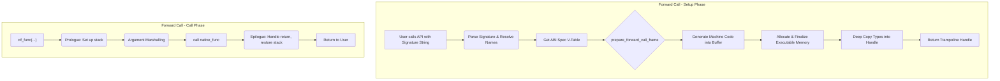
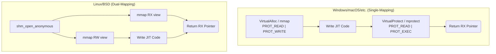
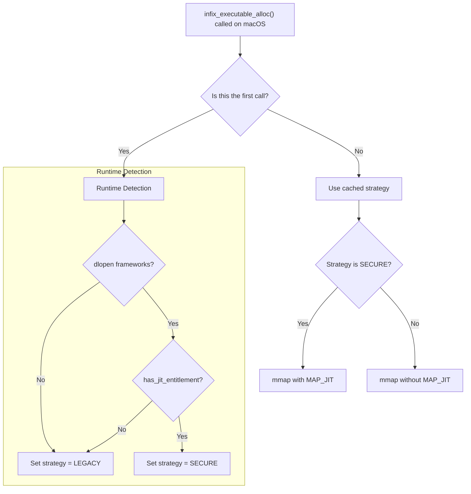

# Architectural Notes

This document provides a deep dive into the architecture and internal workings of `infix`. It is intended for maintainers, contributors, and advanced users who wish to understand the library's design philosophy, core mechanics, security features, and ABI implementations.

## 1. Core Design Philosophy

The architecture of `infix` is the result of a series of deliberate design choices aimed at balancing performance, security, and developer ergonomics.

### 1.1 Guiding Principles

Three high-level principles guide the library's development:

1.  **Security First:** An FFI library with a JIT engine is a prime target for vulnerabilities. We proactively defend against these with a multi-layered approach: strict W^X memory, hardened integer arithmetic, guard pages for freed code, and read-only callback contexts. All complex components are subjected to continuous fuzz testing.
2.  **Performance by Design:** FFI overhead must be minimal. The API is intentionally designed to separate the expensive, one-time **generation cost** from the near-zero **call-time cost**. This encourages users to cache trampolines, making the FFI overhead negligible in high-performance applications.
3.  **Abstraction and Portability:** Platform- and ABI-specific logic is strictly isolated behind a clean internal interface (the "ABI spec" v-tables). This allows the core trampoline engine to remain platform-agnostic, which dramatically simplifies maintenance and makes porting to new architectures a clear, well-defined process.

### 1.2 Key Architectural Decisions

#### The Unity Build
`infix` is designed to be built as a single translation unit. The top-level `src/infix.c` file simply `#include`s all other core `.c` files.
*   **Rationale**:
    1.  **Simplicity of Integration:** A user can add `src/infix.c` and the `include` directory to their project, and it will build without complex makefiles.
    2.  **Potential for Optimization:** Compiling the entire library as a single unit gives the compiler maximum visibility, enabling more aggressive inlining and interprocedural optimizations.
    3.  **Encapsulation:** Because most functions are declared `static`, we avoid polluting the global namespace. The `trampoline.c` file is key, as it includes the ABI-specific `.c` files directly, ensuring their internal functions remain private.

#### The Self-Contained Object Model
Both `infix_forward_t` and `infix_reverse_t` are designed as **self-contained objects**. When a trampoline is created, it performs a **deep copy** of all the `infix_type` metadata it needs into its own private, internal memory arena.
*   **Rationale:** This prioritizes memory safety and API simplicity. It completely eliminates a class of use-after-free bugs where a user might destroy an arena used for type creation while a trampoline still points to it. It also enables a safe introspection API, as the type information is guaranteed to be valid for the entire lifetime of the trampoline handle.

#### Arena-Based Manual API
The low-level, "manual" API for creating `infix_type` objects is **exclusively arena-based**.
*   **Rationale:** The old rule—"the library takes ownership on success, the caller owns on failure"—is a notorious source of memory leaks. By forcing the use of an arena, we eliminate this entire class of bugs. The user's responsibility is simplified to a single pattern: create an arena, perform all type creations, and destroy the arena once.

#### A Dual-Model API for Callbacks and Closures
The reverse call API is built on a dual model to serve two distinct audiences with different needs.
*   **Rationale:** C/C++ developers prioritize type safety and ergonomics, while language binding authors prioritize low-level control for manual data marshalling. Instead of forcing one model on both, `infix` provides a dedicated API for each.
    *   **The Type-Safe "Callback" (`infix_reverse_create_callback`)**: Designed for C/C++ developers. The user provides a normal, type-safe C function (e.g., `int my_handler(infix_context_t*, int, int)`). Internally, `infix` generates a *cached forward trampoline* to bridge the gap between the generic internal dispatcher and the user's type-safe code. This provides compile-time checking and maximum readability at the cost of slightly higher memory usage and a few nanoseconds of overhead.
    *   **The Generic "Closure" (`infix_reverse_create_closure`)**: Designed for language bindings. The user provides a single generic handler (`void handler(infix_context_t*, void* ret, void** args)`). The JIT-compiled stub calls this handler directly after marshalling arguments into a `void**` array. This is more efficient and gives the binding author the raw pointers needed to unbox data into their host language's objects.

---

## 2. Architectural Overview

The library can be broken down into five main layers:

1.  **Public API Layer (`infix.h`, `trampoline.c`)**: The user-facing interface, providing both a high-level Signature API (`infix_forward_create`, etc.) and a low-level Manual API (`infix_forward_create_manual`, etc.). The high-level functions are wrappers that live in `trampoline.c` alongside their manual counterparts.
2.  **Type System (`types.c`, `signature.c`, `registry.c`)**: Describes the data types used in function signatures, including the signature parser and the named type registry.
3.  **Trampoline Engine (`trampoline.c`)**: The core, ABI-agnostic orchestrator that uses the other layers to build the final machine code.
4.  **ABI Abstraction Layer (`infix_internals.h`, `arch/...`)**: Defines the v-table interfaces (`infix_..._abi_spec`) and provides the concrete, platform-specific implementations.
5.  **OS Abstraction Layer (`executor.c`)**: Handles the allocation and protection of memory for JIT-compiled code and contains the universal callback dispatcher.

### The Forward Trampoline Generation Pipeline

The process of creating a forward trampoline, from signature to executable code, follows a clear pipeline:

1.  **Parsing & Resolution:** `infix_forward_create` receives a signature string, which the parser builds into a temporary, possibly unresolved, graph of `infix_type` objects. If a registry is provided, the **resolver** walks the graph and replaces `@Name` placeholders.
2.  **Layout Calculation:** The resolved type graph is passed to the Trampoline Engine, which selects the correct ABI spec and calls its `prepare_forward_call_frame` function to produce a complete layout blueprint.
3.  **Code Generation:** The engine calls the ABI spec's code generation functions (`generate_*_prologue`, etc.) in sequence, appending machine code to a buffer.
4.  **Memory Finalization:** The generated code is copied to a new page of W^X-compliant executable memory.
5.  **Handle Creation:** A final `infix_forward_t` handle is allocated, containing its own private arena into which a deep copy of the type graph is made, making the handle a safe, self-contained object.



### The Reverse Trampoline (Callback/Closure) Pipeline

The reverse call pipeline is more complex, as it supports two distinct handler models.

1.  **API Call & Path Selection:** The user calls either `infix_reverse_create_callback` (for a type-safe C handler) or `infix_reverse_create_closure` (for a generic handler). This choice determines the path.
2.  **Parsing & Resolution:** The signature is parsed and resolved as with forward calls.
3.  **(Conditional) Forward Trampoline Generation:** If creating a "callback", a **cached forward trampoline** is generated for the user's type-safe handler. This step is skipped for a "closure".
4.  **Layout & Code Generation:** The ABI spec's `prepare_reverse_call_frame` and code generation functions are called to create the JIT-compiled assembly stub. This stub is identical for both paths; its only job is to marshal native arguments into a `void**` array and call the universal C dispatcher.
5.  **Call-Time Dispatch:** When the native function pointer is called, it executes the JIT stub. The C dispatcher then inspects the context: if a `cached_forward_trampoline` exists, it uses it to call the type-safe handler; otherwise, it directly invokes the generic closure handler.

```mermaid
graph TD
    subgraph "Reverse Call - Setup Phase"
        A[User calls API with Signature] --> B(Parse Signature & Resolve Names);
        B --> C{Callback or Closure?};
        C -->|Callback| D[Generate Cached Forward Trampoline];
        C -->|Closure| E[Common Path];
        D --> E;
        E --> F{prepare_reverse_call_frame};
        F --> G[Generate JIT Stub Code];
        G --> H[Allocate & Finalize Executable Memory];
        H --> I[Deep Copy Types & Finalize Context];
        I --> J[Return Context Handle];
    end

    subgraph "Reverse Call - Call Phase"
        K[Native Call] --> L(JIT Stub: Marshal args to void**);
        L --> M[Call C Dispatcher];
        M --> N{context->cached_forward_trampoline != NULL?};
        N -->|"Yes (Callback)"| O[Use Fwd Trampoline to call Type-Safe Handler];
        N -->|"No (Closure)"| P[Directly call Generic Handler];
        O --> Q(Return to Dispatcher);
        P --> Q;
        Q --> R(Return to JIT Stub);
        R --> S(Epilogue: Handle return, restore stack);
        S --> T[Return to Native Caller];
    end
```




---

## 3. Security Features Deep Dive

### 3.1 Write XOR Execute (W^X)

A memory region is never simultaneously writable and executable. The implementation strategy varies by platform for maximum security and compatibility:



### 3.2 Guard Pages and Read-Only Contexts
To mitigate use-after-free bugs, `infix_executable_free` turns freed memory into a non-accessible "guard page," causing an immediate and safe crash on attempted use. Additionally, after a reverse trampoline's context is created, its memory is made read-only to prevent runtime corruption.

### 3.3 macOS JIT Hardening and the Entitlement Fallback

The implementation of W^X on macOS, particularly on Apple Silicon, is unique and requires special handling to balance security with developer convenience.

#### The Challenge: Hardened Runtimes on Apple Silicon
Apple Silicon enforces W^X at the hardware level. For a JIT engine to function correctly within a standard, distributable application (e.g., an official Python interpreter), that application **must** be built with specific permissions:
1.  The memory must be allocated with the `MAP_JIT` flag.
2.  The application must be signed with the `com.apple.security.cs.allow-jit` entitlement.
3.  Permissions must be toggled with the special `pthread_jit_write_protect_np()` function, as the standard `mprotect()` will fail.

This presents a major usability problem. Forcing every developer who uses `infix` to learn about and correctly configure linker flags (`-framework Security`, etc.) and code signing for their local test builds would create an unacceptable barrier to entry.

#### The `infix` Solution: Runtime Detection with Graceful Fallback
`infix` solves this problem by making a runtime decision. This provides the best of both worlds: security-by-default for real-world applications, and zero-configuration ease-of-use for developers.

Here is the logic, which is executed once per process:
1.  **Dynamic Linking:** On the first JIT allocation, `infix` attempts to `dlopen()` the `Security.framework` and `CoreFoundation.framework` libraries and find the necessary functions using `dlsym()`. This avoids any build-time linker dependencies.
2.  **Entitlement Check:** If the framework functions are found, `infix` checks if the currently running process has the `com.apple.security.cs.allow-jit` entitlement.
3.  **Strategy Selection:**
    *   If **both** the frameworks are available **and** the entitlement is present, a global flag is set to use the **modern, secure API path** (`MAP_JIT` and `pthread_jit_write_protect_np`). This is the path that will be taken by official interpreters like Python or Perl.
    *   If **either** step fails, the library gracefully falls back to the **legacy, insecure path** (a standard `mmap` followed by `mprotect`). This path works for unhardened developer builds (like our CI tests) because macOS runs them in a more permissive mode.

This ensures the library "just works" for developers, while automatically "leveling up" its security when run inside a properly configured application.



### 3.4 Fuzz Testing
The entire `infix` API surface, especially the signature parser and ABI classifiers, is continuously tested using `libFuzzer` and `AFL++`. The fuzzing harnesses (`fuzz/`) are designed to find memory safety violations (ASan), integer overflows (UBSan), and infinite loops (timeouts). All findings are converted into permanent regression tests.

---

## 4. ABI Internals

This section provides a low-level comparison of the ABIs supported by `infix`.

| Feature                      | System V AMD64 (Linux, macOS)                                   | Windows x64                                                    | AArch64 (ARM64)                                                 |
| ---------------------------- | --------------------------------------------------------------- | -------------------------------------------------------------- | --------------------------------------------------------------- |
| **Integer/Pointer Args**     | 6 GPRs: `RDI, RSI, RDX, RCX, R8, R9`                            | 4 GPRs: `RCX, RDX, R8, R9` (Shared slots)                      | 8 GPRs: `X0` - `X7`                                             |
| **Floating-Point Args**      | 8 XMMs: `XMM0` - `XMM7` (Separate pool)                         | 4 XMMs: `XMM0` - `XMM3` (Shared slots)                         | 8 VPRs: `V0` - `V7` (Separate pool)                             |
| **Struct/Union Passing**     | **Recursive Classification**. Passed in GPRs, XMMs/YMMs/ZMMs, or both. | **By Reference** if size is not 1, 2, 4, or 8 bytes.             | **By Reference** if size > 16 bytes. HFAs passed in VPRs.       |
| **Return by Hidden Pointer** | If struct > 16 bytes or classified as MEMORY. Pointer in `RDI`. | If struct size is not 1, 2, 4, or 8. Pointer in `RCX`.         | If struct > 16 bytes. Pointer in `X8`.                          |
| **Return Value Registers**   | `RAX` (int), `RAX:RDX` (pair), `XMM0`/`YMM0`/`ZMM0` (fp/vec), `st(0)` (ld) | `RAX` (int/struct), `XMM0` (float)                             | `X0` (int), `X0:X1` (pair), `V0` (float/HFA), `Z0` (SVE)         |
| **Variadic `printf` Rule**   | `AL` must contain the number of XMM registers used.             | Floating-point variadic args are passed in GPRs *and* XMMs.    | Standard: no special rule. Apple: All variadic args on stack.   |
| **Stack Alignment**          | 16-byte boundary before `call`.                                 | 16-byte boundary before `call`.                                | 16-byte boundary.                                               |
| **Shadow Space**             | No. Has a 128-byte "red zone" below `RSP`.                      | Yes, caller allocates 32 bytes on stack for the callee.        | No.                                                             |

---

## 5. Maintainer's Debugging Guide

### Method 1: Static Analysis with `infix_dump_hex`
The simplest way to see what the JIT is producing is to enable `INFIX_DEBUG_ENABLED=1` in your build. This will trigger a hexdump of the generated machine code after every trampoline creation.

```
# My Forward Trampoline (size: 78 bytes)
#   0x0000: 55 48 89 e5 41 54 41 55  41 56 41 57 49 89 cc 49 | UH..ATAUAVAWI..I
#   0x0010: 89 d5 4d 89 c6 48 81 ec  20 00 00 00 4c 89 e9 4d | ..M..H.. ...L..M
#   ...
```

### Method 2: Live Debugging with GDB/LLDB
This is the most powerful method. It allows you to step through the JIT'd code one instruction at a time.

1.  **Get the Address**: In your test code, print the address of the executable pointer right after it's generated.
    ```c
    infix_unbound_cif_func cif_func = infix_forward_get_code(trampoline);
    printf("DEBUG: Trampoline generated at address: %p\n", (void*)cif_func);
    ```
2.  **Run Under Debugger**: `gdb ./my_test_executable`
3.  **Set Breakpoint**: Use the printed address to set a breakpoint: `(gdb) b *0x7ffff7fde000`
4.  **Trigger and Disassemble**: Run the program. When it breaks, use `disassemble` to view the JIT code.
5.  **Step and Verify**: Use `stepi` (step instruction) and `info registers` to walk through the code and check register values.

### Useful Tools

*   **System V AMD64 ABI:** [https://github.com/hjl-tools/x86-psABI/wiki/x86-64-psABI-1.0.pdf](https://github.com/hjl-tools/x86-psABI/wiki/x86-64-psABI-1.0.pdf)
*   **Microsoft Windows x64 ABI:** [https://docs.microsoft.com/en-us/cpp/build/x64-calling-convention](https://docs.microsoft.com/en-us/cpp/build/x64-calling-convention)
*   **ARM 64-bit (AArch64) ABI:** [https://developer.arm.com/documentation/ihi0055/latest/](https://developer.arm.com/documentation/ihi0055/latest/)
*   **Apple ARM64 Specifics:** [https://developer.apple.com/documentation/xcode/writing-arm64-code-for-apple-platforms](https://developer.apple.com/documentation/xcode/writing-arm64-code-for-apple-platforms)
*   **Online Assembler/Disassembler**: [shell-storm.org](https://shell-storm.org/online/Online-Assembler-and-Disassembler/) is an invaluable tool for quickly checking instruction encodings. This isn't documentation but I couldn't have come close to getting infix off the ground without it.
