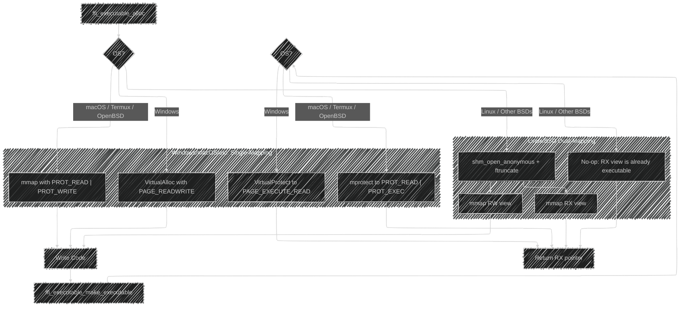

# infix FFI: Internals Documentation

This document provides a deep dive into the architecture and internal workings of `infix`. It is intended for maintainers and developers looking to contribute or understand the library's design philosophy.

## Core Design Philosophy

The library is built on three pillars:
1.  **Security:** Proactively defend against vulnerabilities common in JIT engines. This includes strict W^X memory, hardened integer arithmetic, and safe dispatch logic.
2.  **Performance:** Generate efficient machine code with minimal overhead. The public API is designed to separate the one-time setup cost (trampoline generation) from the per-call cost.
3.  **Abstraction:** Isolate platform- and ABI-specific logic behind a clean internal interface, allowing for easier maintenance and extension.

---

## infix ABI Internals

This document provides a low-level technical comparison of the Application Binary Interfaces (ABIs) supported by infix. It is intended for maintainers and contributors working within the `abi/` directory.

## Comparative Overview

The following table summarizes the key differences in calling conventions between the supported 64-bit ABIs.

| Feature                      | System V AMD64 (Linux, macOS)                                   | Windows x64                                                    | AArch64 (ARM64)                                                 |
| ---------------------------- | --------------------------------------------------------------- | -------------------------------------------------------------- | --------------------------------------------------------------- |
| **Integer/Pointer Args**     | 6 GPRs: `RDI, RSI, RDX, RCX, R8, R9`                            | 4 GPRs: `RCX, RDX, R8, R9` (Shared slots)                      | 8 GPRs: `X0` - `X7`                                             |
| **Floating-Point Args**      | 8 XMMs: `XMM0` - `XMM7` (Separate pool)                         | 4 XMMs: `XMM0` - `XMM3` (Shared slots)                         | 8 VPRs: `V0` - `V7` (Separate pool)                             |
| **Struct/Union Passing**     | **Recursive Classification**. Passed in GPRs, XMMs, or both.    | **By Reference** if size is not 1, 2, 4, or 8 bytes.             | **By Reference** if size > 16 bytes. HFAs passed in VPRs.       |
| **Return by Hidden Pointer** | If struct > 16 bytes or classified as MEMORY. Pointer in `RDI`. | If struct size is not 1, 2, 4, or 8. Pointer in `RCX`.         | If struct > 16 bytes. Pointer in `X8`.                          |
| **Return Value Registers**   | `RAX` (int), `RAX:RDX` (int pair), `XMM0` (float), `st(0)` (ld) | `RAX` (int/struct), `XMM0` (float)                             | `X0` (int), `X0:X1` (int pair), `V0` (float/HFA)                |
| **Variadic `printf` Rule**   | `AL` must contain the number of XMM registers used.             | Floating-point variadic args are passed in GPRs *and* XMMs.    | Standard: `AL` rule. Apple: All variadic args on the stack. |
| **Stack Alignment**          | 16-byte boundary before `call`.                                 | 16-byte boundary before `call`.                                | 16-byte boundary.                                               |
| **Shadow Space**             | No. Has a 128-byte "red zone" below `RSP`.                      | Yes, caller allocates 32 bytes on stack for the callee.        | No.                                                             |

## Deep Dive: System V AMD64 Aggregate Classification

*File: `abi_sysv_x64.c`*

The System V ABI has the most complex rules for passing aggregates (structs/unions). The logic is implemented in `classify_aggregate_sysv` and `classify_recursive`.

*   **Eightbytes**: An aggregate up to 16 bytes is conceptually split into one or two 8-byte chunks called "eightbytes".
*   **Classification**: Each field of the struct is examined recursively. Its type determines the class of the eightbyte(s) it falls into.
    *   `INTEGER`: The eightbyte contains integer types, pointers, or a mix of integer and float. It will be passed in a GPR.
    *   `SSE`: The eightbyte contains only `float` or `double` types. It will be passed in an XMM register.
    *   `MEMORY`: The aggregate is too large (> 16 bytes), contains unaligned fields, or contains special types like `long double`. It must be passed on the stack.
*   **Result**: This classification can result in a single struct being passed across two different register types (e.g., one GPR and one XMM), which is handled by the `ARG_LOCATION_GPR_SSE_PAIR` logic.

## Deep Dive: Windows x64 By-Reference Rule

*File: `abi_win_x64.c`*

The Windows x64 ABI uses a much simpler rule for aggregates, implemented in the `is_passed_by_reference` helper.

*   **Power-of-Two Rule**: An aggregate (or even a primitive like `long double`) is passed **by reference** (a pointer is passed in a GPR) if its size in bytes is **not** 1, 2, 4, or 8.
*   **Shared Slots**: The first four argument "slots" are used for both GPRs and XMMs. For a function `void(int, double, int, double)`, the arguments are passed in `RCX`, `XMM1`, `R8`, and `XMM3`. `RDX` (the second GPR slot) and `XMM0` (the first XMM slot) are skipped because the slots were consumed by arguments of a different type.

## Deep Dive: AArch64 Homogeneous Floating-point Aggregates (HFA)

*File: `abi_arm64.c`*

The ARM64 ABI has a special rule for compact structs containing only floating-point types, implemented in the `is_hfa` function.

*   **Definition**: An HFA is a struct or array containing 1 to 4 elements of the *exact same* floating-point type (`float` or `double`), even if nested. For example, `struct { Point p1; Point p2; }` is an HFA of four `double`s.
*   **Passing**: If a type is identified as an HFA, it is passed directly in up to four consecutive Vector/FP Registers (`V0`-`V7`), instead of by reference. This is a significant performance optimization.
*   **Apple ABI Divergence**: A critical platform-specific rule is handled for macOS on AArch64: all variadic arguments are passed on the stack. The standard AAPCS64 passes them in registers if available. This is handled by a preprocessor check in `prepare_forward_call_frame_arm64`.

---

## Architectural Overview

The library can be broken down into four main layers:

1.  **Type System (`types.c`)**: Describes the data types used in function signatures.
2.  **Executable Memory Manager (`executor.c`)**: Handles the allocation and protection of memory for JIT-compiled code.
3.  **ABI Abstraction Layer (`ffi_forward_abi_spec`, `ffi_reverse_abi_spec`)**: A pair of v-table interfaces that define how to handle a specific calling convention for forward and reverse calls.
4.  **Trampoline Generator (`trampoline.c`)**: The core engine that uses the other layers to build the final machine code.

#### 1. The Type System (`ffi_type`)

The `ffi_type` struct is the cornerstone of the library. It provides the generator with the metadata (size, alignment, and composition) needed to correctly handle arguments and return values.

*   **Static vs. Dynamic Types**: Primitives (`int`, `float`, `void*`) are represented by static, singleton `ffi_type` instances to avoid allocations. Complex types (structs, unions, arrays) are dynamically allocated and must be freed with `ffi_type_destroy`.
*   **Compiler-Specific Nuances**: The type system is aware of compiler-specific type aliases. For example, it knows that `long double` on MSVC and Clang for Windows is an 8-byte alias for `double`, and returns the canonical `double` type to ensure correct ABI classification.
*   **Security**: The type creation functions (`ffi_type_create_struct`, etc.) contain explicit checks to prevent integer overflows. They also follow a strict ownership model: if a creation function fails, the caller retains ownership of all pointers passed in and is responsible for freeing them. This model was validated and hardened using fuzz testing, which uncovered and led to the fixing of a `double-free` vulnerability in the error-handling paths.

#### 2. Executable Memory Management and Security

The library implements multiple layers of security to protect against common JIT vulnerabilities.

##### Write XOR Execute (W^X)
A memory region is never simultaneously writable and executable. The implementation strategy varies by platform for maximum security and compatibility:



##### Guard Pages for Freed Trampolines
To mitigate use-after-free vulnerabilities, `ffi_executable_free` does not immediately release the memory. Instead, it changes its protection to `PROT_NONE` (no read/write/execute). This turns a subtle vulnerability into a safe, immediate, and obvious crash if a dangling function pointer is ever called.

##### Read-Only Callback Contexts
The `ffi_reverse_trampoline_t` struct contains function pointers that could be targeted by memory corruption attacks. After a callback context is fully initialized, the memory page containing it is made read-only using `mprotect`/`VirtualProtect`. This hardening prevents runtime attacks from hijacking the control flow by overwriting these pointers.

#### 3. The ABI Abstraction Layer

The core of the library's portability is the separation of concerns via two v-table structs: `ffi_forward_abi_spec` and `ffi_reverse_abi_spec`. This design makes the logic for each direction of FFI call much clearer.

The `trampoline.c` engine calls these functions to produce the correct machine code:
*   `prepare_*_call_frame`: The "classifier". It analyzes a function signature and produces a `call_frame_layout` blueprint, detailing where each argument should be placed.
*   `generate_*_prologue`: Emits machine code to set up the stack frame and save registers.
*   `generate_*_argument_marshalling`: For reverse calls, this is the most complex step, emitting code to save incoming native arguments to a generic format. For forward calls, it does the opposite.
*   `generate_*_epilogue`: Emits code to handle the return value and tear down the stack frame.

#### 4. Trampoline Generation Flow

##### Forward Call Trampoline

This is the process of creating a `ffi_cif_func` that can call a native C function.


##### Reverse Call Trampoline (Callbacks)

This flow is more complex. We generate a native function pointer that, when called, invokes our generic C dispatcher, which in turn calls the user's C handler function. A key optimization is that the generic C dispatcher (`ffi_internal_dispatch_callback_fn_impl`) uses a **pre-generated and cached forward trampoline** to call the user's handler. This re-uses the existing secure and efficient forward call mechanism.


#### 3. The ABI Abstraction Layer

The core of the library's portability is the separation of concerns via two v-table structs: `ffi_forward_abi_spec` and `ffi_reverse_abi_spec`. This design makes the logic for each direction of FFI call much clearer.

The `trampoline.c` engine calls these functions to produce the correct machine code:
*   `prepare_*_call_frame`: The "classifier". It analyzes a function signature and produces a `call_frame_layout` blueprint, detailing where each argument should be placed.
*   `generate_*_prologue`: Emits machine code to set up the stack frame and save registers.
*   `generate_*_argument_marshalling`: For reverse calls, this is the most complex step, emitting code to save incoming native arguments to a generic format. For forward calls, it does the opposite.
*   `generate_*_epilogue`: Emits code to handle the return value and tear down the stack frame.

#### 4. Trampoline Generation Flow

##### Forward Call Trampoline

This is the process of creating a `ffi_cif_func` that can call a native C function.


##### Reverse Call Trampoline (Callbacks)

This flow is more complex. We generate a native function pointer that, when called, invokes our generic C dispatcher, which in turn calls the user's C handler function. A key optimization is that the generic C dispatcher (`ffi_internal_dispatch_callback_fn_impl`) uses a **pre-generated and cached forward trampoline** to call the user's handler. This re-uses the existing secure and efficient forward call mechanism.


---

### Detailed Trampoline Generation Flows

This section provides a detailed, step-by-step breakdown of how the four primary types of FFI calls are generated and executed.

#### 1. Standard Forward Call

**Description:** This is the most common case, used to call a standard C function like `int add(int, int)`. The process involves a one-time setup phase to generate the JIT code, followed by the execution phase each time the function is called.

**Flowchart:**


#### 2. Variadic Forward Call

**Description:** This flow is for calling a C function with a variable number of arguments, like `printf(const char*, ...)`. The process is nearly identical to a standard forward call, but with two key distinctions during generation, triggered when `num_fixed_args < num_args`.

1.  **ABI-Specific Classification:** The `prepare_forward_call_frame` function applies special ABI rules for variadic arguments (e.g., passing all variadic args on the stack for Apple AArch64, or mirroring float args in GPRs for Windows x64).
2.  **ABI-Specific Setup:** The `generate_forward_argument_moves` function may emit extra setup code required by the ABI (e.g., loading the number of used XMM registers into the `AL` register for System V x64).

**Flowchart:**


#### 3. Reverse Call (Callback)

**Description:** This flow creates a native C function pointer from a user-provided handler. The generated JIT code is a "stub" that acts as a bridge. It receives arguments in the native ABI format, translates them into the generic `void**` array format, and then calls a generic C dispatcher function. This dispatcher then uses a **cached forward trampoline** to safely call the user's C handler.

**Flowchart:**


#### 4. Variadic Reverse Call

**Description:** The library supports creating callbacks for variadic functions. The user must provide the **full, concrete signature of a specific call instance** at generation time. The library does not create a truly "open" variadic callback, but rather a JIT stub hardcoded to expect one specific set of argument types.

**How it Works:** The `generate_reverse_trampoline` function takes both `num_args` (total) and `num_fixed_args`. The `generate_reverse_argument_marshalling` implementation uses this information to correctly locate the incoming arguments based on the platform's specific ABI rules for variadic calls.

*   **System V x64 & Standard AArch64:** The standard register sequence continues for variadic arguments.
*   **Apple AArch64:** All arguments after `num_fixed_args` are read from the stack.
*   **Windows x64:** Variadic floating-point arguments are read from the GPRs where they are mirrored for `va_arg` compatibility.

**Flowchart:**


---

### Guide: Adding a New ABI

This guide provides a detailed walkthrough for adding support for a new CPU architecture and its corresponding calling convention. We will use the standard 64-bit RISC-V ABI (LP64) as our working example.

The process is broken down into eight distinct steps, from initial research to final integration and testing.

#### The Core ABI Contract

The `infix` library is designed around a clean separation of the generic engine (`trampoline.c`) from ABI-specific logic. To add a new ABI, you must provide implementations for two key v-table interfaces: `ffi_forward_abi_spec` and `ffi_reverse_abi_spec`.

*   **Input:** Your functions will receive high-level `ffi_type` descriptions. The data for arguments will be provided in a generic `void**` array.
*   **Output:** Your implementation must generate machine code that correctly marshals this generic data into the specific registers and stack layouts required by the target ABI. For reverse calls, it must do the opposite, un-marshalling from the native ABI into the generic format.

---

#### Step 8: Testing

This is the final, iterative phase.
1.  **Compile:** Build the library for a RISC-V target.
2.  **Emulate:** Run the existing test suite on a RISC-V emulator like QEMU.
3.  **Debug:** Use `DumpHex()` and a debugger (GDB) to inspect the generated machine code and step through the execution of your trampolines. Compare the generated code against the instruction set specification to ensure correctness.
4.  **Extend:** Write new tests that specifically target the unique edge cases of the RISC-V ABI (e.g., how it handles specific aggregate types).

### Debugging

To enable debugging output, define `FFI_DEBUG_ENABLED=1` when compiling. This will:
*   Enable `FFI_DEBUG_PRINTF` macros, which print detailed internal state information.
*   Enable the `DumpHex()` utility, which prints a hex dump of the generated machine code.

The library is tested with multiple sanitizers and tools, which can be run via the build script:
*   `perl build.pl memtest`: Runs the happy-path memory stress test under Valgrind.
*   `perl build.pl memtest:fault`: Runs the advanced fault-injection memory test under Valgrind.
*   `perl build.pl fuzz`: Builds the fuzzer harness to check the type system for vulnerabilities.

## 10. External ABI Documentation

The current `infix` implementations are based on the official ABI documents for each platform.

*   **System V AMD64 ABI:**
    *   [Main Specification (PDF)](https://github.com/hjl-tools/x86-psABI/wiki/x86-64-psABI-1.0.pdf)
*   **Microsoft Windows x64 ABI:**
    *   [Official Microsoft Documentation](https://docs.microsoft.com/en-us/cpp/build/x64-calling-convention)
*   **ARM 64-bit (AArch64) ABI (AAPCS64):**
    *   [Official ARM Developer Documentation](https://github.com/ARM-software/abi-aa/releases/download/2025Q1/aapcs32.pdf)
    *   [Writing ARM64 code for Apple platforms](https://developer.apple.com/documentation/xcode/writing-arm64-code-for-apple-platforms)

## 11. The Debugging Guide

This guide is for library maintainers and advanced contributors who need to debug the low-level machine code generated by `infix`.

## Introduction

Debugging Just-In-Time compiled code can feel like black magic. The code you're stepping through doesn't exist in any source file; it's a raw sequence of bytes in an executable memory page. However, with the right tools and techniques, it's entirely manageable.

This guide covers the two primary methods for inspecting the machine code generated by infix: using the built-in `DumpHex` utility and stepping through the code live with a debugger like GDB or WinDbg.

## Method 1: Static Analysis with `DumpHex`

The simplest way to see what the JIT is producing is to print it. infix provides a `DumpHex` utility (in `utility.h`) that is enabled in debug builds. I built most of `infix` using this.

**How to Use It:**
After you generate a trampoline, you can access its internal `exec` handle and print the contents of its executable memory region.

```c
#include <infix.h>
#include <utility.h> // Required for DumpHex

// ... inside a test or application ...

ffi_trampoline_t* trampoline = NULL;
generate_forward_trampoline(&trampoline, ...);

// The handle is opaque in the public API, but we can access it from the
// implementation file or by temporarily modifying the header for debugging.
// Let's assume you have a way to access `trampoline->exec`.
if (trampoline) {
    DumpHex(trampoline->exec.rx_ptr, trampoline->exec.size, "My Forward Trampoline");
}
```

**What You'll See:**
This will produce a detailed hexdump of the generated machine code, which you can then compare against an instruction set reference for your architecture (e.g., the Intel/AMD developer manuals or the ARM Architecture Reference Manual).

```
# My Forward Trampoline (size: 78 bytes)
#   0x0000: 55 48 89 e5 41 54 41 55  41 56 41 57 49 89 cc 49 | UH..ATAUAVAWI..I
#   0x0010: 89 d5 4d 89 c6 48 81 ec  20 00 00 00 4c 89 e9 4d | ..M..H.. ...L..M
#   ...
```

## Method 2: Live Debugging with GDB (Linux/macOS)

This is the most powerful method. It allows you to step through the JIT'd code one instruction at a time and inspect the state of the CPU registers.

**Scenario**: A test for a `int(int, int)` signature is failing. The arguments seem to be corrupted.

**Steps**:

1.  **Get the Trampoline's Address**: In your C code, print the address of the executable code right after it's generated.

    ```c
    ffi_cif_func cif_func = (ffi_cif_func)ffi_trampoline_get_code(trampoline);
    printf("DEBUG: Trampoline generated at address: %p\n", cif_func);
    fflush(stdout); // Important!
    ```

2.  **Run Under GDB**: Start your test executable with GDB.
    `gdb ./tests/my_failing_test`

3.  **Set a Breakpoint on the Address**: Use the address you printed in step 1 to set a breakpoint. The `*` is crucial—it tells GDB to set a breakpoint on the memory address itself, not on a symbol.

    ```gdb
    (gdb) run
    # Your program will run and print the address
    DEBUG: Trampoline generated at address: 0x7ffff7fde000

    # Now, set the breakpoint
    (gdb) b *0x7ffff7fde000
    Breakpoint 1 at 0x7ffff7fde000
    ```

4.  **Trigger the Trampoline**: In your C code, make the FFI call. GDB will stop execution at the very first instruction of your JIT-compiled code.

    ```gdb
    # After the cif_func() is called in your C code...
    Breakpoint 1, 0x00007ffff7fde000 in ?? ()
    ```

5.  **Disassemble and Inspect**: Now you can see the assembly code you've generated.

    ```gdb
    (gdb) disassemble
    Dump of assembler code for function 0x7ffff7fde000:
    => 0x00007ffff7fde000:  push   %rbp
       0x00007ffff7fde001:  mov    %rsp,%rbp
       0x00007ffff7fde004:  push   %r12
       ...
    End of assembler dump.
    ```

6.  **Step and Verify**: Use `stepi` (step instruction) and `info registers` to walk through the code. The most important place to check is right before the final `call` instruction. At that point, all the argument registers (`rdi`, `rsi`, `xmm0`, etc.) should contain the correct values you passed in.

    ```gdb
    (gdb) # ... stepi until you are right before the call ...
    (gdb) info registers rdi rsi
    rdi            0x2a          42
    rsi            0x64          100
    # If the values here are correct, your trampoline code is likely correct.
    # If they are wrong, you can step backward to see where the wrong value was loaded.
    ```

## Method 3: Live Debugging with WinDbg (Windows)

The process on Windows is conceptually identical but uses different commands.

1.  **Get the Address**: Same as with GDB, print the address of the trampoline.
2.  **Run Under WinDbg**: `windbg.exe my_failing_test.exe`
3.  **Set a Breakpoint**: Use the `bp` command.

    ```
    0:000> g ; Go until the address is printed
    DEBUG: Trampoline generated at address: 0x1ff0a70000

    0:000> bp 0x1ff0a70000
    ```

4.  **Trigger the Trampoline**: Let the program continue with `g`. It will break at your JIT code's entry point.
5.  **Unassemble and Inspect**: Use `u` (unassemble) to view the code and `r` (registers) to view the CPU state.

    ```
    0:000> u .
    my_failing_test!0x1ff0a70000:
    000001ff`0a700000 55              push    rbp
    000001ff`0a700001 4889e5          mov     rbp,rsp
    ...

    0:000> r
    rax=... rcx=... rdx=...
    ```

6.  **Step**: Use `t` (trace) to step through one instruction at a time. Check the argument registers (`rcx`, `rdx`, `r8`, `r9`, `xmm0-3`) right before the final `call` instruction.

By using these techniques, you can demystify the JIT compilation process and effectively debug even the most complex ABI and code generation issues.

---

# License and Leval

Copyright (c) 2025 Sanko Robinson

This documentation is licensed under the Creative Commons Attribution 4.0 International License (CC BY 4.0). You are free to share and adapt this material for any purpose, provided you give appropriate credit.

For the full license text, see the [LICENSE-CC](LICENSE-CC) file or visit [https://creativecommons.org/licenses/by/4.0/](https://creativecommons.org/licenses/by/4.0/).
